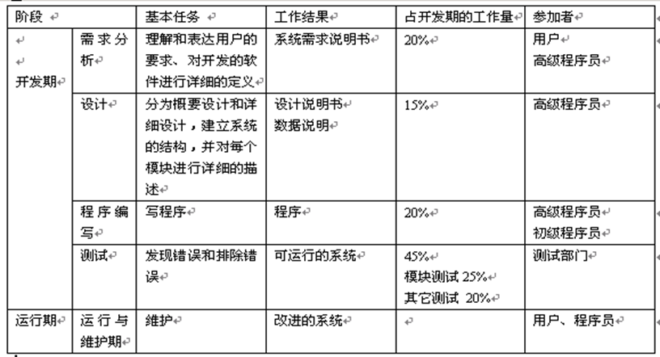
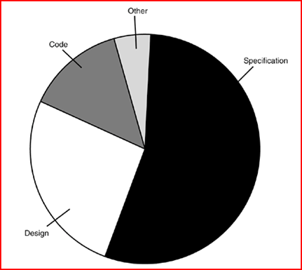
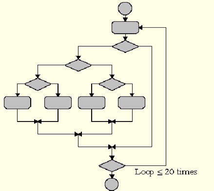
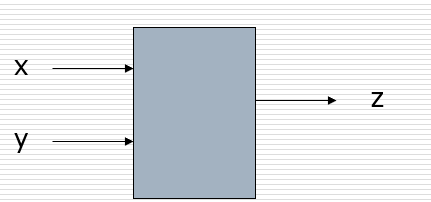
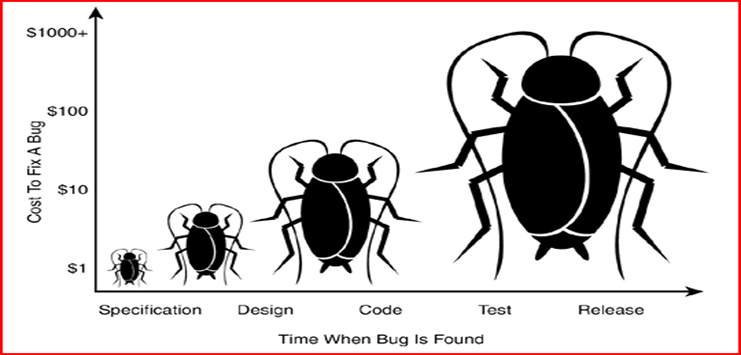
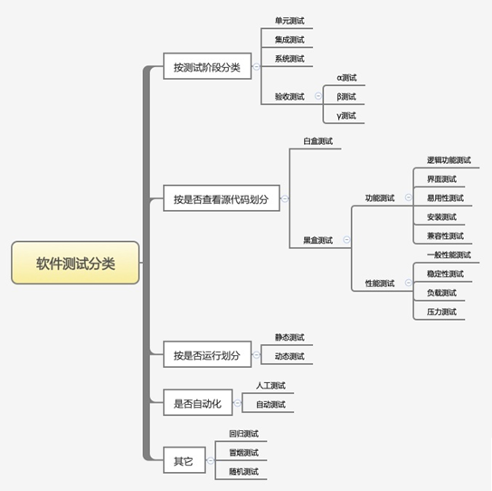
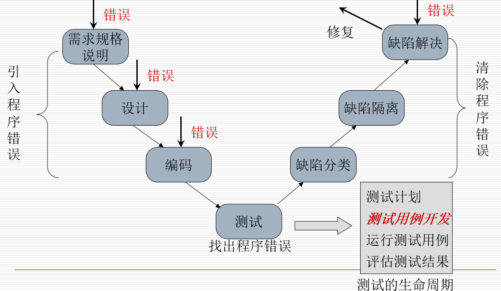

## bug一词的由来
- 1947年，计算机还是由机械式继电器和真空管驱动的、有房间那么大的机器。体现当时技术水平的Mark Ⅱ，是由哈佛大学制造的一个庞然大物。当技术人员正在进行整机运行时，他突然停止了工作。他们爬上去找原因，发现这台巨大的计算机内部一组继电器的触点之间有一只飞蛾，这显然是由于飞蛾受到光和热的吸引，飞到了触点上，然后被高压电击死。
- 计算机缺陷发生了。

## 软件测试背景
- 软件危机
  - 计算机硬件发展迅速，功能和质量提高，价格降低
  - 软件开发速度慢、质量差、维护难
- 软件工程
  - 用**工程化**的原则和方法组织软件开发
  - 目标：解决软件危机，开发高质量的软件（测试要与该目标一致）

## 软件的生命周期

## 导致错误的根源
- 缺乏有效的沟通
- 软件复杂度
- 编程错误
- 不断变更的需求
- 时间的压力
- 人员的自大
- 软件开发工具
- 缺乏文档的代码

错误在软件开发周期中的分布情况：

## 软件项目成员
- 项目经理
- 需求人员
- 体系架构师/系统工程师
- 程序员、开发人员
- 测试员或质量保证员（QA）
- 手册编写者
- 配置管理员（SCM活动的目标就是为了标识变更、控制变更、确保变更正确实现并向其他有关人员报告变更。）

## 软件产品的构成
- 代码（code）
- 帮助文档、用户手册
- 样品和示例（demo）
- 标签和不干胶
- 图标和标志
- 错误信息
- 广告和宣传材料
- 安装文件
- 说明文件

## 软件测试的重要性
软件测试在软件生存期非常重要，工作量和开销要占将近一半，是保证软件质量的主要手段，对于查找软件缺陷、保证产品质量，提高企业效益具有不可替代的作用。

### 著名的软件错误案例（1）
迪斯尼的狮子王：1994－1995（配置测试）
- 94年秋，迪斯尼公司发布了面向儿童的游戏“Lion King Animated Storybook”，进行了大量的宣传和促销，销售额可观。12月26日，开始收到大量投诉：游戏无法正常运行，舆论哗然。
- 原因：没有对市场上的各种PC机型进行测试，该软件只能在少数系统中正常工作，但在大众常用的系统中不行。

### 著名的软件错误案例（2）
Intel奔腾浮点除法：1994（决策）
- (4195835/3145727)*3145727-4195835算式的结果如果为0，则计算机没有问题；如果结果不为0，则使用的是带有浮点除法软件缺陷的老式Intel奔腾CPU，该软件缺陷被刻录在一个芯片中，并反复生产制造。
- 在发布芯片之前的内部测试已经发现了这个问题，不过因为只有在精度要求很高的计算中才导致错误，Intel管理层认为不严重，未修正
- 更换芯片的费用：4亿美元

### 著名的软件错误案例（3）
美国航天局火星探测器，1999
- 1999年12月，美国航天局的火星极地登陆者号探测器试图在火星表面着陆时失踪。故障评估委员会认定出现故障的原因极可能是一个数据位被意外置位。
- 原本的着陆计划：当探测器向火星表面降落时，他将打开降落伞减缓探测器的下降速度。降落伞打开后几秒，探测器的三条腿撑开，准备着陆。当探测器离地面1800米时，他将丢弃降落伞，点燃着陆推进器，缓缓降到地面。
- 美国航天局为了省钱，简化了确定何时关闭着陆推进器的装置。他们在探测器的脚部安装了一个廉价的触点开关，在计算机中设置了一个数据位来控制触点开关关闭燃料。
- 故障评估委员会发现，许多情况下，当探测器的脚迅速撑开准备着陆时，机械振动会触发着陆触点开关，设置致命的错误数据位。这样探测器开始着陆时，计算机极有可能关闭着陆推进器，探测器下坠1800米之后冲向地面，撞成碎片。

### 著名的软件错误案例（4）
千年虫：约1974
- 当时计算机存储的空间小，为节省字节，将四位的年份用两位表示
- 只有到数十年后的2000年1月1日才会出现问题，这期间肯定会升级或更改系统。但是，这也许被忘记了。
- 各种系统中这类问题的解决费用估计超过数亿美元

### 著名的软件错误案例（5）
美国爱国者导弹防御系统：1991（压力测试）
- 该系统应用于海湾战争中对抗伊拉克飞毛腿导弹的防御战，有几次在对抗导弹战役中失利，其中一枚在沙特阿拉伯的多哈击毙了28名美军士兵。
- 原因：软件缺陷。一个很小的系统时钟错误累积起来就可能造成严重的延迟，造成跟踪系统失去准确度。在多哈袭击战中，系统被延迟100多个小时。

## 软件缺陷的定义
- 产品说明书：是软件开发小组的一个协定。它对开发的产品进行定义，给出产品的细节、如何做、做什么、不能做什么。
- 至少满足以下5个规则之一才称为软件缺陷：
  - 软件未实现产品说明书要求的功能。
  - 软件出现了产品说明书指明不应出现的错误。
  - 软件实现了产品说明书未提到的功能。
  - 软件未实现产品说明书虽未明确提及但应该实现的目标。
  - 软件难以理解、不易使用、运行缓慢或者从测试员的角度看最终用户会认为不好。

## 软件缺陷的分类
- 软件需求错误（需求不正确，不完全，文档有误等）
- 功能和性能错误(遗漏功能、冗余的功能、异常处理有误等)
- 软件系统结构错误（系统整体构架有误）
- 软件结构错误（程序控制顺序有误，处理过程有误）
- 数据错误（数据定义或者数据结构有错，数据存取或者操作有误，例如：动态数据和静态数据混淆）
- 软件实现和编码错误（违背编码标准，例如：局部变量和全局变量混淆）
- 软件集成错误（接口有误）
- 测试定义与测试执行错误（例如：测试计划不完整，测试用例不充分）

## 软件失败
- 描述软件问题的术语：
  - 错误（error, mistake, bug ）
  - 缺陷（fault, defect）
    - 过错缺陷和遗漏缺陷
  - 失效（failure）
  - 事故（incident）
- 使用什么术语经常取决与公司的文化和开发软件的过程。
- 关键是属于使用的一致性而不是正确性。

## 软件测试的定义与定位
- IEEE的定义（1983）
  - 使用人工或者自动手段来运行或测定整个系统的**过程**，其目的在于检验它是否满足规定的需求或是弄清预期结果与实际结果之间的**差别**。
- 测试（test）
  - 软件测试就是**一个过程或一系列过程** ，用来确认计算机代码完成了其应该完成的功能，不执行其不该有的操作。
  - 测试的目标是：发现错误

## 软件测试的定义与定位（分析）
- 把软件测试(包括其它任何测试)定位在证明软件的正确性上是不对的，软件测试的目标是：查找软件的错误.原因：
  - 证明软件正确性的目标不可达：测试是无法证明软件的正确性的，原因是我们无法对软件进行理想测试（在理想情况下：对程序的**所有可能执行情况**进行测试），如完全的白盒测试（设计若干测试用例，使得软件中所有的执行路径都被执行到，见图1）或黑盒测试（设计若干测试用例，穷举所有软件可能的输入，见图2），这都要花费我们不能承受的成本（时间，人力），退一步讲，就算我们能对软件实施完全的白盒测试与黑盒测试，我们也无法保证软件在需求获取或是设计上没有失误，更何况我们还要考虑到非法和无效输入的问题。

- 图示，是一个不超过100行的程序结构图，它有大概100,000,000,000,000 条可能的执行路径。以每秒执行1000个测试用例的速度计算，完成所有可能路径的测试大概需要3170 年。
  
- 在32位的计算机上运行，只考虑x, y是整数，不同的测试数据组合最大可能数目为：2的64方，以每秒执行1000个测试用例的速度计算，完成测试大概需要工作5亿年。
  

- 从心理学角度讲，与软件测试的最终目标不一致。我们进行软件测试的最终目标是想为软件增加一些价值，既提高了软件的可靠性和质量（与软件工程的目标一致），换句话说也就是找到了软件的错误并最终修复了它。从心理学的角度讲，测试人员将目标确立为证明程序中存在错误（而不是证明软件中不存在错误）， 将更利于为软件增加更多的价值。

## 软件测试员的目标
- 软件测试员的目标是发现软件缺陷。
- 软件测试员的目标是尽可能早地找出软件缺陷。
  - 随着时间的推移，修复软件缺陷的费用将迅速增长
- 软件测试员的目标是**尽可能**早地找出软件缺陷，并尽可能确保其得以**修复**。

## 软件缺陷的修复费用
修复软件缺陷的费用是随着时间的推移而增加的。

- 如果在编写产品说明书时发现——费用忽略不计。
- 内部测试时发现——费用要高的多，软件需要调试、修改、再测试。
- 被客户发现——损失不可估量，足以耗尽整个产品的利润。

## 软件测试分类

### 按阶段划分
- 单元测试
  - 单元测试又称模块测试，针对软件设计中的最小单位——程序模块，进行正确性检查的测试工作。
  - 单元的定义：C中指一个函数，Java中指一个方法，在图形化的软件中，单元一般指1个窗口，1个菜单;
  - 测试阶段：编码后
  - 测试对象：最小模块
  - 测试人员：白盒测试工程师或者开发工程师
  - 测试依据：代码和注释 + 详细的设计文档
  - 测试方法：白盒测试为主
  - 测试内容：
    - 模块接口测试
    - 局部数据结构测试
    - 路径测试
    - 错误处理测试
    - 边界测试
- 集成测试
  - 集成测试又叫组装测试，通常在单元测试的基础上，将所有程序模块进行有序的、递增测试。重点测试不同模块的接口部分。
  - 测试阶段：一般单元测试之后
  - 测试对象：模块之间的接口
  - 测试人员：白盒测试工程师或者开发工程师
  - 测试依据：单元测试的模块 + 概要设计文档.
  - 测试方法：黑盒测试与白盒测试相结合
  - 测试内容
    - 模块之间的数据传输
    - 模块之间的功能冲突
    - 模块组装功能正确性
    - 全局数据结构
    - 单模块缺陷对系统的影响.
- 系统测试
  - 指的是将整个软件系统看成一个整体进行测试，包括对功能、性能以及软件所运行的软硬件环境进行测试
  - 系统测试在系统集成完毕后进行测试，前期主要测试系统的功能是否满足需求，后期主要测试系统运行的性能是否满足需求，以及系统在不同的软硬件环境中的兼容性等。
  - 测试阶段：集成测试之后
  - 测试对象：整个系统
  - 测试人员：黑盒测试工程师
  - 测试依据：需求规格说明文档
  - 测试方法：黑盒测试
  - 测试内容
    - 功能
    - 界面
    - 可靠性
    - 易用性
    - 性能
    - 兼容性
    - 安全性等
- 验收测试
  - 指按照项目任务书或合同、供需双方约定的验收依据文档进行的对整个系统的测试与评审，决定是否接收或拒收系统。
  - 验收测试是部署软件之前的最后一个测试操作。它是技术测试的最后一个阶段，也称为交付测试。阿旺总结验收测试的目的是确保软件准备就绪，按照项目合同、任务书、双方约定的验收依据文档，向软件购买都展示该软件系统满足原始需求。
  - 测试阶段：系统测试通过之后
  - 测试对象：整个系统(包括软件/硬件)
  - 测试人员：主要是最终测试或者需求方
  - 测试依据：用户需求和验收标准
  - 测试内容：同系统测试(功能，各种文档等)

### 是否查看源代码划分
- 黑盒测试(black-box testing)
  - 又称数据驱动测试，完全不考虑程序内部结构和内部特性，注重于测试软件的功能需求，只关心软件的输入数据和输出数据。
  - 黑盒测试可以发现如下几类错误
    - 功能不对或功能遗漏。
    - 界面错误。
    - 数据库访问或者处理错误。
    - 性能问题。
  - 优点
    - 测试人员不需要了解实现得细节，包括特定的编程语言没有编程经验的人也可以设计测试用例）；
    - 测试人员和编程人员是相互独立的（黑盒测试用例设计与程序如何实现无关）；
    - 从用户的角度进行测试，很容易被接受和理解；
    - 有助于暴露任何与规格不一致或者歧异的地方；
  - 缺点
    - 不能测试程序内部特定部位；
    - 如果程序未执行的代码无法发现;
    - 不可能做到穷举测试;
  - 黑盒测试分类
    - 功能测试：是黑盒测试的一方面，它检查实际软件的功能是否符合用户的需求
      - 逻辑功能测试(function testing)
      - 界面测试(UI testing)
      - 易用性测试(usability testing)
      - 安装测试(installation testing)
      - 兼容性测试(compatibility testing)
    - 性能测试：是软件测试的高端领域，性能测试工程师的待遇和白盒测试工程师不相上下，通常我们所说的高级软件测试工程师一般就是指性能测试或是白盒测试工程师。包括时间性能（事务响应时间等）、空间性能（系统资源消耗）
      - 一般性能测试
      - 稳定性测试
      - 负载测试：通过负载测试来确定在各种工作负载下，系统各项性能指标的变化情况。
      - 压力测试：通过确定一个系统的瓶颈或者刚好不能接受的性能点，来获得系统能够提供的最大服务级别。
- 白盒测试(while0box testing)
  - 指的是把盒子打开，去研究里面的源代码和程序结构。
- 灰盒测试
  - 灰盒测试，是介于白盒测试与黑盒测试之间的一种测试，既可保证黑盒的关注点又可掌控白盒的内部结构，但不会去对内部程序功能和运作做详细了解，灰盒测试结合了白盒测试和黑盒测试的要素。

### 按是否运行分类
- 静态测试(static testing)
  - 指不实际运行被测软件，而只是静态地检查程序代码、界面或文档中可能存在的错误过程.
  - 检查项
    - 代码风格和规则审查
    - 程序设计和结构审查
    - 业务逻辑审核
    - 表态质量
    - 功能性
    - 可用性
    - 可靠性
    - 有效性
    - 可维护性
    - 可移植性
- 动态测试(dynamic testing)
  - 是指实际运行被测程序，输入相应的测试数据，检查实际输出结果和预期结果是否相符的过程;
  - 动态测试方法是指通过运行被测程序，检查运行结果与预期结果的差异，并分析运行效率、正确性和健壮性等性能。这种方法由三部分组成：构造测试用例、执行程序、分析程序的输出结果。

### 按是否自动化划分
- 人工测试
  - 手工测试就是由人去一个一个的输入用例，然后观察结果，和机器测试相对应，属于比较原始但是必须的一个步骤
  - 执行效率慢，量大出错.
- 自动化测试
  - 就是在预设条件下运行系统或应用程序，评估运行结果，预先条件应包括正常条件和异常条件。简单说自动化测试是把以人为驱动的测试行为转化为机器执行的一种过程。
  - 自动化测试比如功能测试自动化、性能测试自动化、安全测试自动化。
  - 通常所说的自动化是指功能测试自动化;

### 其它分类
- 回归测试
  - 是指软件被修改后重新进行的测试，重复执行上一个版本测试时的用例，是为了保证对软件所做的修改没有引入新的错误而重复进行的测试.
- 随机测试
  - 随机测试主要是对被测软件的一些重要功能进行复测，也包括测试那些当前的测试用例没有覆盖到的部分。另外，对于软件更新和新增加的功能要重点测试。重点对一些特殊点情况点、特殊的使用环境、并发性、进行检查。尤其对以前测试发现的重大Bug，进行再次测试，可以结合回归测试(Regressivetesting)一起进行。
- 冒烟测试
  - 冒烟测试目的是确认软件基本功能正常，冒烟测试的执行者是版本编译人员。
- 探索性测试
  - 探索性测试可以说是一种测试思维技术。它没有很多实际的测试方法、技术和工具，但是却是所有测试人员都应该掌握的一种测试思维方式。探索性强调测试人员的主观能动性，抛弃繁杂的测试计划和测试用例设计过程，强调在碰到问题时及时改变测试策略。
  - 探索性测试自动化暂时无法代替。

## 与缺陷相关的开发阶段

## 软件测试员应具备的素质
- 他们是群探索者
- 他们是故障排除员
- 他们不放过任何蛛丝马迹
- 他们具有创造性
- 他们是群追求完美者
- 他们判断准确
- 他们注重策略和外交
- 他们善于说服
- 在软件编程方面受过教育

## 测试工具和测试自动化
- 使用工具可以使测试工作更高效和轻松
  - 速度和效率：自动化工具可以减少执行用例的时间，以考虑新的测试用例
  - 准确度和精确度
  - 坚持不懈，不会半途而废
- 软件测试工具不能代替软件测试员，它们只能帮助测试员更好地工作

## 测试工具分类
- 测试管理工具
- 接口测试工具
- 性能测试工具
- C/S自动化工具
- 白盒测试工具
- 代码扫描工具
- 持续集成工具
- 网络测试工具
- app自动化工具
- web安全测试工具

## 小结
- 缺陷是什么
- 测试是什么
- 测试的目标是什么
- 测试在软件生命期中的地位
- 测试人员的目标和应具备的素质
- 测试工具的作用
- 测试的分类
