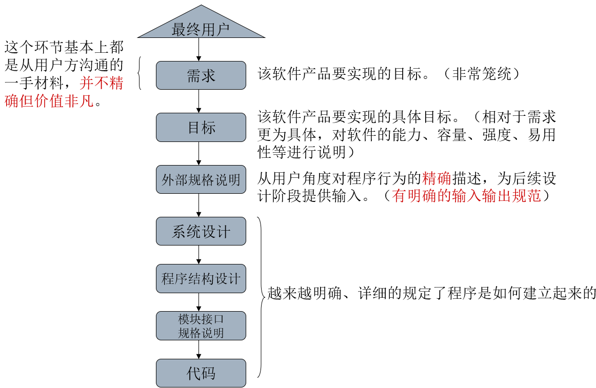
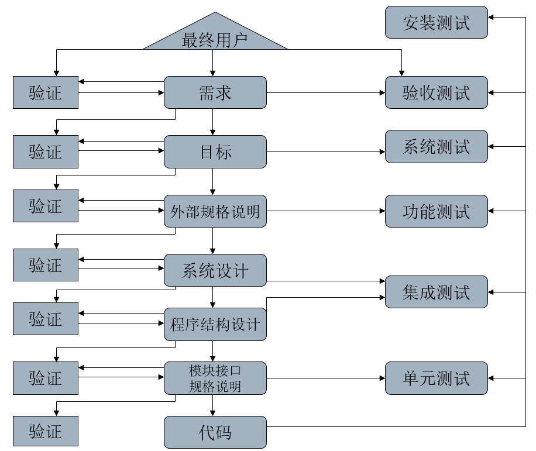
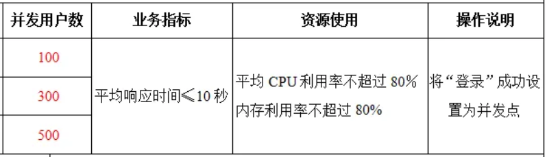
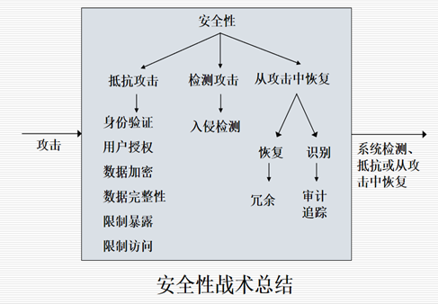
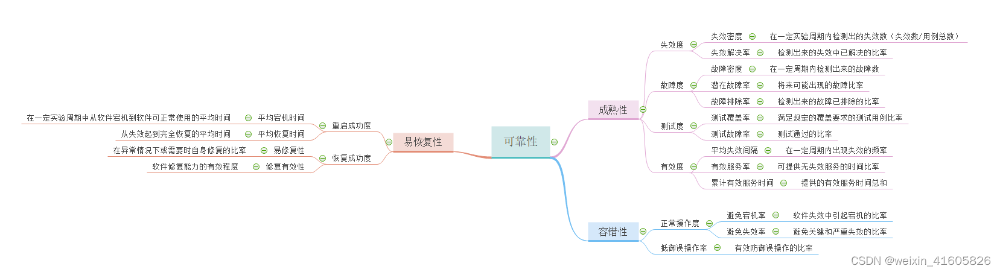

## 软件开发与测试
- 要结束整个测试任务，除模块测试外，还要进行其他更深入的测试，我们称之为“更高级别的”测试。
- 软件开发过程在很大程度上是信息的细化过程，将信息从一种形式转换到另一种形式，因此，绝大部分软件错误都可以归因为信息沟通和转换时发生的故障、差错和干扰。
- 下图为软件开发过程的各个阶段
  
- 要预防和识别这些错误，可以
  - 在每个阶段结束时可以引入一个独立的验证过程。
  - 对不同的开发阶段采用不同的测试方法进行验证（不同的测试过程针对一类特定的错误）。
- 开发过程与测试过程
  

## 功能测试
功能测试是一个试图发现程序与其外部规格说明之间存在不一致的过程。
- 除了很小的程序，功能测试通常是黑盒测试
- 在进行功能测试时，需要对规格说明进行分析以获取测试用例集。
  - 等价类划分、边界值分析、判定表、因果图、错误猜测等方法尤其适合功能测试
  - 要应用测试的原则，如
    1. 对测试用例的预期结果应该有明确定义；
    2. 要对无效输入给予重视；
    3. 发现错误越多的功能，可能存在错误的可能性就越大；

### 一些功能测试自动化工具
- IBM Rational Robot 可以让测试人员对 .NET、Java、Web 和其他基GUI应用程序自动功能回归测试是一种多功能回归和配置环境测试工具。
- Selenium 也用于 Web 应用程序测试。支持的浏览器包括 IE、Mozilla 和 Firefox 等。该工具支持自动录制动作和自动生成.NET、Java、Perl 测试脚本。
- Appium:自动化测试偏移动端
- ...

## 系统测试
系统测试的目的是将系统或程序与其初始目标进行比较，这意味着
- 系统测试并不局限于被测程序，系统测试是一个试图说明程序作为一个整体是如何不满足其目标的过程
- 如果产品没有一组书面的、可度量的目标，系统测试也无法进行。

### 系统测试的类型
- 系统测试没有特定的技术和方法，但可以根据不同类型的测试来考虑测试用例的设计，包括：
  - 容量测试，强度测试，易用性测试，安全性测试，性能测试，存储测试，配置测试，兼容性/配置测试，安装测试，可靠性测试，适用性测试，文档测试，过程测试
- 不是所有这些类型都适用于任何程序/软件，但为了避免有所遗漏，设计测试用例时应该考虑所有类型。

## 容量测试
- 目的是证明程序不能处理目标文档中规定的数据容量。是程序经受大容量数据的检验。
- 容量测试需要大量的资源，不可进行过多。
- 如使操作系统的作业队列达到饱和容量。使用编译器编译一个极其庞大的源程序。庞大的Email信息和文件充满了Internet，一个服务器节点的处理能力达到峰值。

## 强度测试
- 使程序承受高负载或强度的检验。所谓高强度是指在很短的时间间隔内达到的数据或操作的数量峰值。（要与容量测试相区分）
- 强度测试涉及时间因素，适用于在可变负载下运行的程序以及交互式程序、实时程序和过程控制程序。基于Web的应用程序也是最常接受强度测试的软件之一。
- 如，
  1. 在很短的时间内是操作系统的作业队列达到峰值；
  2. Web应用程序要处理一定容量的并发用户。

> 注：强度测试时对强度的界定很重要。

## 性能测试
很多软件都有特定的性能或效率目标，这些特性描述为在特定负载和配置环境下程序的响应时间、吞吐率、资源占用率。应设计测试用例来说明程序不能满足其性能目标。

### 性能测试工具
- Jmeter：是一款开源软件，扩展性强。可以对不同类型的应用或服务进行性能测试，还能对性能测试结果提供图形分析功能。
- 工业标准级负载测试工具Loadrunner：通过以模拟上千万用户实施并发负载及实时性能监测的方式来确认和查找问题，LoadRunner能够对整个企业架构进行测试。通过使用LoadRunner，企业能最大限度地缩短测试时间，优化性能和加速应用系统的发布周期。

## 易用性测试
- 每个用户界面是否都根据用户的智力、教育程度和环境要求进行了调整？
- 程序的输出是否有意义、不模糊且无计算机杂乱信息？
- 错误诊断信息是否直接，非计算机专业用户是否能够理解（这要求对错误进行精确的预测和详细的分类）？
- 整体的用户界面是否在惯例、格式、风格和缩写等方面展现出了相当程度的完整性、一致性和同一性？
- 系统是否包含过多或不太可能用到的选项？
- 对于所有输入，系统是否返回了即时确认信息？
- 不同层次菜单之间的浏览是否容易等。

## 安全性测试
- 设计测试用例来突破程序安全检查。
  - 例如可以设计测试用例来规避操作系统的内存保护机制、破坏数据库管理系统的数据安全机制等。
- 常用的测试用例设计方法是研究类似系统中已知的安全问题，然后生成测试用例，暴露被测系统中的类似问题
- 基于Web的应用程序常常比绝大多数程序所需的安全测试级别更高，对于电子商务网站尤其如此。

## 配置&兼容性测试
- 配置测试
  - 很多软件（OS、DBMS、信息交换系统）都支持多种硬件配置，包括不同类型和数量IO设备或不同的存储容量。通常可能的配置数量非常之大，以至于无法全面测试，但应该尽可能测试各种配置。
- 兼容性/配置/转换测试
  - 很多软件不是全新的，而是为了替换某些已有的系统。这样的软件往往涉及与已有系统的兼容以及从已有系统的转换过程，如升级数据库管理系统。

## 可靠性测试
软件可靠性：在规定的条件下，在规定的时间内，软件不引起系统失效的概率；

## 其他类型的系统测试
- 存储测试：软件偶尔会有存储目标，例如描述程序使用的内存和辅存的容量以及临时文件或移出文件的大小。应设计测试用例来证明这些存储目标没有得到满足。
- 安装测试：有些软件的安装过程非常复杂，测试安装过程是系统测试的一个重要部分。
- 适用性测试：对于软件的适用性和可维护性目标也必须测试。
- 文档测试：系统测试也需要检查用户文档的正确性和清晰性。
- 过程测试：很多软件系统不是完全自动化的，其中包括了很多人员操作过程。在系统测试中，必须对所有已规定的人工过程，如系统操作员、最终用户、数据库管理员的操作过程进行测试。

## 系统测试的执行
系统测试执行的一个最关键的考虑是决定由谁来执行测试
- 不能由程序员来进行系统测试
  - 执行系统测试的人思考问题的方式必须与最终用户相同，必须充分了解最终用户的态度和使用环境以及程序的使用方式。
  - 理想的人员组成：专业的系统测试专家、最终用户代表、人类工程学工程师、程序的主要分析人员或设计人员。
- 在所有的测试阶段之中，这时唯一一个明确地不能由负责该程序开发的机构来执行的测试
  - 软件开发机构的心理有悖于测试活动的目标
  - 至少应该由很少受开发机构左右的独立人群来执行
  - 独立的测试机构

## 独立的测试机构
- 软件测试原则
  - 软件机构应该避免测试自己的软件，因为负责开发程序的机构难以客观地测试同一程序
- 测试机构
  - 在公司内设置远离开发部门的测试部门
  - 测试机构不属于同一公司：雇佣独立的公司进行软件测试
    - 提升了测试过程中的积极性
    - 建立了与开发机构的良性竞争
    - 避免了测试过程处于开发机构的管理控制之下
    - 独立的测试机构可以带来解决问题的专业知识
