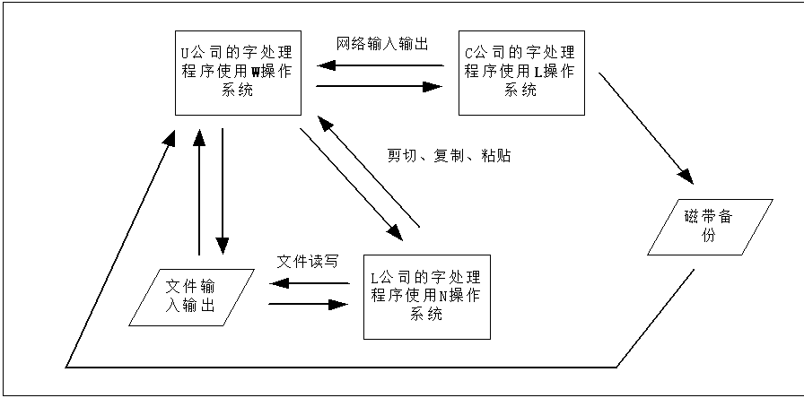

确保测试对象在不同的硬件配置和软件环境按预期运行

## 配置测试综述
- 标准并未被严格遵守。
- 使用各种硬件来测试软件的运行过程。
- 确保测试对象（软件）在不同的硬件配置上按预期运行的测试。（RUP）
- 配置测试是为了保证被测试的软件使用尽量多样化的硬件组合，采用不同的计算机、组件、外设、接口等查看被测试的软件在不同配置下的可用性。

## 配置的种类
- PC
- 部件：CPU、主板等。
- 外设
- 接口：ISA, PCI, USB, PS/2, RS/232, RJ-11, RJ-45, and Firewire
- 可选项和内存
- 设备驱动程序

## 如何与软件关联
- 进行软件的配置测试，必须要考虑哪些配置与程序的关系最密切！（关注软件的系统需求）
- 不同的软件会有不同的针对点，例如：
  - 游戏软件：最关心显卡和声卡测试。
  - 图像处理软件：最关注于显卡和打印机测试。
  - 通信程序：关注网络设备。
  - 贺卡程序：关注打印机。

## 分离配置缺陷
缺陷归类：硬件or软件。
- 缺陷归类的经验做法：在另外一台有完全不同配置的计算机上一步步执行导致问题的相同操作。

## 配置缺陷的分类
1. 软件可能包含在多种配置中都出现的缺陷；
2. 软件可能只包含在某一特殊配置中出现的缺陷；
3. 硬件设备或者其设备驱动程序可能包含仅由软件揭示的缺陷。
4. 硬件设备或者其设备驱动程序可能包含一个借助许多其它软件才能揭示的缺陷。

案例：
1. 贺卡程序使用激光打印机时工作正常，而使用喷墨打印机时工作异常
2. 软件仅在OkeeDokee Model BR549 喷墨打印机上无法正常工作
3. 如只有被测试的软件才使用到显卡的某种设置，从而引起系统 崩溃。
4. 某种打印机驱动程序总是默认地采用草稿模式，每次使用均需要手动设置。

## 配置缺陷的责任人
- 前两种情况，显然要由项目小组负责修复缺陷；
- 后两种情况，责任不太清晰。
- 归根结底，无论问题出在哪里，解决问题都是开发小组的责任----软件开发的柔性。

## 配置测试的方法——等价类划分
完整、全面的配置测试组合上亿种。

如：一种3D游戏，画面丰富，多种音效，允许多个用户联机对战，还可以打印游戏细节。

市场调查：336种显卡，210种声卡，1500种网卡，1200种打印机。
测试组合=336×210×1500×1200

## 执行任务
1. 确定所需的硬件类型
   - 如：联机注册需要的硬件类型有哪些？
2. 确定哪些厂商的硬件、型号和驱动程序可用（通常要求助于销售和市场人员）
3. 确定可能的硬件特性、模式和选项
4. 将确定后的配置缩减为可控制范围
5. 明确与硬件配置有关的软件唯一特性
   - 没有必要在每一种配置下完全测试软件，仅测试那些与硬件交互时互不相同（等价类划分）的特性。
   - 例：测试写字板之类的文字处理程序：
     - 保存和打开特性
     - 打印（字体、大小、颜色、是否嵌入图片）
6. 设计在每一种配置中执行的测试用例
   1. 从清单中选择并建立下一个测试配置。
   2. 启动软件。
   3. 打开文件configtest.doc。
   4. 确认显示出来的文件正确无误。
   5. 打印文档。
   6. 确认没有错误提示信息，而且打印的文档符合标准。
   7. 将任何不符之处作为软件缺陷记录下来。
7. 在每种配置中执行测试
8. 反复测试直到小组对结果满意为止最后达到没有未解决的缺陷或缺陷仅限于不常见的或不可能的配置上。

## 获得硬件
1. 只买经常使用的配置
2. 小组中的每一个测试员都配备不同的硬件
3. 与硬件生产厂商联系，寻求租借甚至赠送某些硬件
4. 动员公司力量帮助测试
5. 与专业配置和兼容性测试实验室进行外协测试

## 明确硬件标准
审查硬件公司用于制造产品的说明书 ，助于做出更多清晰的等价划分。

## 对其他硬件进行配置测试
考虑问题与测试台式机软件是相同的：
- 何种外部硬件运行该软件？
- 该硬件有哪些型号和版本可用？
- 硬件支持哪些特性或者可选项？

问题：
- 为什么配置测试不能少？
- 为什么配置测试可能是艰巨的任务？
- 配置测试的基本方法？
- 如何找到需要测试的硬件？
- 如果不是在为PC测试软件怎么办？

## 小结
- 配置测试的概念；
- 配置测试的步骤；
- 配置的获取途径；
- 作为新手，应该有哪些准备工作？  

## 兼容性测试
软件兼容性测试是指检查软件之间是否正确地交互和共享信息（数据）。如：
- 从WEB页面剪切文字，在字处理程序中打开的文档中粘贴
- 从电子表格程序保存帐目数据，在另一个完全不同的电子表格程序中读入
- 使照片修饰软件在同一操作系统下的不同版本正常工作
- 使字处理程序从联系人管理程序中读取姓名和地址，打印个性化的邀请函和信封
- 升级到新的数据库程序，读入现存所有数据库，像老程序一样对其进行处理。

不同的软件对兼容性要求不同，如
- 用于独立医疗设备的软件，运行其自己的操作系统，将其数据存储在自己的存储卡上，并且不连接到任何其他设备
- Mircrosoft word 2010

## 软件兼容性的复杂性

## 兼容性测试的准备工作
- 软件设计要求与何种其他平台和应用软件保持兼容？
  - 如果被测对象是应用
  - 如果被测对象是平台
  - 选择目标平台或兼容的应用程序（还包括版本）要由熟悉客户基本情况的人来决定。
- 应该遵守何种定义软件之间交互的标准或者规范？
- 软件使用何种数据与其他平台和软件交互和共享信息？

注意：从项目管理的立场看，使兼容清单在满足客户要求的前提下尽可能小是很重要的。

## 向前和向后兼容
向前和向后兼容
- 向后兼容是指可以使用软件的以前版本
- 向前兼容是指可以使用软件的未来版本

## 测试多个版本的影响
- 如果对新平台进行兼容性测试，就必须检查现有程序使用它能否正常工作。
- 对新应用程序的兼容性测试可能要求在多个平台和应用程序上进行
- 运用等价分配原则组织测试用例

## 等价类划分的依据
- 流行程度
- 年头
- 类型
- 生产厂商
- ...

## 标准和规范
兼容性测试标准和规范
- 高级标准
  - 是产品普遍遵守的规章。（例如外观和感觉、支付特性）
  - 例如，可参考Windows认证要求
- 低级标准
  - 是本质细节。（例如文件格式和网络协议等等）
  - 可视为软件规格说明书的扩充部分
  - a例如用于处理图形文件的应用程序，就应该遵守.bmp，.jpg，.gif的格式标准

## 数据共享兼容性
- 在应用程序之间共享数据实际上是增强软件的功能
- 以严格遵守磁盘和文件格式的低级标准为前提
- 数据共享的常见方式：
  - 通过存储介质进行文件保存和读取
  - 文件导入和导出
  - 剪切、复制和粘贴
  - DDE、COM、OLE等数据传输方式

## 软件兼容性小结
- 设计测试用例——对所有可能的兼容软件进行等价划分，使其成为可以控制的范围
- 补充测试用例——研究适用于测试软件的高级/低级标准和规范
- 准备测试数据与环境——测试软件程序之间不同的数据流动方式
