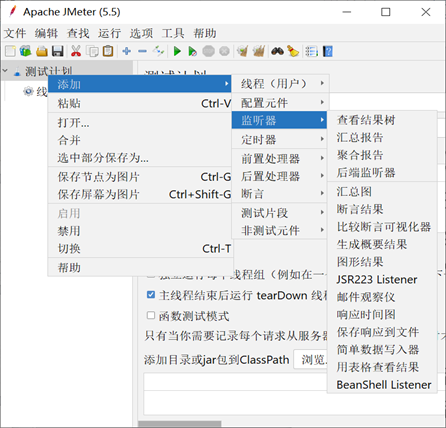

## 软件性能
软件性能是软件的一种非功能特性，它关注的不是软件是否能够完成特定的功能，而是在完成该功能时展示出来的及时性。

## 性能测试与性能指标
很多软件都有特定的性能或效率目标，这些特性描述为在特定负载和配置环境下程序的响应时间、吞吐率、资源占用率。应设计测试用例来说明程序不能满足其性能目标。
并发用户数（负载）：是指系统同时承载的用户数量。

性能指标
- 响应时间是指系统对请求作出响应的时间。
- 吞吐量是指系统在单位时间内处理请求的数量。
- 资源利用率反映在一段时间内资源平均被占用的情况。

## 测试类型
- 负载测试：是通过逐步增加系统负载，测试系统性能的变化，并最终确定在满足性能指标的情况下，系统所能承受的最大负载量的测试。
- 压力测试：压力测试是给软件不断加压，强制其在极限的情况下运行，观察它可以运行到何种程度，从而发现性能缺陷。压力测试强调系统的稳定性。

## Jmeter简介
- Apache JMeter 是Apache组织的开放源代码项目，是一个100%纯Java桌面应用，用于性能测量。
- Apache JMeter可以用于对静态的和动态的资源（文件，Servlet，Perl脚本，Java对象，数据库和查询，FTP服务器或是其它资源）的性能进行测试。

## Jmeter与LoadRunner的对比
| 对比项   | JMeter                                       | Loadrunner                                 |
| -------- | -------------------------------------------- | ------------------------------------------ |
| 支持协议 | 支持协议有限，但通过第三方插件基本满足所用   | 支持的协议很多，比较全面                   |
| 跨平台   | 支持                                         | 不支持                                     |
| 成本     | 开源、免费、轻量级                           | 付费、重量级                               |
| 语言     | Java开发，支持多种Java脚本语言、使用编程扩展 | C语言开发，支持C、Java、VB、C#、JavaScript |
| 结果分析 | 较简单                                       | 结果分析器强大                             |
| 脚本录制 | 自带代理服务器或BadBoy录制                   | 自带录制功能强大，支持录制回放             |
| 扩展性   | 能够开发出最合适应用的测试工具               | 依赖于工具本身提供的特性，较难扩展         |
| 学习成本 | 易于学习和使用                               | 依赖于工具的易用性和所提供的文档           |
| 持续集成 | 可形成特有的测试工具体系                     | 很难与其他产品集成                         |

## Jmeter安装
https://jmeter.apache.org/download_jmeter.cgi

## Jmeter测试计划（Testplan）
- 测试的起点
- 其他元件的容器
- 用来描述性能测试

## Jmeter线程组（Thread Group）
- 线程可以理解为虚拟用户
- 线程组用来模拟一组并发的用户
- 线程数：虚拟用户的数量
- Ramp-Up Period（in seconds）：在多少秒内创建线程数中定义的所有线程。每秒并发数=线程数/RUP
- 循环次数：当前线程组中的测试脚本循环运行次数

## Jmeter元件

### 取样器（Sampler）——真正干活的
- 发送请求到服务器
- 按照其在测试树中的顺序去执行
- 受逻辑控制器控制
- 支持多种协议
- 支持二次开发

### 逻辑控制器（Logic Controller）
控制Sampler发送请求的逻辑、顺序。常用：
- ForEach控制器
- IF控制器
- 循环控制器
- 随机控制器
- 随机顺序控制器
- 事务控制器

### 配置原件（Config Element）
- 数据配置，用于参数化
- 配置默认属性、信息

### 定时器（Timer）
- 设置请求间的时间间隔
- 应用
  - 模拟思考时间：定时器、随机定时器
  - 集合点：Synchronizing Timer

### 前置后置处理器
- 前置处理器：采样器发出请求（Request）前对即将发出的请求进行特殊处理。
  
- 后置处理器：对采样器发出请求后得到服务器响应（Response）进行处理。
  

### 断言（Assertions）
- 判断取样器是否正常工作
- 判断请求响应是否正确
- 判断结果是否符合预期
- 相当于LR的检查点

### 监听器（Listener）
- 收集汇总测试结果
- 将测试结果数据进行加工并展示
- 生成XML、CSV等形式的文件供后续分析

常用：
- 图形结果监听器
  
- 查看结果树监听器
  
- 聚合报告监听器
  
- 用表格查看结果
- 保存响应到文件

### 执行顺序
1. Configuration elements（配置元件）
2. Pre-Processors（前置处理器）
3. Timers（定时器）
4. Sampler（取样器，实际干活的）
5. Post-Processors（后置处理器）
6. Assertions（断言）
7. Listeners（监听器）

Samplers 按它们在树里的排列顺序执行

### 作用域

- Sampler无作用域问题。
- 逻辑控制器（Logic Controller）：只对其子节点中的元件（取样器）起作用。
- 除采样器和逻辑控制器元件外，其他6类元件，如果是某个sampler的子节点，则该元件只对其父节点起作用。
- 除采样器和逻辑控制器元件外，其他6类元件，如果其父节点不是sampler，则其作用域是该元件父节点下的所有后代节点。

## Jmeter的参数化设置
- 通过添加前置处理器参数化
- 通过CSV Data Set Config参数化
- 借助函数助手参数化

## 实例

### 实例1：使用Jmeter创建Web测试计划
- 准备好被测Web应用
- 使用Badboy录制脚本
- 导入Jmeter
- 将用户名和密码参数化（2种参数化方式）
- 设置响应断言（验证登录成功）…..
- 添加断言结果监听器
- 添加同步定时器
- 添加“查看结果树”、“聚合报告”监听器
- 在“线程组”界面中，设置测试场景。
  - 10个用户10秒内到达
  - 100个用户10秒内到达
  - 500个用户10秒内到达

### 实例2：使用Jmeter创建JDBC测试计划
- 准备MySql的JDBC驱动，放在Jmeter的lib目录下
- 启动Jmeter
- 新增一个线程组，设置好测试场景
- 为线程组新增一个JDBC连接配置
- 为线程组新增一个JDBC请求（参数化）
- 添加“查看结果树”、“聚合报告”监听器
