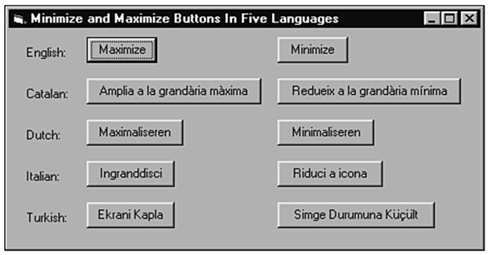

## 概述

### 问题的提出
- Microsoft的Windows XP支持106种不同语言和方言，从阿富汗语到匈牙利语到祖鲁语。
- 大多数其他公司也意识到英语国家的市场不过是潜在客户的一小半。

### 本地化测试的概念
- 使软件适应语言、方言、地区习俗和文化的过程称为本地化（localization）。
- 测试此类软件称为本地化测试。

## 翻译问题

### 1. 文本扩展(text expansion) 问题
英语被翻译为其他语言时，表达同一事物时往往需要加一些字符。
大拇指规则：单词长度预计增加100%，语句和短小段落长度预计增加50%。

- 是否正确换行？
- 文本显示是否正常？
- 文本是否正常截断？
- 文本是否丢失？
- 是否影响系统的正常运转？

### 2. ASCll、DBCS和Unicode
- ASCII只能表示256（2^8）种不同的字符。
- 代码页：一种语言用一个代码页表示。
- DBCS（双字节字符集）表示65,636个字符，带来兼容性问题。
- 建议程序员在开发时采用Unicode！

#### ASCII
- 0~32：控制码。规定了特殊的用途，一旦终端、打印机遇上这些字符，就要做一些约定的动作。 
- 33~127：标准字符。空格、标点符号、数字、大小写字母。
- 128~255：扩展字符。表示新的字母、符号，还有画表格用到的横线、竖线、交叉等形状。

#### GB2312
- 到中国时，如何保存6000多个常用汉字呢？
- 规定：一个小于127的字符意义与原来相同，两个大于127的字符连在一起，表示一个汉字，组合出约7000多个简体汉字。
- 127号以下的字符为“半角”字符；
- 其他的两个字节长度的编码称为“全角”字符。

#### GBK
- 但是中国汉字太多了，于是规定：只要第一个字节是大于127就表示这是一个汉字，不管后面是不是扩展字符集里的内容。
- 扩展之后的编码方案被称为 GBK 标准。
- GBK 包括了 GB2312 的所有内容，同时又增加了近20000个新的汉字（包括繁体字）和符号。 

#### GB18030和DBCS
- 后来增加了几千个少数民族文字，GBK 扩成了 GB18030。
- 中国的程序员们把这一系列汉字编码的标准通称为 “DBCS”（双字节字符集）。
- 在DBCS里，最大的特点是两字节长的汉字字符和一字节长的英文字符并存。

#### 兼容性问题
- 各个国家采用独特的DBCS，互相之间不理解、不支持。
- 举例：大陆和台湾采用不同的 DBCS 编码方案——大陆显示汉字，装“汉字系统”，台湾则装支持 BIG5 编码的“倚天汉字系统”。

#### Unicode
- ISO 解决问题的方法：废除所有地区性编码方案，重新策划一个包括了地球上所有文化、所有字母和符号的编码！——UNICODE。
- Unicode与UTF8冲突的经典例子：在记事本中输入“联通”保存再次打开后变为乱码。
- 一个汉字不再是相当于两个字符了，而是一个字符！
- 从 UNICODE 开始，无论是半角英文字母，还是全角汉字，都是统一的“一个字符” ,“两个字节” ！
- “字符”和“字节“区别：“字节”是一个8位的物理存贮单元，而“字符”则是一个文化相关的符号。UNICODE 中，一个字符就是两个字节。一个汉字算两个英文字符的时代已经快过去了。

### 3. 扩展字符测试方法
- 找出软件中所有接受字符输入和输出之处；
  - 调制解调器可以收发扩展字符吗？
  - 能使用扩展字符命名文件，或文件内容中出现扩展字符吗？
  - 扩展字符可以正常打印吗？
  - 程序之间剪切、复制、粘贴扩展字符可以吗？
- 在每一处尝试使用扩展字符，把它们添加到测试等价类中

### 4. 字符计算
字符计算体现在文字排序和大小写转换。
- 排序测试方法：寻找排序依据。
- 大小写转换测试：应用扩展字符测试转换功能。

### 5. 热键和快捷键
在软件的本地化版本中，要测试所有热键和快捷键工作是否正常，而且使用起来不困难。

### 6. 阅读习惯—从左向右和从右向左读
从测试的角度看，最好把它当做全新产品。

### 7. 图形中的文字
图形文字的影响是当软件本地化时，每一个图标都要改变，以反映新的语言。

### 8. 让文本与代码脱离
有文本字符串、错误提示信息和其他可能翻译的内容都应该存放在与源代码独立的文件（resource file ）中。

## 本地化问题
经过准确翻译和仔细测试的软件是精确和可靠的，但是如果不考虑本地化的问题，程序就可能不够准确和高质量。

### 什么是本地化
- 本地化：指在另一个国家正式行销某产品之前，对“原始产品”进行的“修订”。
- 本地化通常不包括对源代码的“修订”。
- 本地化包括但不限于以下方面：翻译、文化本地化、图形处理、编译、测试等。

### “翻译”和“本地化”的区别是什么？
- 翻译是本地化的子集。翻译包括把源文字从一种语言转换到另一种语言。
- 翻译后，必然对产品进行许多更改。这些更改包括技术上和文化上的更改。
- 技术问题：重新编排格式 、调整默认设置、重新编译等。
- 文化问题（包括文化习俗和习惯）：如包装 、图标、宣  传、样品、政治敏感的术语、地方规章、宗教信仰、节假日等等。

### 1. 受影响的内容
可能更改的内容：除了代码的所有东西 ，如：
范例文档、图标、图片、声音、视频、有边界争端的地图、市场宣传材料、包装、帮助文件、Web链接

### 2. 数据格式
不同的地区在诸如货币、时间和度量上使用不同的数据单位格式。
测试时需要对本地使用的度量单位非常熟悉。如平方米和亩的概念。

## 配置和兼容性问题
软件与各种硬件交互时出现的问题在遇到全新且不同组合时会愈发扩大。难度不大，但工作量极大。

### 1. 国外平台配置
例：WindowsXP支持106种不同的语言和66种不同的键盘布局（语言依赖性最大的硬件）。 打印机能否在各种规格纸张上正常打印所有字符。
在设计等价划分时，不要忘了应该考虑构成平台的所有硬件和软件，包括硬件本身、设备驱动和操作系统。

### 2. 数据兼容性
增加了本地化问题之后，数据的兼容性测试也具有了全新的意义。

例：使用公制单位和扩展字符的德文应用程序通过剪切粘贴操作把数据移至法文程序中。法文应用程序然后导出数据，再导入到英文应用程序，英文程序使用英制单位和非扩展字符，把数据移回原来的德文应用程序中；

## 测试工作量
软件与各种硬件交互时出现的问题在遇到全新且不同组合时会愈发扩大。难度不大，但工作量极大。

- 与所有的测试一样，本地化测试的量的要求是一个有风险的抉择。
- 首先是项目从一开始是否考虑计划了本地化 。如果软件一开始就考虑了本地化问题，本地化测试的风险就很小。
- 其次是软件产品中什么需要改变 ——文本和图形 还是基本代码？

## 思考：本地化测试和源程序测试区别
测试顺序不同
- 首先要现对源程序软件进行测试，然后再创建本地化软件，测试本地化软件。

测试内容和重点不同
- 源程序软件主要测试功能、性能、界面测试。
- 本地化软件测试注重因本地化引起的错误。

测试环境不同
- 源程序软件测试通常在源语言的操作系统上进行。本地化软件在本地化的操作系统上进行。
