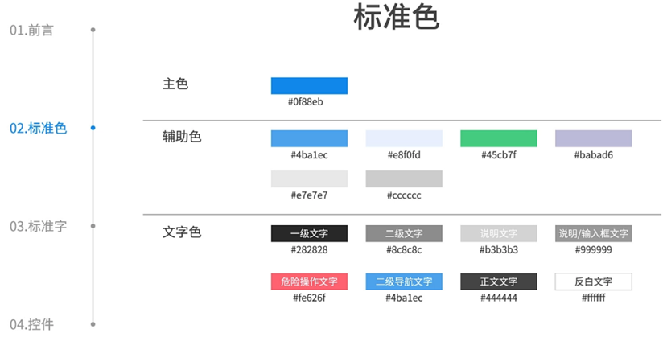
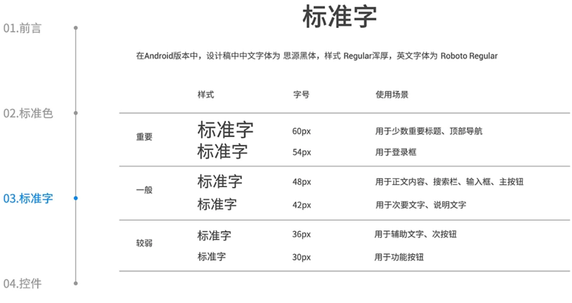
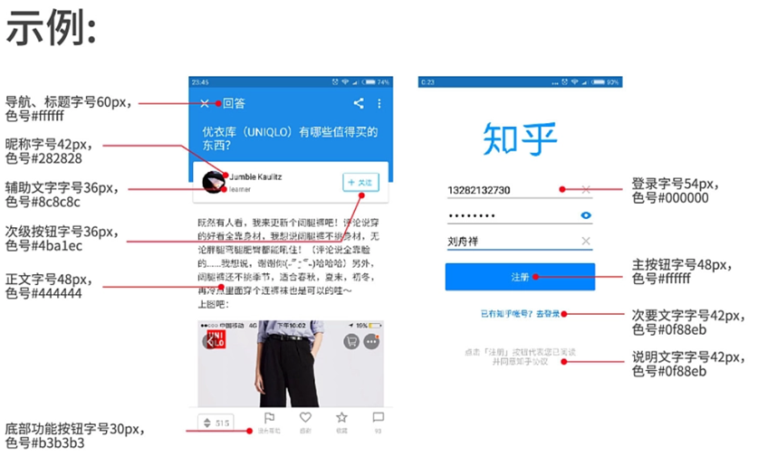
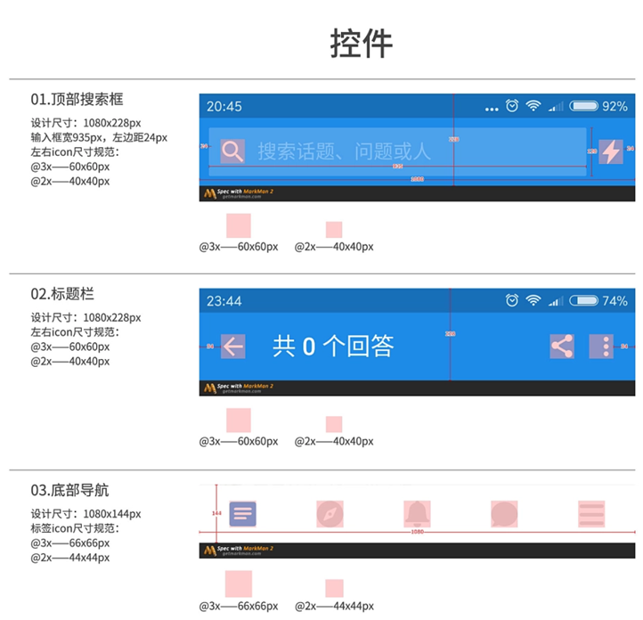
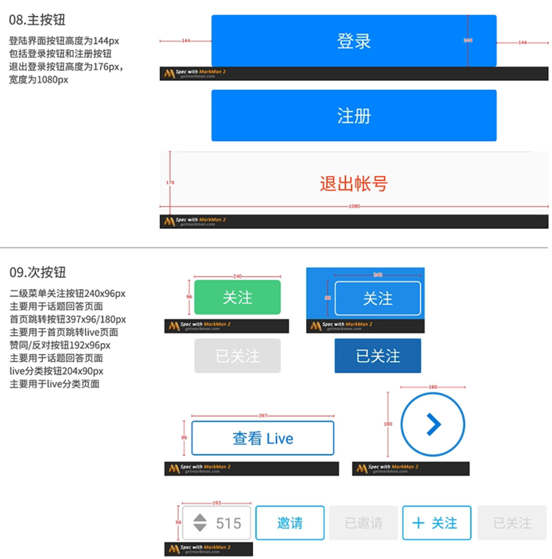
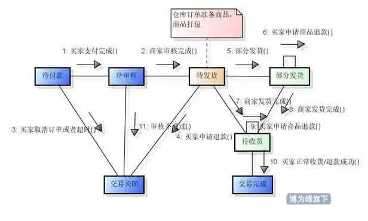

## 易用性测试

### 易用性的定义
- 易用性是指软件产品被理解、学习、使用和吸引用户的能力。
- 特点：
  - 易理解性：软件产品使用户能理解软件是否合适以及如何能将软件用于特定的任务和使用环境的能力
  - 易学习性：软件产品使用户能学习它的能力
  - 易操作性：软件产品使用户能操作和控制它的能力
  - 吸引性：软件产品吸引用户的能力
  - 依从性：软件产品依附于易用性相关的标准、规定、指南的能力

### 易用性测试
- 目的：增加软件操作的简易性，让用户容易接受软件，方便用户的日常使用
- 内容：易用性测试不仅针对应用程序，而且还包含对用户手册等系列文档的测试
- 准则：
  - 一切以用户为中心
  - 软件测试需要把自己当作用户去找UI中的问题
  - 邀请陌生人使用软件，进行测试

### 人体工程学
- 定义：研究“人-机-环境”系统中人、机、环境三大要素之间的关系，为解决该系统中人的效能、健康问题提供理论与方法的科学
- 目标：提高易用性

## 优秀的UI长什么样

### 用户界面（UI）
- 定义：用户与软件交互的方式称为用户界面或UI
- 用户界面的意义（用户评价软件的重要依据）
  - 界面的好坏决定用户对软件的第一印象
  - 界面如同人的面孔，具有吸引用户的直接优势
- 优秀的用户界面
  - 能够引导用户自己完成相应的操作，起到向导的作用
  - 能够给用户带来轻松愉悦的感受和成功的感觉
- 不好的用户界面
  - 由于界面设计的失败，让用户有挫败感，再实用强大的功能都可能在用户的畏惧与放弃中付诸东流

### 软件用户界面
所有软件都有某种UI，我们最为熟悉的是图形用户界面（GUI）除了图形用户界面外，还有很多种UI
- 早期计算机的触发开关和发光二极管
- 上世纪60、70年代最流行的纸带、和电传打字机
- 1981年面世的MS-DOS命令行

### 一个优秀的UI应该具有以下七个要素
1. 符合标准和规范
2. 直观性
3. 一致性
4. 灵活性
5. 舒适性
6. 正确性
7. 实用性

#### ①符合标准和规范
符合标准和规范是最重要的用户界面要素
- 如果测试的是应用程序，则根据标准或规范进行易用性测试。
- 如果测试的是平台软件，则只能根据测试经验或感觉进行测试。

#### ②直观
- 用户界面是否洁净、不唐突、不拥挤？
- 是否允许用户轻松地从一个功能转移到另一个功能？
- 任何时候都可以决定放弃或者退回、退出吗？
- UI的组织和布局合理吗？
- 有多余功能吗？
- 如果其他所有努力失败，帮助系统能帮忙吗？

#### ③一致
- 用户在应用程序中能体会到风格、操作上的一致
- 用户的使用习惯：希望对一个程序的操作方式能够带到另一个程序中

**游戏的按键问题**
现在的人们玩游戏都已经习惯了WSAD控制行走，所以这基本成了游戏界行规，一旦更改，用户将觉得很不适应。

#### ④灵活
- 支持多种视图的选择
- 支持多种状态灵活跳转
- 数据输入和输出的多种方式

**测试方法**
- 发挥“好奇心”的特性
- 跳出常规
- 不走寻常路

**灵活带来的问题**
提高了程序和测试的复杂性

#### ⑤舒适
舒适性要素是模糊的，主要体现在
- 恰当
- 错误处理
- 性能

功能性动效，指的是在UI设计中作为功能的一部分被采用的小动效，有着非常明确和合理的目的。
- 减轻认知的负担
- 防止发生变化时看漏（Change Blindness）

**提交按钮**：
当用户点击提交按钮，在成功之前通过一点点加载动画来显示。加载对号的动效，使用户感觉过程已经成功完成。

**进度条**：
上传和下载数据的过程是采用功能性动效的一个好机会。有动效的加载栏，可以直观地看到动作加载完成预计还要多少时间。

**下拉刷新**：
下拉刷新这一技术，让我们尝试在操作瞬间作出反应。告诉用户“你的进程已经开始”，最重要的是给予用户视觉反馈。

#### ⑥正确
- 市场定位
- 语言和拼写
- 不良媒体
- WYSIWYG（所见即所得）

#### ⑦实用
是否实用是优秀用户界面的最后一个要素

## 辅助选项测试——为有残疾障碍的人员测试

### 关于残疾人使用软件的调查
视力损伤，听力损伤，运动损伤，认知和语言障碍等对使用计算机和软件会造成极大的困难。
- 英国高科技厂商Nomensa对20个国家100个流行网站研究发现许多网站不符合国际访问标准。
- 使用不带解释性文字的图像。
- 没有考虑盲人如何能阅读软件或“看到”图像。
- 颜色搭配不够好，给患有眼疾的用户访问网页带来困难。

### 辅助选项测试的意义
- 道德要求：残疾人数量庞大
- 法律要求：对于开发残疾人可以使用的软件有相关法律规定
