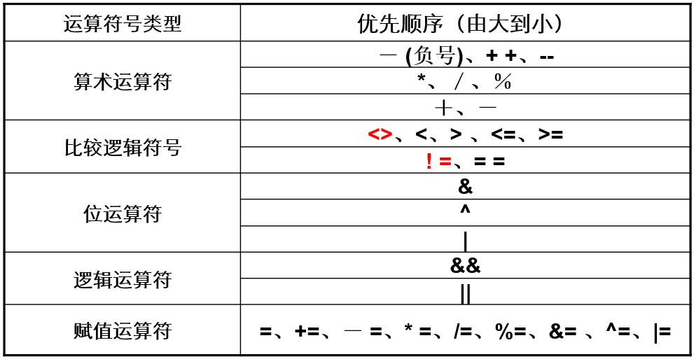
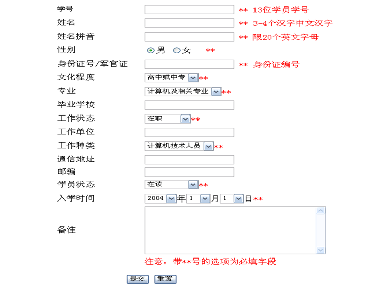

## 第一个JavaScript程序
javascript代码直接写在页面中(.html/.jsp/.asp等)，一般习惯放在`<HEAD>`及`</HEAD>`的卷标之中，事实上放在任意地方都可以，脚本需放在`<SCRIPT></SCRIPT>`标签中，其中language属性可以是JavaScript、VBScript或是Jscript。

```html
<HTML>

<HEAD></HEAD>

<BODY>
    <SCRIPT LANGUAGE="JavaScript">
        document.write("这是以JavaScript输出的!")
    </SCRIPT>
</BODY>

</HTML>
```


## JavaScript函数
脚本写在function中或写在function之外有差别吗？
- 前者会自动顺序执行；
- 而后者须等事件发生后或被其他函数调用时才会执行；
- 如果是要对使用者所作的动作作一些判断的话，就应把脚本写在function之中。

```html
<HTML>

<HEAD>
    <SCRIPT LANGUAGE="JavaScript">
        function getResult(iNum) { var iTemp = iNum * iNum; document.write(iTemp); }
    </SCRIPT>
</HEAD>

<BODY>
    <SCRIPT LANGUAGE="JavaScript">
        getResult(8);
    </SCRIPT>
</BODY>

</HTML>
```

### return
功能：把函数的执行结果返回

例：
```javascript
// 假设有下列的一个自定函数
function half(x) { return x / 2; }
// 当程序执行了下列调用：
y = half(4);
// 此时half函数中的x值便是4，而其执行结果4/2=2便会返回给y，变量y的值便是2。
```


## JavaScript的运算符



## JavaScript的控制语句
- if else
- switch case
- for循环
- while循环
- break语句
- continue语句


## JavaScript对象

### Math
- 常量：E、PI、SQRT2等
- 基本函数：abs函数、ceil函数、floor函数、log函数、exp函数、max函数、min函数、sqrt函数、round函数、random函数等

### string
字符串处理函数：length函数、charAt函数、indexOf函数、substring函数、toLowerCase函数、toUpperCase函数等。

### history
- back()：回到上一页
- forward()：回到下一页
- go(n)：到任意页
  - -1：上一页
  - 0：重新读取
  - 1：下一页

### window
- alert方法
- confirm方法
- close方法
- open方法：`window.open(地址,窗口名称,[窗口特征])`
- 页面跳转：`window.location.href=xxx`


## 页面元素——form对象

### form属性（共有7个）
- 名称(name)
- 传递程序(action)
- 参数传递方法(method)
- 编码方式(encoding)
- 输出窗口(target)
- 窗口对象(elements)
- 输入对象个数(length)

### form方法
- submit方法（表单提交）
- reset方法（表单重置）

### form事件
- onSubmit（提交事件）
- onReset（重置事件）


## form中的对象
在窗口中一共有text、radio、hidden、checkbox、select、password、textarea、button、reset、submit等10种对象。

### form中对象的常用属性：
- name：对象的名称，是所有对象的有效属性
- value：基本上这个属性是用户在窗口上所输入的数据
  - 第一类：text、textarea、password
  - 第二类：select
  - 第三类：button、reset、submit
  - 第四类：radio、checkbox
  - 第五类：hidden
- length：可得到radio/checkbox/select（以群为单位）的选项个数
- checked：radio与checkbox的选项的选中状态（true/false）
- options：select元素中选项构成的集合
  - selected：select元素中选项的选中状态（true/false）
  - text：select元素中选项的显示内容
  - value：select元素中选项的值
  - `s.options[i].text/value/selected`

### form中对象上的事件：
- onclick：当对象被按下后发生的事件,可产生此事件的对象有submit/button/reset/radio/checkbox
- onfocus：当对象变为当前输入项时发生的事件，可产生此事件的对象有select/text/textarea/password
- onblur：当对象失去焦点时发生的事件，可产生此事件的对象有select/text/textarea/password
- onchange：当一个输入值被更改的时发生的事件，可产生此事件的对象有text/textarea/password/select


## 综合——数据合法性校验

