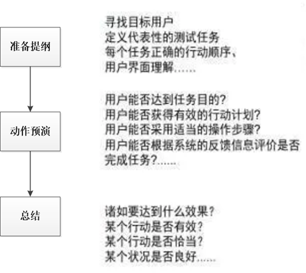
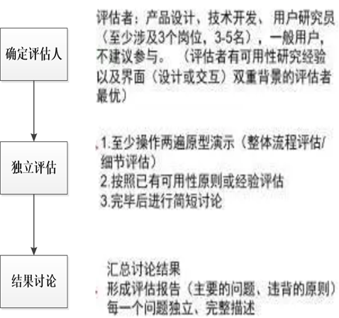
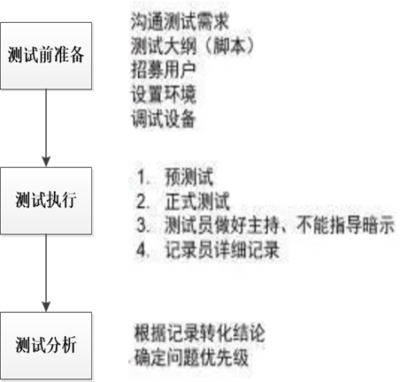
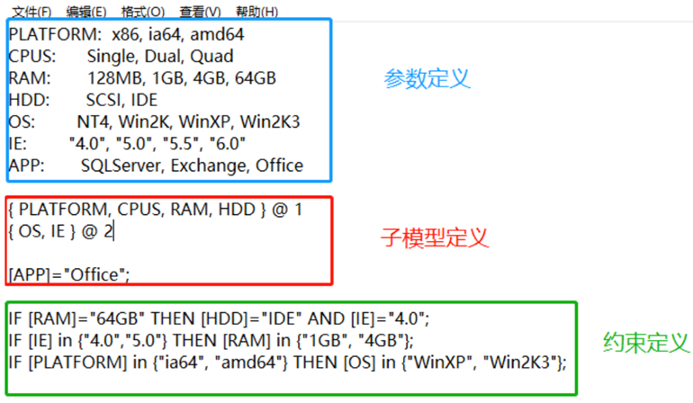
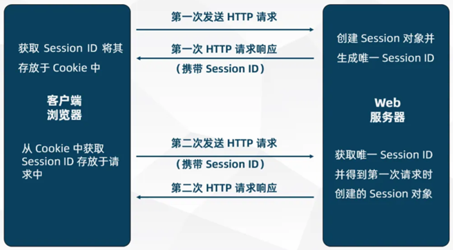
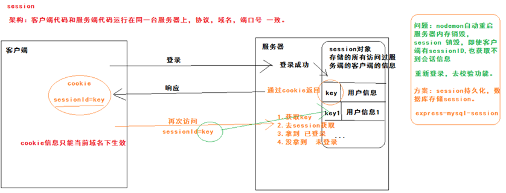
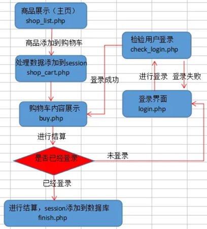
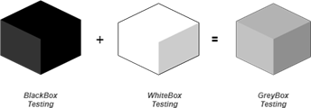
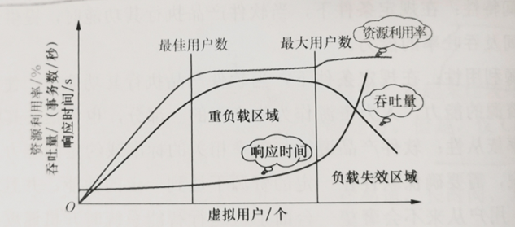

## 网站测试概述
网站测试是指的当一个网站制作完上传到服务器之后，针对网站的各项指标的一项检测工作。

测试种类
- ①可用性测试
- ②兼容性测试
- ③功能测试
- ④性能测试
- ⑤安全性测试

测试方法
- 黑盒测试
- 白盒测试
- 灰盒测试

### ①可用性测试
可用性是指在特定环境下，产品为特定用户用于特定目的时所具有的有效性、效率和主观满意度。

网站可用性：
- 导航
- 内容（文本、图片...）
- 界面
- ...

导航测试
- 导航是否直观？
- 系统的主要部分是否通过主页转到？
- 系统的页面结构、导航、菜单、连接的风格是否一致？
- 应用系统导航帮助要尽可能的准确？

可用性测试的常见方法
- 认知预演（Cognitive Walkthroughs）
- 启发式评估（Heuristic Evaluation）
- 用户测试法（User Test）
  - 实验室测试
  - 现场测试

#### 认知预演
- 该方法优点在于能够使用任何低保真原型，包括纸原型。
- 该方法缺点在于：评价人不是真实的用户，不能很好地代表用户。

#### 启发式评估
- 由多位评价人（专家）根据可用性原则反复浏览系统各个界面，独立评估系统后讨论各自的发现，共同找出可用性问题。
- 优点：专家决断较快、使用资源少，能够提供综合评价；
- 不足之处：
  - 会受到专家的主观影响；
  - 没有规定任务，会造成专家评估的不一致；
  - 是专家评估与用户的期待存在差距，所发现的问题仅能代表专家的意思

#### 用户测试法
- 让用户真正地使用软件系统，由实验人员对实验过程进行观察、记录和测量。该方法可以准确反馈用户的使用表现、用户的需求，是一种非常有效的方法。用户测试可分为实验室测试和现场测试。
  - 实验室测试是在可用性测试实验室里进行的
  - 现场测试是由可用性测试人员到用户的实际使用现场进行观察和测试。

可用性问题分级
- 五级划分
  - 5：无关紧要的错误
  - 4：问题虽小但却让用户焦躁
  - 3：中等程度，耗费时间但不会丢失数据
  - 2：导致数据丢失的严重问题
  - 1：灾难性错误，导致数据的丢失或者软硬件的损坏
- 三级划分
  - 低：会让参加者心烦或沮丧，但不会导致任务失败。
  - 中：与任务的失败有一定关系但不直接导致任务的失败。
  - 高：直接导致任务失败的问题。

#### 可用性测试注意事项
- 你测试的是产品，而不是使用者。当用户不能按预期完成任务时，需要改变的是产品而非用户。
- 更多地依靠用户的表现（操作，使用时间，错误率等），而不是他们的偏好（主观态度，满意度评价等）。
- 基于用户体验，找出问题的最佳解决方法。

### ②配置/兼容性测试
- 对Web程序与硬件、软件之间的兼容性的测试。
- 关注点：
  - 平台
  - 浏览器
  - 分辨率
  - 打印机
  - 组合测试
  - ...

#### 平台
- 主要指的是不同的操作系统或者相同的操作系统的不同版本。
- PC
  - Windows
  - MacOS
  - Linux
- 移动平台
  - Android
  - IOS

浏览器：来自不同厂商的浏览器对Java、JavaScript、 ActiveX或不同的HTML规格有不同的支持。

你可以建立测试矩阵或借助工具（如PICT）

### ③功能测试
- 功能测试就是对产品的各功能进行验证，根据功能测试用例，逐项测试，检查产品是否达到用户要求的功能。
- 关注点：
  - 链接测试
  - 表单测试
  - Session&cookies测试
  - 数据库测试
  - ...

#### 链接测试
它是在页面之间切换和指导用户去一些不知道地址的页面的主要手段。链接测试可分为三个方面：
1. 所有链接是否按指示的那样确实链接到了该链接的页面
2. 所链接的页面是否存在。
3. 保证Web应用上没有孤立的页面（所谓孤立页面是指没有链接指向该页面，只有知道正确的URL地址才能访问）。

#### 表单测试
表单就是需要在线显示和填写的表格。
- 用户注册、登录、信息提交等，校验提交给服务器的信息的正确性、合法性。
- 检查相关联的数据或默认值显示是否正确。
- 如系统只接受限定以内的字数，测试时可以测试内外边界值，看系统是否可正确反应。

#### session&cookies测试
session是服务器端的一个集合，可以存储在一次会话过程中的用户信息。

session的工作原理

例：使用session实现用户身份验证

例：使用session实现购物车功能

#### 数据库测试
- 测试数据正确性、完整性、有效性。
- 关注点：
  - 数据库的设计概念、数据库的风险评估；
  - 安全控制机制；
  - 数据的维护更新和升级过程；
  - 并发时的可操作性；
  - 确保数据库操作能够有足够的空间处理数据。

#### 功能测试方法
- 黑盒测试
- 白盒测试
- 灰盒测试

**灰盒测试**

它是两者的结合，因为它需要对内部编码访问以构建测试用例

例子：
1. 如果测试人员在测试网站时单击链接并遇到错误，灰盒测试人员可以更改 HTML 代码以验证问题。
2. 假设网页收到错误代码“内部服务器错误 500”，使用此信息，测试人员可以进一步调查问题并向开发人员提供详细信息，而不是简单地向他们报告。
3. 测试人员可以检查日志文件以确定问题的根本原因。

### ④性能测试
- 很多软件都有特定的性能或效率目标，这些特性描述为在特定负载和配置环境下程序的响应时间、吞吐率、资源占用率。应设计测试用例来说明程序不能满足其性能目标。
  - 并发用户数（负载）：是指系统同时承载的用户数量。
- 性能指标
  - 响应时间是指系统对请求作出响应的时间。
  - 吞吐量是指系统在单位时间内处理请求的数量。
  - 资源利用率反映在一段时间内资源平均被占用的情况。

#### 测试类型
- 负载测试：是通过逐步增加系统负载，测试系统性能的变化，并最终确定在满足性能指标的情况下，系统所能承受的最大负载量的测试。
- 压力测试：压力测试是给软件不断加压，强制其在极限的情况下运行，观察它可以运行到何种程度，从而发现性能缺陷。压力测试强调系统的稳定性。

#### 性能测试自动化工具
- Jmeter
- LoadRunner
- ...

### ⑤安全性测试
- 设计测试用例来突破程序安全检查。
- 关注点：
  - 登录测试：必须测试有效和无效的用户名和密码，还需要注意到是否大小写敏感，可以测试多少次的登录限制，是否可以不登录而直接浏览某个页面。
  - 日志文件：用于记录系统操作事件的文件或文件集合。具有处理历史数据、诊断问题的追踪以及理解系统的活动等重要作用。
  - 超时限制
  - ...
