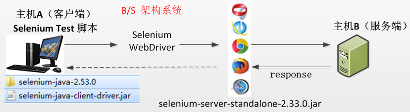
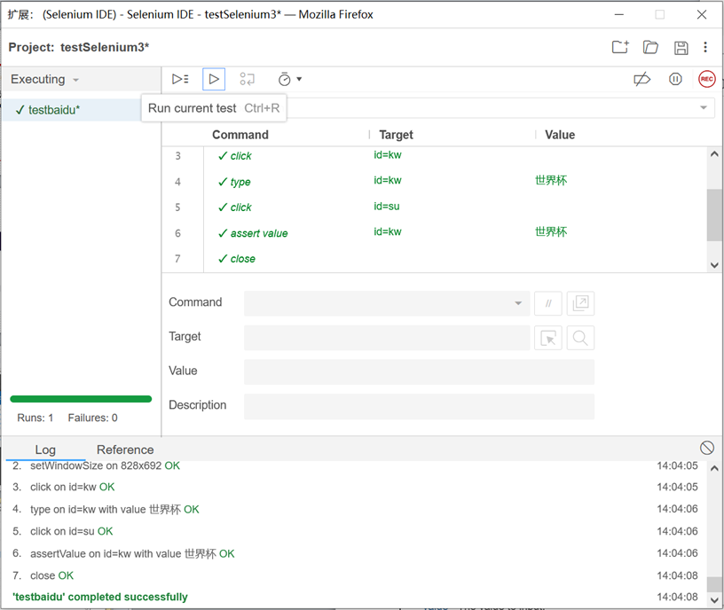

## Selenium简介
Selenium是一款基于web应用的开源测试工具，是ThoughtWorks为Web应用编写的一个验收测试工具。
- 开源、免费、轻量、简单、灵活
- 支持分布式测试用例执行
- 多浏览器支持：Firefox、Chrome、IE
- 多平台支持：Linux、window、MAC
- 多语言支持：Java、Python、Ruby、Php、C#
- Selenium IDE提供录制功能


## Selenium2.0
- WebDriver一个轻便简洁的自动化测试框架。调用系统设备操作，模拟用户真实浏览器操作。
- 简洁的API，支持多操作系统，多语言，多浏览器。
- Selenium2.0进行了架构的调整和升级：Selenium2.0 = Selenium1.0 + WebDriver


## Selenium2.0工作原理
- 客户端(也就是测试脚本)创建1个session，在该session中通过http向remote server发送请求；
- remote server解析请求，完成相应操作并返回response；
- 客户端接受response，分析其返回值以决定是否继续还是结束脚本。




## Selenium自动化测试开发框架
| 工具            | 说明                                                                                                                                         |
| --------------- | -------------------------------------------------------------------------------------------------------------------------------------------- |
| Junit/TestNg    | 开发源代码的Java测试框架，用于编写和运行可重复的测试                                                                                         |
| Selenium IDE    | 在Firefox上录制脚本                                                                                                                          |
| Selenium server | SeleniumRC，Selenium Remote Control缩写，是使用具体的语言来编写测试类，下载Selenium-server-standalone3.9.1.jar，导入到Eclipse工具的libraries |
| Eclipse         | Java开发工具                                                                                                                                 |
不同浏览器使用对应的驱动文件，并且浏览器的版本与驱动文件的版本有对应关系。
- Firefox：geckodriver.exe
- IE:IEDriverServer.exe
- Chrome：chromedriver.exe


## Selenium IDE



## Selenium WebDriver - API

### WebDriver提供的控制浏览器API
- 打开firefox浏览器：WebDriver driver = new FirefoxDriver();
- 打开IE浏览器：WebDriver driver = new InternetExplorerDriver ();
- 打开chrome浏览器：WebDriverdriver = new ChromeDriver();
- 最大化浏览器：driver.manage().window().maximize();
- 关闭浏览器：driver.close(); 或 driver.quit();
- 打开Url地址：driver.get("http://www.google.com");

### WebDriver提供的元素定位方法
```java
Driver.findElement(By.name("xxx"))
Driver.findElement(By.id("xxx"))
Driver.findElement(By.xpath("xxx"))
Driver.findElement(By.tagName("xxx"))
Driver.findElement(By.linkText("xxx"))
Driver.findElement(By.className("xxx"))
Driver.findElement(By.cssSelector("xxx"))
Driver.findElement(By.partialLinkText("xxx"))
```

#### 定位元素举例

##### By.name()
```html
<button id="gbqfba" aria-label="Google Search" name="btnK" class="buttonStyle"></button>
```

```java
WebElement searchBox = driver.findElement(By.name("btnK"));
```

##### By.id()
```java
WebElement searchBox = driver.findElement(By.id("gbqfba"));
```

##### By.className()
```java
WebElement searchBox =  driver.findElement(By.className("buttonStyle"));
```

##### By.tagName()
在使用tagName方法进行定位时，需要注意通常有些HTML元素的tagName是相同的。
```java
List<WebElement> allInputs =driver.findElements(By.tagName("input"));
for(WebElement e: allInputs) {
  if(e.getAttribute("type").equals("text")) {
    System.out.println(e.getText().toString()); //打印出每个文本框里的值
  }
}
```

##### By.linkText()
通过超文本链接上的文字信息来定位元素，这种方式一般专门用于定位页面上的超文本链接。
```html
<a href="/intl/en/about.html">About Google</a>
```

```java
WebElement aboutLink = driver.findElement(By.linkText("AboutGoogle"));
```

##### By.partialLinkText()
这个方法是上一个方法的扩展。当你不能准确知道超链接上的文本信息或者只想通过一些关键字进行匹配时，可以使用这个方法来通过部分链接文字进行匹配。代码如下：
```java
WebElement aboutLink = driver.findElement(By.partialLinkText("About"));
```

##### By.xpath()
- 这个方法是非常强大的元素查找方式，使用这种方法几乎可以定位到页面上的任意元素。
- XPath是XML Path的简称，由于HTML文档本身就是一个标准的XML页面，所以我们可以使用XPath的语法来定位页面元素。

```html
<html>
<body>
  <form id="loginForm">
    <input type="text" name="username" />
    <input type="password" name="password" />
    <input type="submit" value="Login" />
    <input type="reset" value="Clear" />
  </form>
</body>
</html>
```

- 引用页面上的form元素(即源码中的第3行)：`/html/body/form[1]`
- Xpath相对路径引用写法：
  - 查找页面根元素：`//`
  - 查找页面上所有的input元素：`//input`
  - 查找页面上第一个form元素：`//form[1]`
  - 查找页面上id为loginForm的form元素下的第一个input元素：`//form[@id='loginForm']/input[1]`

> 一般不推荐使用绝对路径的写法，因为一旦页面结构发生变化，该路径也随之失效，必须重新写。

##### By.cssSelector()
cssSelector这种元素定位方式跟xpath比较类似，但执行速度较快，而且各种浏览器对它的支持都相当到位，所以功能也是蛮强大的。

下面是一些常见的cssSelector的定位方式：
- 定位id为flrs的div元素，可以写成：`#flrs`
  - 注：相当于xpath语法的`//div[@id='flrs']`
- 定位id为flrs下的a元素，可以写成 `#flrs > a`
  - 注：相当于xpath语法的`//div[@id='flrs']/a`
- 定位id为flrs下的href属性值为/forexample/about.html的元素，可以写成：`#flrs > a[href="/forexample/about.html"]`
- 如果需要指定多个属性值时，可以逐一加在后面，如`#flrs > input[name="username"][type="text"]`。

可以利用`^`用于匹配一个前缀，`$`用于匹配一个后缀，`*`用于匹配任意字符。例如：
- 匹配一个有id属性，并且id属性是以”id_prefix_”开头的超链接元素：`a[id^='id_prefix_']`
- 匹配一个有id属性，并且id属性是以”_id_sufix”结尾的超链接元素：`a[id$='_id_sufix']`
- 匹配一个有id属性，并且id属性中包含”id_pattern”字符的超链接元素：`a[id*='id_pattern']`

#### 定位元素出错常见情况
**动态id定位不到元素**
```java
//WebElement xiexin_element = driver.findElement(By.id("_mail_component_82_82"));
WebElement xiexin_element = driver.findElement(By.xpath("//span[contains(.,'写 信')]"));
xiexin_element.click();
```

上面一段代码注释掉的部分为通过id定位element的，但是此id“_mail_component_82_82”后面的数字会随着你每次登陆而变化，此时就无法通过id准确定位到element。
所以推荐使用xpath的相对路径方法查找到该元素。

**页面加载延时问题**
```java
//用WebDriverWait和until实现显示等待 等待欢迎页的图片出现再进行其他操作
WebDriverWait wait = (new WebDriverWait(driver,10));
wait.until(new ExpectedCondition<Boolean>(){
    public Boolean apply(WebDriver d){
        boolean loadcomplete = d.switchTo().frame("right_frame").findElement(By.xpath("//center/div[@class='welco']/img")).isDisplayed();
        return loadcomplete;
    }
});
也可以自己预估时间通过Thread.sleep(5000);//等待5秒 这个是强制线程休息
```

#### 元素定位方法总结
- 当页面元素有id属性时，最好尽量用id来定位。但由于现实项目中很多程序员其实写的代码并不规范，会缺少很多标准属性，这时就只有选择其他定位方法。
- xpath很强悍，但定位性能不是很好，所以还是尽量少用。如果确实少数元素不好定位，可以选择xpath或cssSelector
- 当要定位一组元素相同元素时，可以考虑用tagName或name。
- 当有链接需要定位时，可以考虑linkText或partialLinkText方式。

### WebDriver提供的页面元素操作API

#### 输入框（text field or textarea）
```java
WebElement element = driver.findElement(By.id("xxx"));
element.sendKeys("test");//在输入框中输入内容
element.clear();//将输入框清空
```

#### 按钮 （ button ）
```java
WebElement btn= driver.findElement(By.id("xxx"));
btn.click();//点击按钮
btn.isEnabled ();//判断按钮是否enable
```

#### 下拉选择框（select）
```java
Select select = new Select(driver.findElement(By.id("xxx")));
select.selectByIndex(1);//index从0开始
select.selectByVisibleText("A");
select.selectByValue("1");
select.deselectAll();
select.deselectByValue("1");
```

#### 单选项（Radio Button）
```java
WebElement radio = driver.findElement(By.id("xxx"));
radio.click();//选择某个单选项
radio.clear();//清空某个单选项
radio.isSelected();//判断某个单选项是否已经被选择
```

#### 多选项（checkbox）
```java
WebElement checkbox = driver.findElement(By.id("xxx"));
checkbox.click();
checkbox.clear();
checkbox.isSelected();
checkbox.isEnabled();
```

#### 弹出对话框（Alert、Confirm）
```java
Alert alert = driver.switchTo().alert();//可以在窗口、对话框间切换
alert.accept();//确定
alert.dismiss();//取消
alert.getText();//获取文本
```

#### 表单（Form）
```java
WebElement approve = driver.findElement(By.id("approve"));
approve.click();
approve.submit();//只适合于表单的提交
```

#### 上传文件
```java
WebElement fileUpload= driver.findElement(By.id("xxx"));
String filePath = "C:\\test\\uploadfile\\test.jpg";
fileUpload.sendKeys(filePath);
```

#### Windows 和 Frames之间的切换
```java
driver.switchTo().defaultContent();//返回到最顶层的frame/iframe
driver.switchTo().frame("leftFrame");//切换到某个frame：
driver.switchTo().window("windowName");//切换到某个window
```

#### 调用Java Script
```java
Web driver对JavaScript的调用是通过JavascriptExecutor来实现，如：
JavascriptExecutor js = (JavascriptExecutor) driver;
js.executeScript("JS脚本");
```

#### 超时设置
```java
//识别元素时的超时时间
driver.manage().timeouts().implicitlyWait(10,TimeUnit.SECONDS);
//页面加载时的超时时间
driver.manage().timeouts().pageLoadTimeout(10, TimeUnit.SECONDS);
//异步脚本的超时时间
driver.manage().timeouts().setScriptTimeout(10, TimeUnit.SECONDS);
```


## Selenium+
+ Junit
+ Jmeter：JMeter通过WebDriver Sampler plugin与Selenium集成，能够以多线程方式运行Selenium测试。
