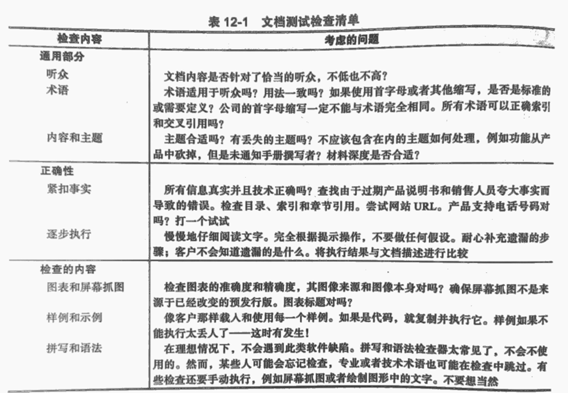

软件产品由大量的非软件部分组成——主要是文档

## 软件文档的类型
1. 包装文字和图形。包括盒子，纸箱和包装纸。可能包含软件的屏幕抓图，功能列表，系统要求，版本信息等。
2. 市场宣传材料、广告以及其他插页。
3. 授权注册登记表。这是客户注册软件时填写并寄回的卡片，也可以作为软件的一部分，显示在屏幕上让用户阅读、认可，并完成联机注册。
4. EULA。发音为"you-la"，代表最终用户许可协议。
5. 标签和不干胶。可能出现在媒体，包装盒或者打印材料上。
6. 安装和设置向导。对于复杂软件，还可以是完整的手册。
7. 用户手册/联机帮助。联机手册的实用性和灵话性使打印的手册不如以前常用了。联机帮助有索引和搜索功能，用户查找所需信息更加容易。
8. 样例、示例和模板。例如某些文字处理程序带有表单或者样例，用户只需填写内容即可快速创建具有专业外观的结果。编译器可能用小段代码来演示如何使用编程语言的某些方面。
9. 错误提示信息。这些在本书中作为常常忽略的部分多次讨论过，它们属于文档一类。

## 文档测试的重要性
- 软件用户把这些独立的非软件部分当做整个软件的一部分。他们不管这些东西是由程序员、作家还是图形艺术家创建的，他们关心的是整个软件包的质量。
- 注意：如果安装指导有误，或者不正确的错误提示信息把用户引人歧途，他们就会认为这是软件缺陷——软件测试员应该发现这些问题。
- 回忆软件缺陷的定义。

测试文档以下述3种方式确保产品的整体质量：
1. 提高易用性
2. 提高可靠性
3. 降低支持费用
   - 客户发现问题比早在产品开发期发现问题并修复费用高10到100倍
   - 用户有麻烦或者遇到意外情况会请示公司帮助，很昂贵
   - 好的文档通过恰当的解释、引导用户解决困难来预防这种情况

## 审查文档时要找什么
测试文档有两个等级
- 非代码：如打印出来的用户手册和包装盒。方法一般是阅读，可以视为技术编辑和技术校对，静态测试过程；     
- 文档和代码紧密结合：例如联机手册，则要进行动态测试

> 注意：无论文档是不是代码，像用户一样对待他都是非常有效的测试方法

## 文档测试的实质
- 文档常常得不到重视，预算和援助。
- 编写文档的人可能对于软件做什么不甚了解。
- 印刷文档制作要花不少的时间，可能几周，甚至几个月。

## 小结&小测验
- 说说你不能接受的文档错误。
- 测试错误提示信息属于文档测试的范围吗？
- 打开Windows画图程序，你觉得测试文档应该找什么？
- 好的文档以哪三种方式提高软件产品的质量？
