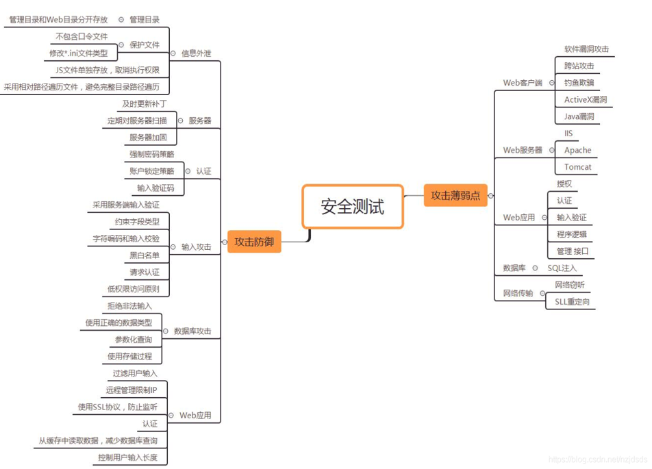
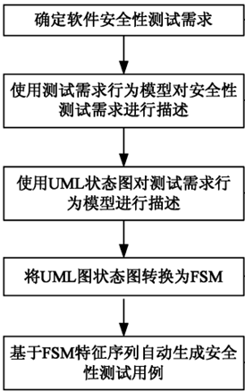
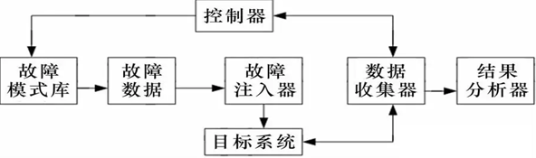
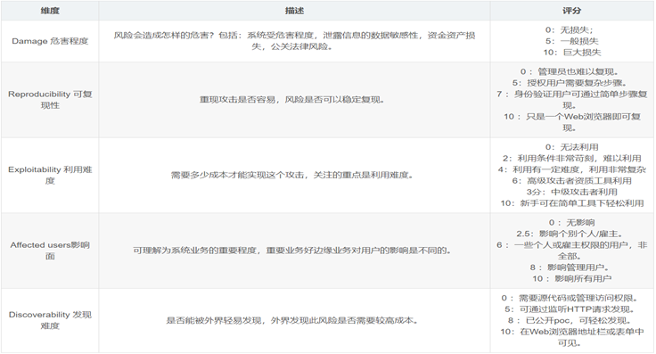
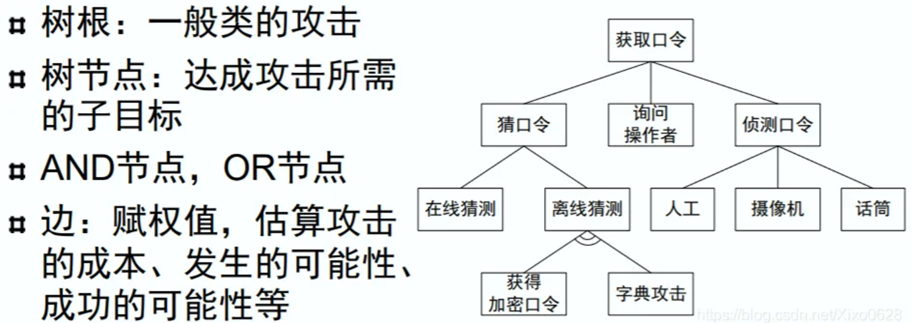
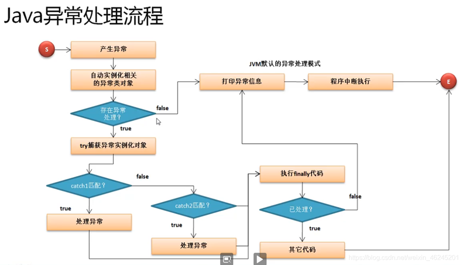
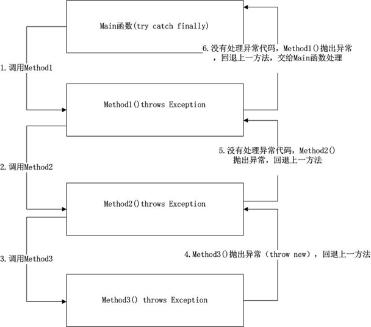
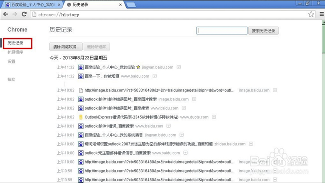
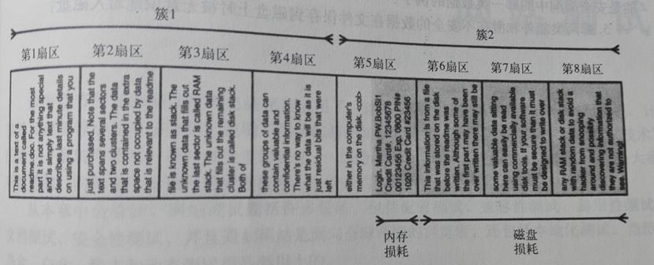
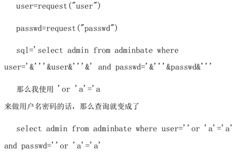

## 软件安全性测试概述

### 一个例子
大卫•莱特曼利用他的家用计算机和一个300波特的音频Modem攻入了美国政府的北美防空联合司令部计算机系统。进入后，他发现了一个叫做“全球热核战争”的游戏，他认为这仅仅是一个游戏，但其实这是一个真实场景的模拟仿真。
大卫是如何获得访问权限的呢？他在自己的电脑上编了一个程序，顺序的从例如555-0000到555-9999进行拨号，并监听对方计算机Modem的应答。如果对方是人应答，计算机就挂机。他的程序为自动运行，会逐一进行拨号，看哪一台计算机允许他登录。

### 了解动机
- 挑战/成名：纯粹为了挑战性的任务或在黑客同行中形成成功者的威望。（想象一下一个开锁匠为练习开锁技能每天晚上在邻居家随意开锁，然后在同行中进行炫耀）
- 好奇：黑客不会停止在获得访问权限上，会进一步看看里面有什么。（防止黑客在获得访问权限后进一步对有价值的数据进行访问）
- 使用/借用：这个动机下黑客的行为就不仅是攻击或进入了，黑客会为自己的目的尝试使用系统。（黑客使用许多计算机的分布式处理能力能够干更多的事，还能够有效地掩饰痕迹）
- 恶意破坏：丑化，破坏，拒绝服务（黑客借此来展示意见和想法，破坏系统数据以达到特定目的，妨碍被黑的系统执行正常的操作）
- 偷窃：最严重、最恶劣的黑客攻击，其动机是找出可以使用和出卖的有价值的东西（如信用卡号、个人信息、商品和服务等等）

### 安全性测试的定义
- 软件安全性测试是确定软件的安全特性实现是否与预期设计一致的过程；
- 软件安全性测试是在软件的生命周期内采取的一系列措施，用来防止出现有违反安全策略的异常情况和在软件的设计、开发、部署、升级以及维护过程中的潜在系统漏洞。

### 安全性测试的特点
- 安全性测试不同于传统测试类型最大的区别是，它强调软件不应当做什么，而不是软件要做什么。
- 回忆软件测试的定义。
- 功能性测试：软件做它应该做的事
  1. 应用输入，验证正确的输出
  2. 非安全性缺陷往往是违反规约，即软件应当做A，但是却做了B
- 安全性测试：软件不做它不应该做的事
  1. 应用输入，验证没有不安全的事情发生
  2. 安全性缺陷往往由软件的副作用引起，即软件应当做A，在做A的同时又做了B（如潜在数据）

## 安全性测试主要方法

### 静态分析测试（Static Analysis Security Testing）
- 静态分析是指在不执行代码的情况下对其进行评估的过程
- 主要通过对源代码进行安全扫描，根据程序中数据流、控制流、语义等信息与其特有软件安全规则库进行匹配，从中找出代码中潜在的安全漏洞。静态源代码安全测试是非常有用的方法，它可以在编码阶段找出可能存在安全风险的代码，这样开发人员可以在早期解决潜在的安全问题。
- 缺点：静态分析工具（安全规则库）存在覆盖缺口，因此存在各种风险。

### 基于模型的测试
- 基于模型的安全性测试是对软件的结构和行为进行建模，生成相应的测试模型，再由测试模型自动生成测试用例，以驱动安全性测试。
- 常用的软件测试模型（形式/半形式化模型）有限状态自动机、UML模型、马尔可夫链。
- 优点：该方法具有数学基础，能够精确的揭示不一致性、二义性和不完全性
- 缺点：开发成本较高、维护困难、状态爆炸问题

一个基于模型的测试工具的工作流程

### 基于故障注入的测试
- 故障注入是评测容错机制的一种有效方法，可以对软件的容错性、可靠性、安全性进行测试。通过人为方式将故障引入到系统当中，加速系统发生故障的过程。
- 故障注入针对应用与环境的交互点，主要包括用户输入、文件系统、网络接口、环境变量等。
- 故障注入可以有效地模拟各种异常程序行为，通过故障注入函数能强制程序进入某些特定状态，而这些状态在采用常规的标准测试技术是无法达到的。
- 虽然关于软件的故障注入测试技术虽然已经取得了很大的进展，但同时也存在故障的精确模拟、故障的有效注入、通用性和移植性等问题，仍处于探索阶段。

基于故障注入的测试工具的工作模型

### 模糊测试
- 模糊测试是一种基于黑盒的随机性测试，它通过随机的变异正常的程序输入来检测程序的响应，以发现程序中隐藏的安全漏洞。
- 模糊测试非常有效，但覆盖率比较低。
  - 设x是一个随机的32位输入
    - 语句 `z=1/(x-7)` 的除零缺陷，只有2^32分之一的概率被发现。
    - 语句 `if(x==7) then` 的then分支只有2^32分之一的概率被测试到

> 建议：从建立应用之初就考虑安全问题是上上策，只有将安全理念融入产品需求与设计中去，并以静态分析、动态测试等技术加以验证，才最有可能创造出牢固安全的软件。

## 威胁建模方法

### DREAD恐怖公式
DREAD 模型是微软提出的威胁评级模型，由五个指标量化评定：
- 潜在危害（Damage potential）：如果成功利用漏洞，可能造成的危害有多大？
- 可重现性（Reproducibility）：重现攻击的难易度如何？
- 可利用性（Exploitability）：发起攻击的难易度如何，多少成本能实现攻击？
- 受影响用户（Affected users）：大概会有多少用户受到影响？
- 发现难度（Discoverability）：发现该漏洞的难易度如何？

### Attack Trees（攻击树）
- 使用Attack Trees对威胁进行建模是应用最广泛的技术之一。
- 可以结合其他方法和框架使用（如DREAD恐怖公式）。
- Attack Trees的树根是攻击的目标，子节点是实现该目标的方法。
- 每个目标都可以表示为一棵单独的树，因此系统威胁分析会生成一组Attack Trees。

## 软件系统的安全性测试举例

### 1. 没有被验证的输入
你需要考虑的输入项包括：
- 命令行参数
- 配置文件
- 从数据库中检索出的数据（数据完整性）
- 环境变量
- 网络服务提供
- ...

#### 针对没有被验证的输入的测试方法
等价类划分你需要考虑
- 各种数据类型（字符串，整型，实数，等）
- 不同的字符集
- 最小和最大的长度
- 空输入
- 重复的输入
- 数值范围
- 特定的值

#### 防止无效输入的方法
白名单法：创建一个可接受输入值的白名单。输入值可以以相应规则组合而成，从而使有效范围大大扩大。

黑名单法：建议避免使用黑名单法。因为黑名单法只拒绝已知恶意的数据，在给定的环境下，恶意值的集合通常是难以枚举的，而且随着时间的变迁原有的清单会过时，不利于应用程序的安全。

### 2. 不恰当的异常处理
没有使用finally
- 很多人在catch语句之后不使用finally语句。由于在try语句中可能会涉及资源的申请和释放。如果在资源申请之后、资源释放之前抛出异常，就会发生资源泄露。

笼统的catch语句块 
- 有些人为了省事，只在自己模块的最外层代码包一个try语句块，然后catch(Exception)。不管捕获到什么异常，都作统一log了事。这种做法由于不能对具体的异常进行具体处理，对一些可恢复的异常，丧失了恢复的机会。

向上抛的处理办法

### 3. 缓冲区溢出（BO）
- 概念：就是你申请了一点内存，而你填入的数据超过了内存的大小，这样你填入的数据就会占用其他的内存空间（可能包含重要内容或安全代码），这种情况就是缓冲区溢出。
- 利用BO实施攻击：攻击者可以利用缓冲区溢出带来的漏洞来实施攻击或浸入，从而使计算机能够执行攻击者填入的恶意代码。例如，改变程序的返回地址（或者返回值）到攻击者想到的地址等，从而控制计算机。
- 缓冲区溢出主要影响的语言是C语言和C++
- 问题：Java语言如何避免该问题?

安全字符串函数
- 强壮的、完全测试过的、文档齐全的新函数集。
- 函数接收目标缓冲的长度作为输入。确保写入时不会超过缓冲区长度。
- 函数返回一个NTSTATUS值，只有一个值代表“成功”，调用函数能够轻易确定函数执行是否成功。

### 4. 潜在数据
潜在数据：用户变更时未被删除的保留数据叫做潜在数据。

### 5. 磁盘损耗
- 数据写到磁盘时，以块为单位（扇区），扇区又组合成簇。文件系统不同，扇区、簇大小有差别。
- 第5扇区后半部分，叫做RAM损耗。
- 第6扇区到第8扇区，叫做磁盘损耗

### 6. 拒绝服务
攻击者可以从一个或多个主机产生足够多的流量来耗尽服务的资源，最终使程序陷入瘫痪。

### 7. 注入式漏洞

## 小结&小测验
- 安全性问题是软件缺陷吗？
- 尝试在Windows应用程序中打开一个文件时出现最近使用过的文件清单，这是安全漏洞中哪一类数据的例子？
- 磁盘损耗&内存损耗?
