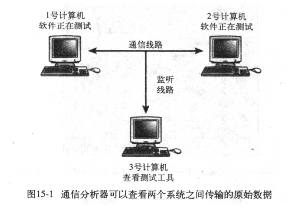
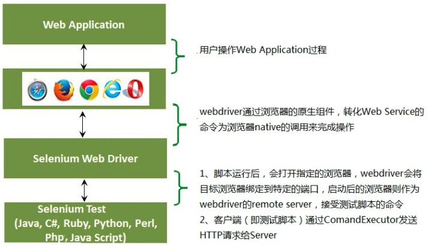
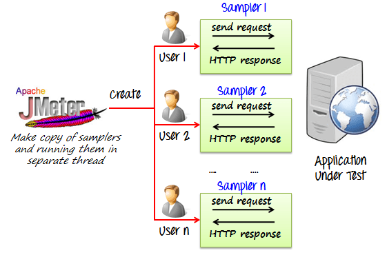
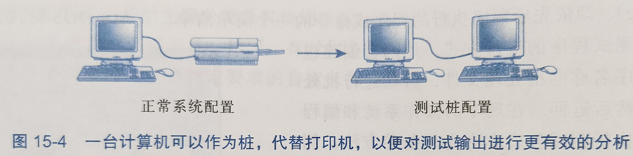
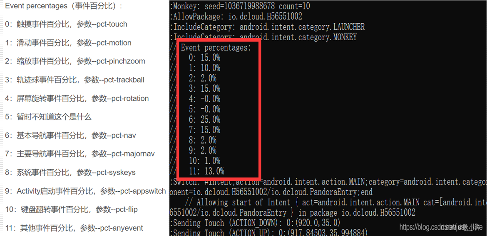
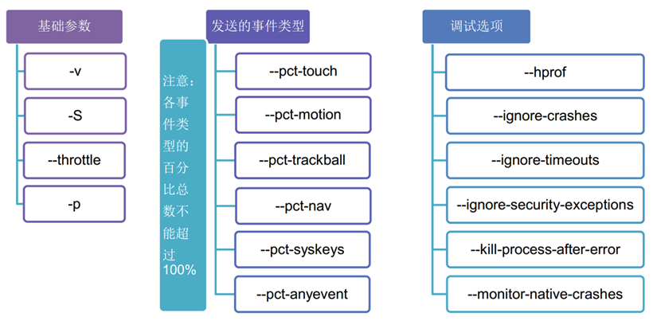

## 工具和自动化的好处

### 为什么测试工具和自动化是必须的
- 静态测试工具
- 单元测试工具Junit
- 代码覆盖率分析器Eclemma
- 性能测试工具Jmeter
- 可用性测试装备和相关软件工具
- 网站测试工具Selenium
- 组合测试工具PICT
- 测试生命周期管理工具(测试用例管理工具）
- ...

### 测试工具和自动化的好处

- 软件测试员会面对一大堆测试工具。使用工具的类型取决于测试的软件类型，以及是进行黑盒测试还是白盒测试。
- 测试工具的好处是使用时并不是总需要深入了解工具在怎样做或者做什么。假设正在测试与允许一台计算机同时与一百万台计算机连接的网络软件。即使有可能，也很难用100万个真实的连接进行可以控制的测试。但是，如果提供模拟那些连接的专用工具，则可以进行测试。

## 各种类型的测试工具（不全）

### 1. 查看器和监视器
- 查看器（viewer）或者监视器（monitor）测试工具能够看到正常情况下看不到的软件运行的细节。
- 代码覆盖率分析器是查看工具的一个例子。
- 另一种查看器的例子——通信分析器
  - 该工具允许查看通过网络或者其他通信电缆传输的原始协议数据。
  - 这种监视器也被称为“嗅探器”；
  - 思考：编译器附带的代码调试器属于查看器吗？

  

### 2. 驱动程序
- 驱动程序是控制和操作被测试软件的工具。
- 如Windows的任务管理器就兼有驱动程序的作用。
- 驱动程序的另一个例子
  - 编写程序自动产生相应的敲击键盘、鼠标操作等来控制软件。
  - 回忆一下Selenium工具，我们使用WebDriver API编写控制网页的程序。
    
  - 回忆一下Jemeter工具，我们使用取样器元件模拟各种类型的用户请求。
    

### 3. 桩程序
- 桩程序与驱动程序本质上是相反的，桩不控制或者操作备测试软件；相反，它接收或者响应软件发送的数据。
- 例如测试像打印机发送数据的软件。如果用真正的打印机测试，存在慢、浪费资源、出现错误需要人工分析。怎么办?
- 
- 航空航天领域的仿真工具
- 医疗领域的仿真工具
- ...

### 4. 压力负载工具
- 用于向被测软件增加压力和负载。
- 软件在系统资源不足的情况下，极有可能碰到许多潜在软件缺陷。
- 通过复制大量文件占满磁盘，运行大量程序耗尽内存等方法效率差、且不够恰当。

### 5. 干扰注入器
- 特点是模拟随机性行为。
- 有些程序在资源充足和资源不足的情况下都能够良好应对，但是如果系统资源忽高忽低就有可能出错。
- 如下图所示的计算机干扰测试工具，可以模拟所有由数据中断、噪声或者电缆损坏等因素导致的通信错误。
- 使用干扰注入器时，要考虑何种外部因素会影响被测软件，然后设法改变和操作这些影响因素看软件如何应对。

### 6. 分析工具
- 文字处理工具
- 电子表格工具
- 数据库软件
- 文件比较软件
- 抓屏软件
- 调试器
- 二进制-十六进制计算器
- 计时器
- 录像机或者照相机
- ...

### 7. 录制与回放工具
- 最基本的测试自动化类型是录制第一次执行测试用例时的键盘和鼠标操作，然后在需要重新执行这些测试时回放一次。
- 宏录制器和播放器是一种驱动程序工具。

### 8. 可编程的自动测试工具
- 解决灵活性问题（如等待控件加载的策略）
- 解决自动验证问题
- 解决1变n的问题
- ...

### 9. 随机测试工具
- 这类自动测试工具不是为帮助执行或者自动执行测试用例而设计的，其目标是模拟用户可能的操作。此类自动化工具称为测试猴子（test monkey）。
- 如果有足够的时间和精力，就像猴子写Shakespeare名著一样，随机输入可能打出程序员和测试员没有想到的奇特序列。
- 不停重复使用笨拙的猴子可能会暴漏内存泄露等软件缺陷，这类缺陷要在正常使用软件数小时或者数天后才能出现。

Monkey工具
- “猴子测试”是指没有测试经验的人甚至对计算机根本不了解的人（就像猴子一样）不需要知道程序的任何用户交互方面的知识，如果给他一个程序，他就会针对他看到的界面进行操作，其操作是无目的的、乱点乱按的。这种测试方式在产品周期中的早期阶段会找到很多很好的bug，为用户节省不少的时间。
- 它是Android系统自带一个命令行工具，可以运行在模拟器里或者真是设备中运行。
- monkey向系统发送伪随机的用户事件流，实现对正在开发的应用程序进行随机测试。
- 不可能使用monkey来指定做一样测试，重复做很多次。因为monkey产生的是伪随机的事件流。但是我们可以通过添加命令选项将操作限制在一定的范围内。

monkey包括很多选项，大致分以下几类：
- 基本配置选项，如设置尝试的事件数量。
- 事件类型和频率。
- 调试选项

## 测试工具的实质
- 软件变更
- 人眼和直觉是不可替代的
- 验证难以实现
- 容易过分依赖自动化
- 不要花太多时间使用达不到测试软件目的的测试工具和自动化
- 编写宏、开发工具和编制猴子都属于开发工作
- 某些工具是入侵式的，可能导致被测试的软件不正常的失败

## 小结&小测验
- 说出使用软件测试工具和自动化的一些好处？
- 使用软件测试工具和自动化需要注意的问题？
