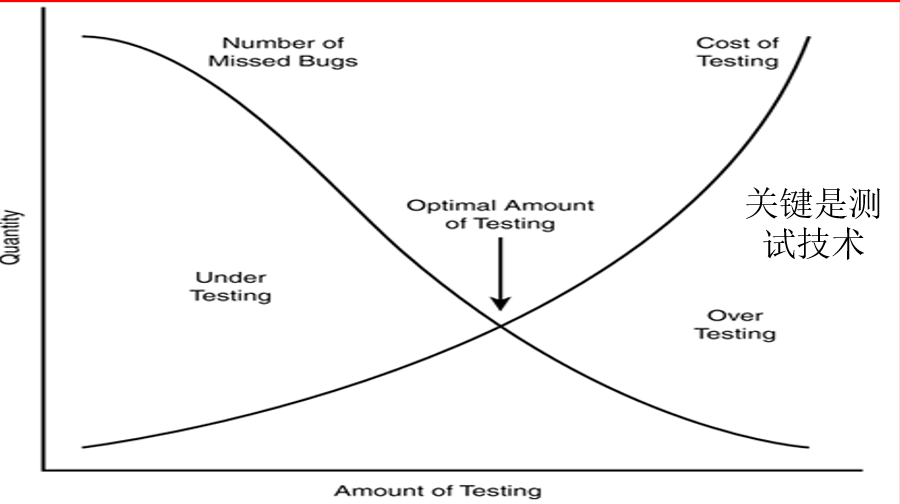
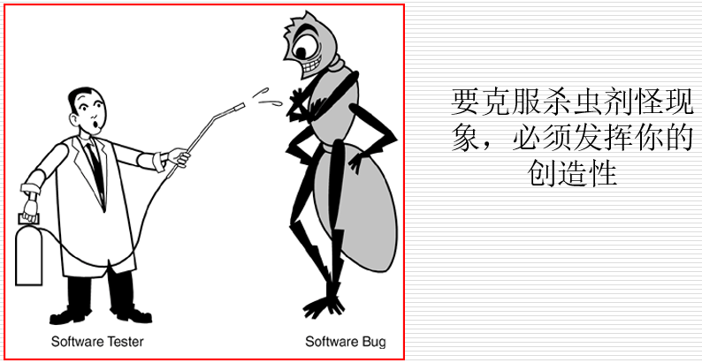
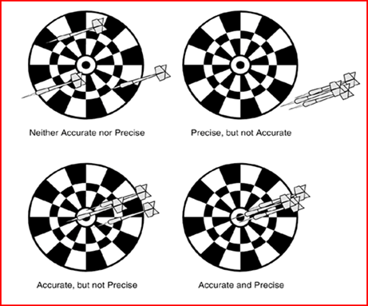

## 软件测试的特点
- 完全测试程序是不可能的
- 软件测试是有风险的行为
- 测试很难显示潜伏的软件缺陷
- 找到的软件缺陷越多，就说明软件缺陷越多
- 杀虫剂现象：软件测试越多，免疫力越强
- 并非所有软件缺陷都能修复
- 产品说明书不断变化
- 软件测试员在产品小组中不受欢迎
- 软件测试是一项讲究条理的技术工作

### 完全测试是不可能的
- 想想完全的白盒测试和完全的黑盒测试
- 以测试windows的计算器为例

### 软件测试是有风险的行为
- 做不到完全测试，就是选择冒险
- 即不能完全测试（控制成本），又要降低风险，怎么办呢？——找到最优（相对）的测试量。

### 测试无法显示潜伏的软件缺陷
- 找害虫的例子。
- 你可以报告软件缺陷存在，但不能报告软件缺陷不存在。

### 找到的软件缺陷越多，说明软件缺陷越多
- 2-8定律：巴莱多定律是19世纪末20世纪初意大利经济学家巴莱多发现的。 他认为，在任何一组事物中，最重要的只占其中一小部分，约20%， 其余80%尽管是多数，却是次要的，因此又称 2-8 定律。
  - 举例子...
- 程序员也有心情不好的时候
- 程序员往往会犯同样的错误

### 杀虫剂现象
软件测试越多，软件的免疫力越强。

### 并非所有的软件缺陷都要修复
- 不需要修复软件缺陷的原因：
  - 没有足够的时间
  - 不是真正的软件缺陷
    - 理解错误、测试错误或是说明书的变更
  - 修复的风险太大
  - 不值得修复
    - 缺陷出现在不太常用的功能中
    - 很少出现
- 归结于商业决策

### 产品说明书没有最终版本
- 行业变化快、需求变化快
- 由于软件越来越复杂、庞大，导致开发周期越来越长
- 最终导致开发周期内产品说明书不断变化
  - 增加新功能
  - 功能会发生变化或是删除

### 软件测试员在产品小组中不受欢迎
给测试员的建议：
- 早点找出缺陷
- 控制情绪
- 不要总是报告坏消息

### 软件测试是一项讲究条理的技术专业
- 生产劣质软件的成本太高
- 测试人员应该具备专业素质。
- 软件测试是一个职业选择——需要训练和规范，又发展空间。
- 回顾软件测试人员应具备的素养

## 软件测试的误区
- 调试和测试是一样的
- 测试组应当为保证质量负责
- 把测试作为新员工的一个过渡工作
- 把不合格的开发人员安排做测试
- 关注测试的执行而忽略测试的设计
- 测试自动化是万能的
- 测试是可以穷尽的
- 软件测试是证明软件不存在错误，能正确完成其预定功能的过程；没有发现错误的测试是成功的测试，发现了新错误的测试是不成功的测试
- 测试是枯燥乏味，缺乏创造力的工作

## 软件测试的术语和定义
- 精确（precision）和准确（accurate）
  

### 确认和验证
- 确认（verification）：保证软件符合产品说明书的过程。
- 验证（validation）：保证软件满足用户需求的过程。
- 例：哈勃天文望远镜
  - 哈勃在运行期间拍摄的7500张
  - 总共包含约265000个星系，有些星系已至少133亿岁
  - 帮助天文学家解决了许多天文学上的基本问题
  - 证实了爱因斯坦相对论的正确性

### 质量和可靠性
- 质量（quality）：客体的一组固有特性满足要求的程度。
  - “特性”指“可区分的特征”，如
    - 功能
    - 性能
    - 服务
    - 价格
    - 可靠性等
- 质量具有经济性、广义性、时效性、主观性、相对性
- 可靠性
  - 元件、产品、系统在一定时间内、在一定条件下无故障地执行指定功能的能力或可能性。可通过可靠度、失效率、平均无故障间隔等来评价产品的可靠性。

### 测试和质量保证（QA）
- 软件测试员的目标是尽可能早的找到软件缺陷，并确保缺陷得以修复
- 软件质量保证人员（找规律、定政策）：的主要职责是创建和执行改进软件开发过程并防止软件缺陷发生的标准和方法（要求有较高的总结、沟通与推广能力）
