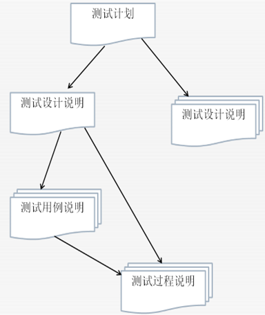
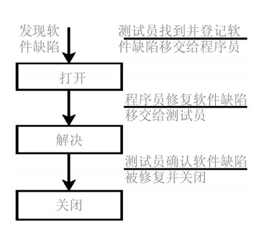
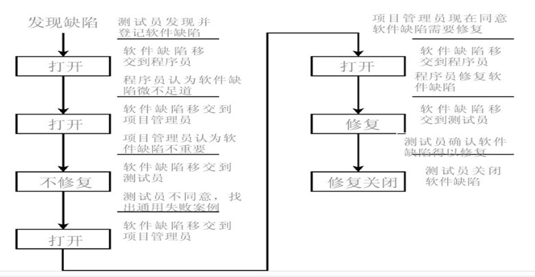
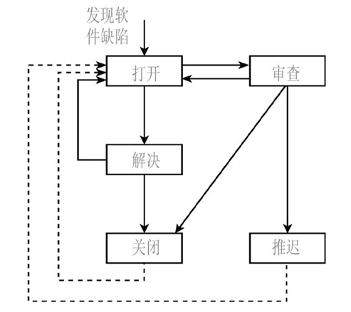

## 测试文档

### 测试文档的作用
利用精心组织地测试计划、测试用例和测试报告，对测试工作进行正确地记录以及交流，将使达到目标变得更有可能。

## 计划测试任务

### 测试计划的目标
- 软件测试计划是软件测试员与产品开发小组交流意图的主要方式。
- IEEE 的829-1998关于软件测试文档的标准以如下的方式表达了软件测试计划的目的：规定测试活动的范围、方法、资源和进度；明确正在测试的项目、要测试的特性、要执行的测试任务、每个任务的负责人、以及与计划相关的风险。
- 注意：
  1. 测试计划只是创建详细计划过程中的一个副产品，重要的是计划的过程，而不是产生的结果文档。
  2. 测试计划过程的最终目标是交流（而不是记录）软件测试小组的意图、期望，以及对将要执行的测试任务的理解。

### 测试计划的主题
1. 高级期望
2. 人、地点和事
3. 定义
4. 团队之间的责任
5. 哪些要测试、哪些不要测试
6. 测试的阶段
7. 测试策略
8. 资源需求
9. 测试员的任务分配
10. 测试进度
11. 测试用例
12. 软件缺陷报告
13. 度量和统计
14. 风险和问题

### 测试计划编写的六要素
1. Why —为什么要进行这些测试；
2. What — 测试哪些方面，不同阶段的工作内容；
3. When —测试不同阶段的起止时间；
4. Where —相应文档，缺陷的存放位置，测试环境等；
5. Who — 项目有关人员组成，安排哪些测试人员进行测试;
6. How — 如何去做，使用哪些测试工具以及测试方法进行测试。

## 编写和跟踪测试用例

### 测试用例计划
- 测试员拿到测试计划，开发出更详细的测试用例计划，并分发出去通过审查，再开始着手测试。
- 测试用例计划的重要性
  - 可组织性：测试用例有可能有很多个，甚至上千个。对于测试用例的建立往往需要很长的时间。有了好的测试用例计划，可以组织好用例，以便全体测试员和其他项目小组成员有效地审查和使用。
  - 可重复性：在项目期间有必要执行同样的测试，来寻求新的软件缺陷，保证老的软件缺陷得以修复。有正确的计划，能知道最后执行哪个测试用例及其执行情况，以便重复原有测试。
  - 可跟踪性：用于提供对测试用例的监控，实时掌握最新的测试情况
  - 测试证实：防止发布的软件实际上是不合法和危险的

- 编写测试设计说明：组织和描述针对具体特征需要进行的测试
- 编写测试用例说明：编写用于输入的实际数值和预期输出结果数值，并明确指出使用具体测试用例产生的测试程序的任何限制
- 编写测试程序（过程）说明：明确指出为实现相关测试设计而操作软件系统和试验具体测试用例的全部步骤；定义了测试测试用例的每一步操作

### 测试用例的组织&跟踪
- 为什么要组织与跟踪测试用例？
  - 计划执行哪些测试用例？
  - 计划执行多少个测试用例？执行需要多少时间？
  - 能否挑选出测试集（相关测试用例组）测试某些特性或者软件部分？
  - 在执行测试用例时，能否记录哪一个通过、哪一个失败？
  - 在失败的测试用例中，哪些在最近的一次执行时也失败了？
  - 最近一次执行测试用例时通过的百分比是多少？
  - ……
- 回答这些问题就需要有效的组织和跟踪测试用例。

### 测试用例的组织&跟踪策略
- 凭脑子记：绝对不要考虑这一种
- 书面文档：对于非常小的项目可以用纸笔来管理测试用例
- 电子表格：非常奏效的流行方法。在一个地方保存测试用例的全部细节，从而可以提供测试状态的一目了然的查看方式。容易使用，比较容易建立，可以为测试提供很好的跟踪和证明
- 自定义数据库：跟踪测试用例的理想方法是使用测试用例管理工具，一种为处理测试用例而专门编程设计的数据库。里面已经有许多完成这项任务的商业应用程序。

（自行了解和学习一种测试用例管理系统）

## 报告发现的问题

### 报告软件缺陷的基本原则
- 尽快报告软件的缺陷
- 有效描述软件缺陷
  - 短小
  - 单一
  - 明显且通用
  - 可再现
- 在报告软件缺陷时不要做评价
- 对软件缺陷报告跟踪到底

### 分离软件缺陷的建议
- 不要想当然地接受任何假设。
- 查找时间依赖和竞争条件的问题。
- 边界条件软件缺陷、内存泄漏和数据溢出等白盒问题可能会慢慢自己显露出来。
- 状态缺陷仅在特定软件状态中显露出来。
- 考虑资源依赖性和内存、网络、硬件共享的相互作用。
- 不要忽视硬件。

### 软件缺陷的分级
- 在报告软件缺陷时，一般要讲明它们将产生什么后果。测试员要对软件缺陷分类，以简明扼要的方式指出其影响。常用方法是给软件缺陷划分严重性（severity）和优先级（priority）。
- 严重性：严重性表示软件缺陷的恶劣程度，当用户碰到该缺陷时影响的可能性和程度。
- 优先级：优先级表示修复缺陷的重要程度和紧迫程度。

### 软件缺陷的严重性分级
严重性：严重性表示软件缺陷的恶劣程度，当用户碰到该缺陷时影响的可能性和程度。

对于缺陷的严重性，如果分为4级，则可以参考下面的方法确定：
1. 非常严重的缺陷，例如，软件的意外退出甚至操作系统崩溃，造成数据丢失。
2. 较严重的缺陷，例如，软件的某个菜单不起作用或者产生错误的结果：
3. 软件一般缺陷，例如，本地化软件的某些字符没有翻译或者翻译不准确；
4. 软件界面的细微缺陷，例如，某个控件没有对齐，某个标点符号丢失等：

### 软件缺陷的优先级
优先级：优先级表示修复缺陷的重要程度和紧迫程度。

对于缺陷的优先性，如果分为4级，则可以参考下面的方法确定：
1. 最高优先级，例如，软件的主要功能错误或者造成软件崩溃，数据丢失的缺陷。
2. 较高优先级，例如，影响软件功能和性能的一般缺陷；
3. 般优先级，例如，本地化软件的某些字符没有翻译或者翻译不准确的缺陷；
4. 低优先级，例如，对软件的质量影响非常轻微或出现几率很低的缺陷：

### 软件缺陷的生命周期
下图给出了一个最简单的软件缺陷生命周期的例子。

### 软件缺陷的复杂生命周期
下图给出了一个复杂的软件缺陷生命周期的例子。

### 软件缺陷的通用生命周期
其中审查状态是指项目经理或者委员会决定软件缺陷是否应该修复。

### 软件缺陷跟踪系统
- 图展示了一个典型的缺陷报告。
- 如果要有效的跟踪与管理数量庞大的缺陷报告，我们就需要缺陷跟踪管理系统，从而对软件缺陷的整个生命周期进行有效管理。

### 缺陷跟踪管理系统
- 缺陷跟踪管理系统的任务
  - 问题一旦报告，所有需要了解该问题的人必须立即获知。
  - 不能有任何错误仅因为被某人遗忘而未得到改正。
  - 不能有任何错误因为某个程序员的一念之差而未得到改正。
  - 使仅因为沟通不畅而未得到改正的错误尽量少。
- 自行了解和学习一种缺陷跟踪管理系统

## 成效评价（度量）
...
