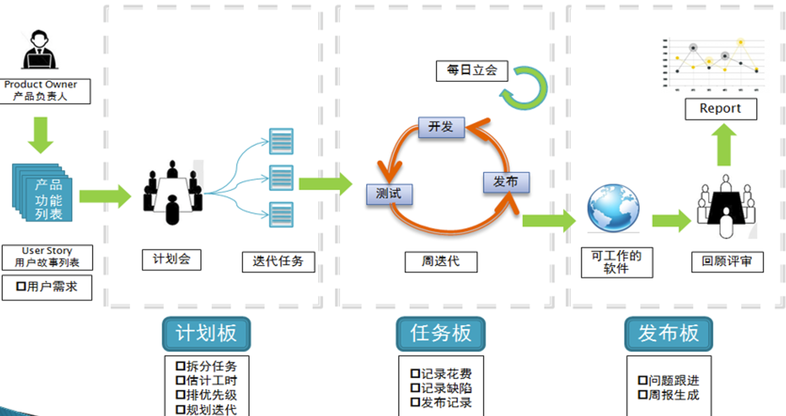

- 软件产品的建立可能需要数十个、数百个甚至上千个小组成员在严密进度计划下，各司其职、相互协作。
- 软件开发过程描述了这些人做什么、如何交互、如何决策的细节。

## 软件产品需要多少投入
- 客户需求
- 产品说明书
- 进度表
- 软件设计文档
- 测试文档
- 代码
- ...

### 客户需求
- 软件是为了满足一些人的需求，这些人成为客户。
- 需求的获取
  - 问卷调查（合理）
  - 收集软件以前版本的反馈信息（全面）
  - 收集竞争产品的信息（真实）
  - 收集期刊评论（分析到位）
  - 收集焦点人群p14的意见（准确）
- 信息将被研究、提炼、分析以便确定软件产品的功能。

### 产品说明书
- 对客户需求的研究结果只是原始资料，没有真正描述要做的产品。
- 产品说明书综合上述信息以及没有提出但必须要实现的需求，真正的定义软件产品是什么、有哪些功能、不能做什么、外观如何。

### 进度表
- 随着项目的不断复杂和庞大，制造产品需要投入很多人力和物力，因而必须要有某种机制来跟踪进度。价值在于发现问题和控制风险。
- 工具有很多，如Gantt图，Project2000等。

### 软件设计文档
常用软件设计文档的清单：
- UML的各种模型
- 模块划分图、数据流图（DFD）、程序流程图

### 测试文档
测试提交清单：
- 测试计划（test plan）：用于验证软件是否符合产品说明书和用户需求的整体方案。
- 测试用例（test case）：描述验证软件的详细步骤。
- 缺陷报告（bug report）：描述执行测试用例找出的问题。
- 度量、统计和总结：测试过程的汇总。采用图形表格和表表等形式。

## 软件产品的组成部分
所有产品的构成部分都影响软件的质量。
- 代码（code）
- 帮助文档、用户手册
- 样品和示例（demo）
- 标签和不干胶
- 图标和标志
- 错误信息
- 广告和宣传材料
- 安装文件
- 说明文件

## 软件项目成员
测试员要学会与项目中各类成员沟通协作：
- 项目经理：负责编写产品说明书、管理进度、进行重大决策。
- 体系架构师：技术专家，设计整个系统的体系架构或软件。
- 程序员（桥梁）：编写代码、修改缺陷。
- 测试员和QA
- 手册编写员：制作软件附带文件或联机文档。
- 配置管理员：负责把程序员编写的代码及全部文档资料组合在一起，合成一个软件包。

## 软件开发生命周期模式
不同的开发模式导致测试的方式方法的不同：
- 大爆炸模式
- 编写边改模式
- 瀑布模式
- 螺旋模式
- 敏捷开发

### 大爆炸模式
- 宇宙形成的大爆炸说。
- 软件开发大爆炸模式——一大堆东西（人力&物力）放在一起，产生巨大的能力释放——产生优秀软件——或者一堆废品。
- 大爆炸模式的优点：简单。
- 适应场景：产品需求无需很好理解、最终发布日期可以随意调整、团队能力超强。
- 该模式下，测试意味着将回头修复杂乱无章的东西。
- 尽量避免在该模式下进行测试。

### 编写边改模式
- 在大爆炸模式的基础上有所改进，至少考虑到了产品需求。
  
- 适应场景：意在快速制作且用完就扔的小项目，如原型或演示程序。
- 测试在该模式下的地位举足轻重。但却陷入了无休止的循环往复。
- 调试期间，边写边改模式最常碰到。

### 瀑布模式
瀑布模式强调三点：
- 瀑布模式强调产品的定义。
- 各个步骤分离、没有交叉。
- 瀑布模式无法回溯。

- 优点：从测试的角度看，瀑布模式拥有一切完整细致的说明。测试小组可以：
  - 清楚了解测试对象。
  - 指定精确测试计划。
  - 测试依据明确。
  - 识别缺陷简单。
- 缺点：直到最后才发现缺陷（致命）。

### 螺旋模式
- 螺旋模式于1986年由Barry Boehm在美国计算机协会的论文中提出。
- 兼顾瀑布模式的优点，而克服了该模式的缺点。

螺旋模式每一次循环包括：
- 确定目标
- 明确并化解风险
- 评估可选方案
- 开发和测试
- 计划下一阶段
- 确定进入下一阶段的方法。

### 敏捷开发

## 敏捷开发—核心实践
- 开发人员需要和用户保持现场的接触
- 代码集体所有制（打破壁垒）
- 测试性思维
- 尽可能的使你的模型（需求、分析、架构、设计）保持简单
- 公开展示模型，营造出开放诚实的沟通氛围
- 小增量建模（迭代）
- ...

## 核心实践—测试性思维
测试性思维 当你在建立模型的时候，你就要不断的问自己，“我该如何测试它？”如果你没办法测试正在开发的软件，你根本就不应该开发它。在现代的各种软件过程中，测试和质保（quality assurance）活动都贯穿于整个项目生命周期，一些过程更是提出了“在编写软件之前先编写测试”的概念（这是XP的一项实践：“测试优先”）。
