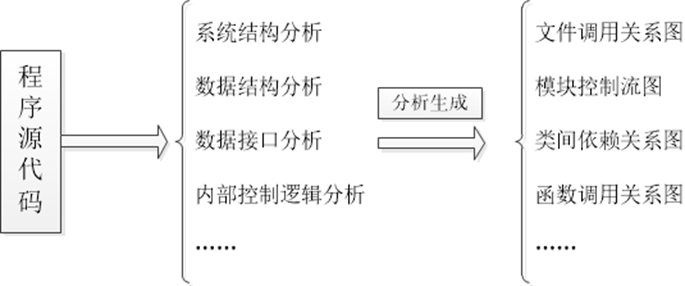
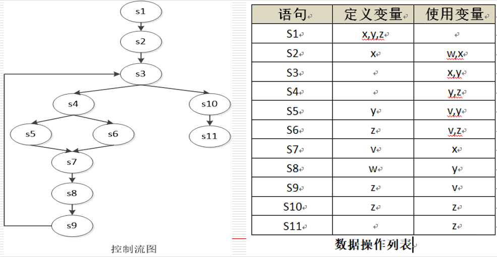

静态测设：在执行程序之前的人工测试

## 静态测试和动态测试
- 静态测试（人工测试）
  - 不运行程序进行测试，即检查和审阅
    - 静态黑盒测试——检查产品说明书
    - 静态白盒测试——检查设计和代码，在不执行的条件下有条理地仔细审查软件设计、体系结构和代码，从而找出软件缺陷的过程，有时称为**结构分析**。
- 动态测试（基于计算机的测试）
  - 运行和使用软件以发现错误，即通常意义上的测试

## 人工测试
人工测试方法的正规性、精确性不如基于计算机测试，但并不妨碍测试取得成功，相反可以提高测试的功效和可靠性
- 错误发现得越早，改正错误成本越低，正确改正错误可能性越大
- 程序员在开始基于计算机的测试时要经历一个心理上的转变，改正早期发现的错误比改正后期计算机执行发现的错误时失误更少
- 更容易定位以及发现由该错误引发的其他缺陷（如连锁错误或类似错误）降低调试成本
- 通常会有效地查找出**30％－70％**的逻辑设计和编码错误

## 代码检查
- 实施过程
  - 协调人在代码检查前几天分发程序清单和设计规范
  - 编码人员讲述程序的逻辑结构，其他人员提问题并判断是否存在错误(对照历来常见的**编码错误列表**)
  - 注意力集中在发现错误而非纠正错误上（非调试）
  - 会议结束后，所有程序员会得到一份已发现错误的清单
- 代码检查的其他作用
  - 程序员会得到编程风格、算法选择及编程技术等方面的反馈信息其他参与者也可以同样受益

## 代码检查的错误列表

### 1.数据引用错误
- 变量使用前是否赋值或初始化？
  - 容易引起变量使用错误，特别是对于引用变量。
  - 如：在java中要求局部变量在使用前必须初始化。
- 数组下标的范围和类型
  - 是否存在下标越界错误，下标类型是否为整型。
- 被引用的变量或内存的属性是否与编译器预期的一致？
  - 如A类型的引用是否指向的是非A类型对象。

### 2.数据声明错误
- 是否所有变量都已声明？
  - 绝大多数编程语言要求变量先定义后使用，可保证变量使用的安全性。
- 变量的初始化是否正确？变量的初始化是否与其存储空间的类型一致？
- 是否每个变量都有正确的长度、类型和存储类别？
- 是否存在相似名称的变量？

### 3.运算错误
- 是否存在非算术变量之间的算数运算？
- 是否存在混合模式或不同字长变量之间的运算？（int与float类型）
- 目标变量大小是否小于所赋值的大小？（精度损失或越界错误）
- 中间结果是否上溢或下溢？
- 是否存在除0错误？
- 操作符的优先级、结合性是否正确？
- 整数除法是否正确？（精度问题，如2*(i/2)==i？）

### 4.比较错误
- 是否有不同类型数据的比较运算？（如日期与数字）
- 是否有混合模式或不同长度数据的比较运算？
- 比较运算符是否正确？（如至多、至少，不小于）
- 布尔表达式（与、或、非）是否正确？
- 比较运算符是否与布尔表达式相混合？（`2<i<10`）
- 是否存在**浮点数**的比较？
- 优先顺序是否正确？
- 布尔表达式的计算方式

### 5.控制流程错误
- 是否所有循环都能终止？（循环结束条件是否能满足以及递归的终止条件是否能满足。）
- 是否存在由于入口条件不满足而跳过循环体？（while循环/for循环）
- 是否存在仅差一个的循环错误？（`for(int i=0;i<=10;i++){}`）
- 程序结构中括号是否匹配、`if, else`是否匹配、`do, while`是否匹配、`try, catch`是否匹配等。

### 6.接口错误
- 形参和实参的**数量**是否相等？
- 形参的类型是否与实参的类型相匹配？
- 形参的属性是否与实参的**顺序**相匹配？
- 形参的单位是否和实参匹配？（属逻辑错误）

### 7.输入输出错误
- 文件属性是否正确？
- 缓冲区、内存大小是否足够来保留程序将读取的文件？
- 文件在使用前是否打开？
- 文件在使用后是否关闭了？
- 是否处理了IO错误/异常？
- 输出结果是否正确。

### 8.其他检查
- 是否存在未引用过的变量？
- 编译通过的程序是否存在“警告”或“提示”信息？
- 程序或模块是否对输入的**合法性**进行了检查？（如第一章中三角形例）
- 程序是否遗漏了某个功能？
- 程序是否存在多余的功能？

## 代码走查
- 代码走查和代码检查类似，都是以小组为单位进行代码阅读，是一系列规程和错误检查技术的集合。二者的过程大致相同，不同之处在于
  - 规程稍微不同
    - 走查会议期间，每个测试用例都在人们脑中推演，即把测试的数据沿着程序的逻辑结构走一遍，记录程序的状态供监视，很多错误是在向程序员提问的过程中发现的。
- 其他与代码检查相同的地方
  - 参与者所持的态度同样非常关键
  - 代码走查也会带来同样的附带作用

## 桌面检查
- 桌面检查可视为由单人进行的代码检查或代码走查
  - 由一个人阅读程序，对照错误列表检查程序，对程序推演的过程。
- 桌面检查的缺点
  - 桌面检查的效率低
  - 是一个完全**没有约束的过程，缺少互相促进的效应**
  - 违反了测试原则：人们一般不能有效测试自己编写的程序，因此桌面检查最好由其他人而非该程序的编写人员来完成

## 结构分析
静态结构分析是帮助测试人员理解软件架构的有效方法

这些静态结构分析方法（工具）帮助测试人员更好地从宏观、微观层面把握程序结构，发现缺陷，便于进一步的分析和缺陷定位。

## 程序流程分析

### 控制流分析
控制流图的定义：制流图(Control Flow Graph, CFG)也叫控制流程图，是一个过程或程序的抽象表现，是用在编译器中的一个抽象数据结构，由编译器在内部维护，代表了一个程序执行过程中会遍历到的所有路径。它用图的形式表示一个过程内所有基本块执行的可能流向，也能反映一个过程的实时执行过程。

| 缺陷               | 影响             |
| ------------------ | ---------------- |
| 转向并不存在的标号 | 程序运行意外中止 |
| 存在无用的语句标号 | 占用额外管理资源 |
| 存在不可达语句标号 | 相应功能无法调用 |
| 不能到达可停机语句 | 程序运行难以中止 |

通过控制流分析，这些缺陷可以被有效地检测出来，从而保证程序可以正常运行，减低管理资源的耗费。

### 数据流分析
- 数据流分析相关定义
  - 定义1：变量定义（Definition，DEF）。变量v存在于语句s中，若s运行时改变了v的值，则称v被s定义。
  - 定义2：变量使用（Usage，USE）。变量v存在于语句s中，若s运行时使用了v的值，则称v被s使用。
- 数据流分析的作用
  - 数据流分析用于分析变量在程序中的定义、使用及传递情况，以检测变量定义/使用错误和相关异常，主要包括以下三类错误
    1. 变量被定义，但从未被使用；
    2. 变量被使用，但还未被定义；
    3. 变量在使用之前被定义多次。
- 数据流分析的一个例子
  
- 数据流分析发现的问题
  1. 语句s2使用了未定义的变量w
  2. 语句s5、s6使用了未定义的变量v
  3. 语句s8定义了变量w，但是之后程序再未使用过变量w
  4. 语句s6、s9均定义了变量z，但两次定义之间并未再使用变量z

## 静态测试的工具
- 程序语法错误检查通常由编译器完成
- 程序中语法错误被修正后，研发人员还需借助人工或者其他静态方法或工具进一步检测程序中的非语法类型缺陷，如代码不符合规范、不匹配的参数、不适当的循环嵌套和分支潜逃、不允许的递归、未使用过的变量、空指针的引用等等。

常用的静态分析工具（Java）
| 工具名称   | 分析对象   | 应用技术                 |
| ---------- | ---------- | ------------------------ |
| CheckStyle | Java源文件 | 缺陷模式匹配             |
| FindBugs   | 字节码     | 缺陷模式匹配、数据流分析 |
| PMD        | Java源文件 | 缺陷模式匹配             |
| P3C        | Java源文件 | 缺陷模式匹配             |

## 小结
- 人工测试的必要性和有效性
- 人工测试的开展方式
  - 利用错误列表进行代码检查
  - 小组代码走查
  - 桌面检查
- 结构分析
- 程序流程分析（控制流/数据流）
- 常见静态测试工具及使用
