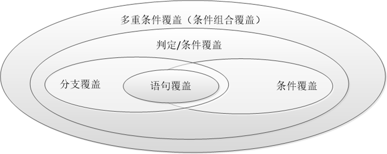

## 测试用例的设计
- 软件测试中最重要的因素是设计和生成有效的测试用例
  - 完全发现软件中的错误是不可能的，那么如何发现尽可能多的错误？
- 软件测试最关键的问题
  - 在给定的时间和成本约束下，在所有可能的测试用例中，哪个子集最有可能发现最多的错误？
- 采用某种策略设计测试用例
  - 随机输入测试：低效
  - 有策略的黑盒测试和白盒测试


## 逻辑覆盖测试
- 白盒测试
  - 语句覆盖
  - 判定覆盖
  - 条件覆盖
  - 判定/条件覆盖
  - 多重条件覆盖
- 如黑盒测试也是着力于设计覆盖各种输入条件的测试用例。


### 白盒测试充分性关系



### 逻辑覆盖准则
- 语句覆盖：设计若干测试用例，运行被测程序，使得每一个可执行语句至少执行一次。
- 判定/分支覆盖：设计若干测试用例，运行被测程序，使得程序每个判断的取真分支和取假分支至少经历一次。
- 条件覆盖：设计若干测试用例，运行被测程序，使得程序中每个判断的每个条件的可能取值至少经历一次。
- 判定/条件覆盖：设计若干测试用例，运行被测程序，使得判断中每个条件的所有可能取值至少经历一次，同时每个判断本身的所有可能判断结果至少经历一次。
- 多重条件覆盖：设计若干测试用例，运行被测程序，使得每个判断的所有可能的条件取值组合至少经历一次。

### 例子
```java
//被测试的程序段如下
if (a>1 && b==0) {
    x = x / a;
}
if (a==2 || x>1) {
    x = x + 1;
}
```

- 语句覆盖的测试用例（1个）
  - `[(2,0,4),(2,0,3)]` 覆盖ace
- 判定/分支覆盖的测试用例（2个）
  - 方案1：
    - `[(2,0,4),(2,0,3)]` 覆盖ace
    - `[(1,1,1),(1,1,1)]` 覆盖abd
  - 方案2：
    - `[(2,1,1),(2,1,2)]` 覆盖abe
    - `[(3,0,3),(3,0,1)]` 覆盖acd
  - 问题：如果将x>1错写成x<1，以上判定/分支覆盖测试用例时发现不了的（需让判断2中的两条件分别为假、真）。
- 条件覆盖的测试用例（2个）
  - 对于第一个判断：条件a>1真时为T1,否则为T1；条件b==0真时为T2,否则为T2
  - 对于第二个判断：条件a==2真时为T3,否则为T3；条件x>1真时为T4,否则为T4
  - 方案1：
    - `[(2,0,4),(2,0,3)]` 覆盖ace T1,T2,T3,T4
    - `[(1,1,1),(1,1,1)]` 覆盖abd T1,T2,T3,T4
  - 方案2：
    - `[(2,1,1),(2,1,2)]` 覆盖abe T1,T2,T3,T4
    - `[(3,0,3),(3,0,1)]` 覆盖acd T1,T2,T3,T4
    - `[(1,0,3),(1,0,4)]` 覆盖acd T1,T2,T3,T4
  - 方案3：
    - `[(2,0,4),(2,0,3)]` 覆盖ace T1,T2,T3,T4
    - `[(1,0,1),(1,0,1)]` 覆盖abd T1,T2,T3,T4
    - `[(2,1,1),(2,1,2)]` 覆盖abe T1,T2,T3,T4
  - 方案4：
    - `[(1,0,3),(1,0,4)]` 覆盖abe T1,T2,T3,T4
    - `[(2,1,1),(2,1,2)]` 覆盖abe T1,T2,T3,T4
- 判定/条件覆盖的测试用例（2个）
  - `[(2,0,4),(2,0,3)]` 覆盖ace T1,T2,T3,T4
  - `[(1,1,1),(1,1,1)]` 覆盖abd T1,T2,T3,T4
- 多重条件覆盖（4个）
  - `[(2,0,4),(2,0,3)]` 覆盖ace T1,T2,T3,T4
  - `[(1,1,1),(1,1,1)]` 覆盖abd T1,T2,T3,T4
  - `[(2,1,1),(2,1,2)]` 覆盖abe T1,T2,T3,T4
  - `[(1,0,3),(1,0,4)]` 覆盖abe T1,T2,T3,T4


## 结论
条件覆盖与分支覆盖
- 条件覆盖中要求每个条件至少取得一次真值和一次假值，但并不意味每条条件判断语句也至少取得一次真值和一次假值。如上例中条件覆盖的测试用例中的方案2。
- 因此，条件覆盖分析了更小的条件粒度，与分支覆盖相比，条件覆盖并不具有更高的测试强度。

白盒测试准则
- 对包含每个判定只存在一种条件的程序的测试准则
  - 设计出足够数量的测试用例，实现：
    - 将每个判断的所有结果都至少执行一次
- 对包含多重条件判断的程序的测试准则
  - 是设计出足够数量的测试用例，将每个判断的所有可能的条件结果的组合


## 测试策略
以上的每种方法都能提供一组有用的测试用例，但是都不能单独提供一个完整的测试用例集合，可以应用以下策略得到较好的测试结果：
1. 如果规格说明中输入条件有明显的逻辑关系以及与结果的因果关系，应该首先使用因果图分析或判定表
2. 在任何情况下都应该使用边界值分析方法，而且是对输入和输出边界进行的分析，用以产生一系列补充的测试用例
3. 应为输入和输出确定有效和无效的等价类，在必要时对上面确认的测试用例进行补充
4. 使用错误猜测技术增加更多的测试用例
5. 针对上述测试用例检查程序的逻辑结构，使用判定覆盖、条件覆盖、判定/条件覆盖或多重条件覆盖准则。如果为前4步确定的测试用例尚未满足覆盖准则，那么在可能的情况下，增加足够的测试用例，使覆盖准则得以满足。


## 路径覆盖测试：复杂度
软件复杂度的意义
- “简单就是可靠”是软硬件设计过程中的一条基本原则。
- 因此，程序应保持在合理的复杂度范围内，以确保不会带来过高的软件开发和维护成本。
- 此外，对软件复杂度进行衡量还可以帮助研发人员识别难于测试和维护的模块，已安排工作进度。

环复杂度
- 用软件规模度量程序的复杂度不准确。
- 环复杂度是程序复杂度度量的常用方法。
- 环复杂度v可通过程序控制流图g中的区域、节点、判定节点和边的数目来计算。
  - 基于区域数目的计算方法： $ v(g) = num_{area} $
  - 基于边和节点数目的计算方法：$ v(g) = num_{edge} - num_{node} + 2 $
  - 基于判定节点数目的计算方法：$ v(g) = num_{node \_ branch} + 1 $


## 可运行路径覆盖
- 路径：从程序的入口节点到出口节点所经过节点（或边）的有序排列称为路径。
- 如下程序流程图，存在路径：
  $$
  e_{1} → e_{2} → e_{3} → e_{6} → e_{8} \\
  e_{1} → e_{2} → e_{4} → e_{5} → e_{6} → e_{8} \\
  e_{1} → (e_{2} → (e_{3} + e_{4} → e_{5}) → e_{6})^{n} → e_{8} \\
  (注：+表示选择结构；乘法表示循环结构）
  $$
  
- 由于程序包含循环结构，导致路径长度和数量无限。该例中限定最大循环次数为50，其路径数量为 $ \sum_{i=1}^{50} 2^{i} \approx 2.25E + 15 $


## 基本路径覆盖
- 独立路径定义：独立路径是指与其他独立路径相比至少包含一个新节点的路径。
- 由于每条语句至少会包含在一个独立路径中，因此满足独立路径覆盖同时也满足语句覆盖。
- 基本路径覆盖测试步骤：
  1. 构建程序控制流图
  2. 计算环复杂度（该复杂度确定了程序基本路径集合中独立路径的条数的上界）
  3. 根据环复杂度确定独立路径集合
  4. 针对每一条独立路径设计测试用例


## 循环结构测试
- 相较顺序、选择结构，循环是最复杂的一种结构。
- 由于循环次数的不确定，存在于循环结构中的缺陷更难被检测和定位。
- 因此，应当将程序中的循环结构作为测试和分析重点，并对循环变量采用边界值测试等方法以验证其正确性。


- 针对简单循环测试
  - 对于简单循环测试，用i表示循环次数控制变量，用n表示最大循环次数。此时，应当针对i采用基于7点法的边界值分析。

  
- 针对连接循环测试
  - 可以按照简单循环测试方法测试每一个循环体；
- 针对嵌套循环测试
  1. 选择最内层循环体作为起始点，并将其他层的循环控制变量设置为最小值；
  2. 依照简单循环测试策略对最内层循环进行测试，外层循环控制变量保持为最小值；
  3. 向外扩展至下一层循环体，所有外层循环控制变量设置为最小值，所有内层循环控制变量选择典型值；
  4. 持续运行步骤3直至嵌套循环体测试完毕。
- 对于非结构循环测试，目前尚不存在特定的测试策略。因此，当发现程序中存在非结构循环体时，建议将其修改为其他类型循环结构。
