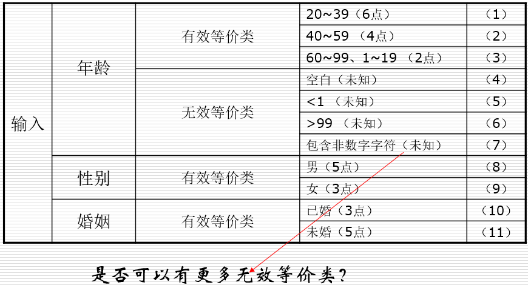
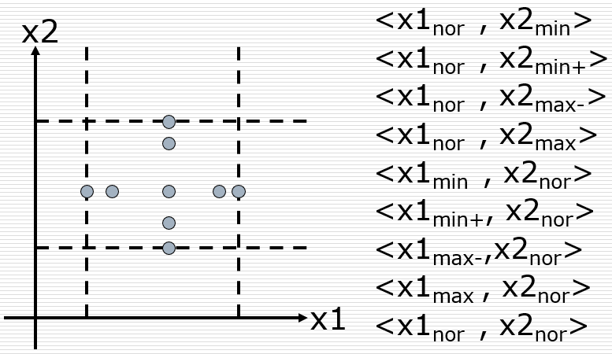
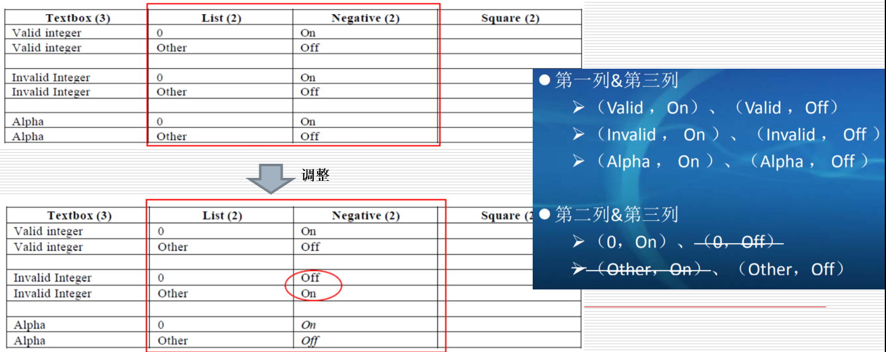

## 黑盒测试
- 黑盒测试是最常用和最有效的软件测试技术
- 有效的黑盒测试需要软件的文档
  - 需求文档或者产品说明书，通过这些了解输入什么能得到什么或者操作的结果
  - 没有产品说明书时使用探索测试——了解软件、设计测试、执行测试同时执行

## 测试用例的设计
- 软件测试中最重要的因素是设计和生成有效的测试用例
  - 完全发现软件中的错误是不可能的，那么如何发现尽可能多的错误？
- 软件测试最关键的问题
  - 在给定的时间和成本约束下，在所有可能的测试用例中，哪个子集最有可能发现最多的错误？
- 采用某种策略设计测试用例
  - 随机输入测试：低效
  - 有策略的黑盒测试和白盒测试

## 黑盒测试用例设计方法
- 等价类划分
- 边界值分析
- 因果图
- 判定表
- 错误猜测

## 通过性测试和失效性测试
- 通过性测试：确认软件**至少**能作什么（软件的基本功能），而不会考验其能力。软件测试员并不需要想尽办法使软件崩溃，紧紧运用最简单、最直观的测试用例。
- 失效性测试：纯粹为了**破坏**软件而设计和执行的测试用例称为失效性测试（错误强制测试），它是**蓄意攻击**软件的薄弱环节。

## 等价类划分：Equivalence Partitioning
等价划分
- 要从所有可能的测试用例中要找出某个小的子集，而且是可能发现最多错误的子集，精心挑选的测试用例还应该具备两个特征：
  - 它覆盖（代表）了大部分其他可能的测试用例——对程序输入范围进行划分，将其划分为有限数量的等价类，就可以合理地假设测试每个等价类的代表性数据等同于测试该类的其他任何数据。即，如果等价类的某个输入发现了某个错误，该等价类的其他数据也应该能发现同样的错误，反之如果等价类的某个输入不能发现错误，那么该等价类中的其他数据也不能发现错误。
  - 严格控制测试用例的增加——每个测试用例必须体现尽可能多的不同的输入情况

## 等价划分法设计测试用例

### 第一步：确定等价类
- 选取每个输入条件（通常是规格说明中的一个句子或短语），并将其划分为两个或多个等价类：有效等价类代表对程序的有效输入，无效等价类代表其他任何可能的输入。
- 根据输入条件确定等价类的指导原则
  - 取值范围：一个有效等价类，两个无效等价类
  - 取值个数：一个有效等价类，两个无效等价类
  - 输入值的集合，且每个值处理不同：为每个值确定一个有效等价类和一个无效等价类
  - “必须是...”：一个有效等价类，一个无效等价类
  - 如果有任何理由可以认为程序并未等同地处理等价类中的元素，那么应该将这个等价类再划分为小一些的等价类

确立等价类的原则
1. 如果输入条件规定了取值范围，或者值的个数，则可以确立一个有效等价类和两个无效等价类，例如：
   - 数据范围是1~50
   - 有效等价类为“>=1&&<=50”
   - 两个无效等价类为“<1”和“>50”
2. 如果输入条件是一个布尔量，则可以确立一个有效等价类和一个无效等价类
3. 如果规定了输入数据的一组值（枚举、集合），而且程序要对每一个输入值分别进行处理，这时要对每一个规定的输入值确立一个有效等价类，而对于这组值之外的所有值确立一个无效等价类
4. 如果规定了输入数据必须遵守的规则，则可以确立一个有效等价类（即遵守规则的数据）和若干无效等价类（从不同角度违反规则的数据），例如：
   - 测试密码域，要求密码必须是数字或字母
   - 有效等价类为“密码是数字和字母组合”（还可以细分）
   - 无效等价类为“密码包括中文”、“密码包括其它符号”等
5. 如果确知已划分的等价类中的各元素在程序中的处理方式不同（例如字母还要区分大小写等），则应进一步划分成更小的等价类

### 第二步：生成测试用例
- 为每个等价类设置一个不同的编号；
- 编写新的测试用例，**尽可能多地**覆盖那些尚未被涵盖的有效等价类，直到所有等价类都被测试用例所覆盖；
- 编写新的用例，覆盖一个且仅一个尚未被覆盖的无效等价类，直到所有无效等价类都被测试用例所覆盖。

## 一个范例
- 某报表处理系统要求用户输入处理报表的日期，日期限制在2003年1月至2008年12月，即系统只能对该段期间内的报表进行处理，如日期不在此范围内，则显示输入错误信息。
- 系统日期规定由年、月的6位数字字符组成，前四位代表年，后两位代表月。
- 如何用等价类划分法设计测试用例,来测试程序的日期检查功能？

### 等价类划分
| 输入条件             | 有效等价类          | 无效等价类                                                      |
| -------------------- | ------------------- | --------------------------------------------------------------- |
| 报表日期的类型及长度 | 6位数字字符(1)      | 有非数字字符(4) 少于6个数字字符(5) 多于6个数字字符(6) |
| 年份范围             | 在2003～2008之间(2) | 小于2003(7) 大于2008(8)                                    |
| 月份范围             | 在1～12之间(3)      | 小于1(9) 大于12(10)                                        |

### 有效等价类设计测试用例
对表中编号为1,2,3的3个有效等价类用一个测试用例覆盖：
| 测试数据 | 期望结果 | 覆盖范围        |
| -------- | -------- | --------------- |
| 200306   | 输入有效 | 等价类(1)(2)(3) |

### 为每一个无效等价类至少设计一个测试用例
| 测试数据 | 期望结果 | 覆盖范围   |
| -------- | -------- | ---------- |
| 003MAY   | 输入无效 | 等价类(4)  |
| 20035    | 输入无效 | 等价类(5)  |
| 2003005  | 输入无效 | 等价类(6)  |
| 200105   | 输入无效 | 等价类(7)  |
| 200905   | 输入无效 | 等价类(8)  |
| 200300   | 输入无效 | 等价类(9)  |
| 200313   | 输入无效 | 等价类(10) |

## 几种等价类测试
- 进行完备测试，又避免冗余
- 例如：
- $ a \le x \le d $ ，区间为 $ [a,b),[b,c),[c,d] $
- $ e \le y \le g $ ，区间为 $ [e,f),[f,g] $
- 包含：
  - 弱一般等价类测试
  - 强一般等价类测试
  - 弱健壮等价类测试
  - 强健壮等价类测试

### 1. 弱一般等价类测试
使用每个等价类（区间）的一个值生成测试用例

### 2. 强一般等价类测试
根据多缺陷假设：需要等价笛卡尔积的每个元素生成测试用例

### 3. 弱健壮等价类测试/传统等价类测试
- 根据单缺陷假设：考虑无效值
- 对于有效输入，使用每个有效类的一个值
- 对于无效输入，测试用例将拥有一个无效值，并保持其余的值都是有效的。

### 4. 强健壮等价类测试
所有等价类笛卡儿积的每个元素中获得测试用例。

## 几个等价类划分实例
- 保险费率计算
- NextDate

### 1. 保险费率计算
按照输入域划分等价类的例子。
- 某保险公司承担人寿保险，该公司保费计算方式为： $ 保费=投保额*保险率 $ ，保险率依点数不同而有别，10点以上（含10点）费率为0.6%，10点以下费率为0.1%
- 点数的计算是年龄、性别、婚姻、抚养人数所得的点数的总和
- 输入：年龄、性别、婚姻、抚养人数
- 输出：保险率

输入数据说明

第一步：输入和输出变量确认
- 按照输入域划分等价类的例子。
  - 输入：年龄、性别、婚姻、抚养人数
  - 输出：保险率
  - 等价类划分原则：按照输入变量来确认等价类（有效等价类和无效等价类）

第二步：等价类划分

第三步：设计测试用例
- 按照输入域划分等价类的例子。
  - 1、设计测试用例，尽可能的覆盖尚未覆盖的有效等价类。
    - （1）（8）（10）（12）
    - （2）（9）（11）（13）
    - （3）（8）（10）（14）
  - 2、设计测试用俐，使得每一个新设计的测试用例只包含一个无效等价类，其他的选择有效等价类。
    - （4）（8）（10）（12）
    - （5）（9）（11）（13）
    - （6）（8）（10）（14）
    - （7）（8）（10）（14）
    - （1）（8）（10）（15）
    - （2）（9）（11）（16）
    - （3）（8）（10）（16）
- 说明：在设计无效部分的测试用例的时候，有效等价类部分，可以任意选择。

第四步：选取测试用例

### 2. NextDate函数的等价类测试用例
**确定等价类：**
- 有效等价类：
  - $ M1 = {月份：1 \le 月份 \le 12} $
  - $ D1 = {日期：1 \le 日期 \le 31} $
  - $ Y1 = {年：1812 \le 年 \le 2012} $
- 无效等价类：
  - $ M2 = {月份：月份 < 1} $
  - $ M3 = {月份：月份 > 12} $
  - $ D2 = {日期：日期 < 1} $
  - $ D3 = {日期：日期 > 31} $
  - $ Y2 = {年：年 < 1812} $
  - $ Y3 = {年：年 > 2012} $

弱一般等价类测试用例
| 用例ID   | 月份 | 日期 | 年   | 预期输出  |
| -------- | ---- | ---- | ---- | --------- |
| WN1，SN1 | 6    | 15   | 1912 | 6/16/1912 |

弱健壮等价类测试用例
| 用例ID | 月份 | 日期 | 年   | 预期输出  |
| ------ | ---- | ---- | ---- | --------- |
| WR1    | 6    | 15   | 1912 | 6/16/1912 |
| WR2    | -1   | 15   | 1912 | 无效输入  |
| WR3    | 13   | 15   | 1912 | 无效输入  |
| WR4    | 6    | -1   | 1912 | 无效输入  |
| WR5    | 6    | 32   | 1912 | 无效输入  |
| WR6    | 6    | 15   | 1811 | 无效输入  |
| WR7    | 6    | 15   | 2013 | 无效输入  |

强健壮等价类测试用例
| 用例ID | 月份 | 日期 | 年   | 预期输出 |
| ------ | ---- | ---- | ---- | -------- |
| SR1    | -1   | 15   | 1912 | 无效输入 |
| SR2    | 6    | -1   | 1912 | 无效输入 |
| SR3    | 6    | 15   | 1811 | 无效输入 |
| SR4    | -1   | -1   | 1912 | 无效输入 |
| SR5    | 6    | -1   | 1811 | 无效输入 |
| SR6    | -1   | 15   | 1811 | 无效输入 |
| SR7    | -1   | -1   | 1811 | 无效输入 |

测试用例的个数： $ M × D × Y = 3 * 3 * 3 = 27 $

**另一种划分法**
- $ M1 = {月份：每月有30天} $
- $ M2 = {月份：每月有31天} $
- $ M3 = {月份：此月是2月} $
- $ D1 = {日期：1 \le 日期 \le 28} $
- $ D2 = {日期：日期 = 29} $
- $ D3 = {日期：日期 = 30} $
- $ D4 = {日期：日期 = 31} $
- $ Y1 = {年：年是闰年} $
- $ Y2 = {年：年是平年} $

弱一般等价类测试用例
| 用例ID | 月份 | 日期 | 年   | 预期输出  |
| ------ | ---- | ---- | ---- | --------- |
| WR1    | 6    | 14   | 2000 | 6/15/2000 |
| WR2    | 7    | 29   | 1996 | 7/30/1996 |
| WR3    | 2    | 30   | 2002 | 无效输入  |
| WR4    | 6    | 31   | 2000 | 无效输入  |

强一般等价类测试用例
| 用例ID | 月份 | 日期 | 年  | 预期输出  |
| ------ | ---- | ---- | --- | --------- |
| 1      | 2000 | 6    | 15  | 6/16/2000 |
| 2      | 2000 | 6    | 29  | 6/30/2000 |
| 3      | 2000 | 6    | 30  | 7/1/2000  |
| 4      | 2000 | 6    | 31  | 无效输入  |
| 5      | 2000 | 7    | 15  | 7/16/2000 |
| 6      | 2000 | 7    | 29  | 7/30/2000 |
| 7      | 2000 | 7    | 30  | 7/31/2000 |
| 8      | 2000 | 7    | 31  | 8/1/2000  |
| 9      | 2000 | 2    | 15  | 2/16/2000 |
| 10     | 2000 | 2    | 29  | 3/1/2000  |
| 11     | 2000 | 2    | 30  | 无效输入  |
| 12     | 2000 | 2    | 31  | 无效输入  |
| 13     | 2002 | 6    | 15  | 6/16/2002 |
| 14     | 2002 | 6    | 29  | 6/30/2002 |
| 15     | 2002 | 6    | 30  | 7/1/2002  |
| 16     | 2002 | 6    | 31  | 无效输入  |
| 17     | 2002 | 7    | 15  | 7/16/2002 |
| 18     | 2002 | 7    | 29  | 7/30/2002 |
| 19     | 2002 | 7    | 30  | 7/31/2002 |
| 20     | 2002 | 7    | 31  | 8/1/2002  |
| 21     | 2002 | 2    | 15  | 2/16/2002 |
| 22     | 2002 | 2    | 29  | 无效输入  |
| 23     | 2002 | 2    | 30  | 无效输入  |
| 24     | 2002 | 2    | 31  | 无效输入  |

测试用例的个数： $ M × D × Y = 3 * 4 * 2 = 24 $

## 边界值分析：Boundary Value Analysis
- 等价划分虽然优于随机选取用例，但不足之处在于忽略了某些特定类型的**高效测试用例**
- 经验证明，考虑了边界条件的测试用例与其他测试用例相比，具有更高的测试回报率
  - 边界条件：输入和输出等价类中那些恰好处于边界、或超过边界、或在边界以下的状态
- 边界值分析与等价划分的不同
  - 边界值分析需要选取一个或多个元素（而不是选任一个代表元素），以便等价类的每个边界都经过一次测试
  - 边界值分析不仅关注输入条件，还考虑从输出等价类设计测试用例

## 常见的边界值
- 对16-bit 的整数而言 32767 和 -32768 是边界
- 屏幕上光标在最左上、最右下位置
- 报表的第一行和最后一行
- 数组元素的第一个和最后一个
- 循环：0次、1次、2次、n-1次、n次、n+1次（七点法）

## 边界值分析的通用指南
1. 输入条件规定了一个输入值范围：针对范围的边界设计测试用例，针对刚刚越界的情况设计无效测试用例
2. 输入条件规定了输入值的数量：针对最小数量、最大数量、最小数量少一、最大数量多一的情况设计测试用例
3. 对每个输出条件应用1；是否产生超过输出范围的结果
4. 对每个输出条件应用2；
5. 如果程序的输入或输出是一个有序序列，则应该特别注意序列的第一个和最后一个元素
6. 边界值分析是具有创造性的方法，发挥聪明才智找出其他的边界条件

## 边界值测试
- 边界值分析
- 健壮性测试
- 最坏情况测试
- 特殊值测试
- 随机测试

### 1. 边界值分析
- 依据原理：错误更可能出现在输入变量的极值附近
- 基本思想：使用在最小值、略高于最小值、正常值、略低于最大值、最大值处输入变量值。
- 生成测试用例
  - 使所有变量取正常值，只使一个变量取极值（依据“单缺陷”假设：失效极少是由两个或多个缺陷同时发生引起的）
  - n个变量函数：1个变量取最小值、略高于最小值、正常值、略低于最大值、最大值，n-1个变量取正常值；对每个变量重复此过程，4n+1个测试用例

### 2. 健壮性测试（Robustness Test）
对边界值分析的扩展

### 3. 最坏情况测试（Worst Case Testing）
- 当多个变量取极值时会出现什么情况？
- 生成测试用例：
- 对每个变量：首先进行包含最小值、略高于最小值、正常值、略低于最大值、最大值5元素集合测试，然后对这些集合进行笛卡尔积计算，生成测试用例
- n变量函数的最坏测试情况测试，会产生5n个测试用例

**两变量函数的健壮最坏情况测试用例（Robust Worst Case Testing）**

### 4. 特殊值测试
- 测试人员依赖经验、领域知识给出特殊值
- 特殊值测试特别依赖测试人员的能力
- 例如：
  - NextDate函数：闰年2月28日，2月29日

### 5. 随机测试
- 避免出现测试偏见
- 方法：使用随机数生成器选取测试用例值

### “报表日期”边界值分析法测试用例

## 判定表：Decision Table Testing
- 边界值分析和等价划分的弱点是没有对输入条件的组合进行分析
- 判定表适合描述不同输入条件的组合，被测软件有以下特征时可以使用判定表 
  - 输入变量之间存在逻辑关系
  - 输入与输出之间存在因果关系
- 判定表的结构
  - 条件部分(输入)：列出条件和条件的组合，条件是根据输入和环境因素归结为真或假的判定变量。
  - 动作部分(输出)：列出了相应的条件组合下产生的响应。

- 构造判定表
  - 确定判定变量——输入
  - 确定要选择或控制的结果动作——输出
  - 确定对特定的条件组合将产生哪些动作——规则
    - n个条件的判定表，理论上规则共有2n条，但是因为存在无关条件和不可能发生的条件，判定表的实际大小通常比理论上小。
- 从判定表得到测试用例
  - 规则中的条件部分对应输入，动作部分对应预计输出

## 判定表例子

### 三角形问题
判定表（假设a，b，c都是范围内正数）

从判定表得到的测试用例

### NextDate函数

| -   | C1：月份在： | C2：日期在： | C3：年在： | a1：不可能 | a2：日期增1 | a3：日期复位 | a4：月份增1 | a5：月份复位 | a6：年增1 |
| --- | ------------ | ------------ | ---------- | ---------- | ----------- | ------------ | ----------- | ------------ | --------- |
| 1   | M1           | D1           | －         |            | ×           |              |             |              |
| 2   | M1           | D2           | －         |            | ×           |              |             |              |
| 3   | M1           | D3           | －         |            | ×           |              |             |              |
| 4   | M1           | D4           | －         |            |             | ×            | ×           |              |
| 5   | M1           | D5           | －         | ×          |             |              |             |              |
| 6   | M2           | D1           | －         |            | ×           |              |             |              |
| 7   | M2           | D2           | －         |            | ×           |              |             |              |
| 8   | M2           | D3           | －         |            | ×           |              |             |              |
| 9   | M2           | D4           | －         |            | ×           |              |             |              |
| 10  | M2           | D5           | －         |            |             | ×            | ×           |              |
| 11  | M3           | D1           | －         |            | ×           |              |             |              |
| 12  | M3           | D2           | －         |            | ×           |              |             |              |
| 13  | M3           | D3           | －         |            | ×           |              |             |              |
| 14  | M3           | D4           | －         |            | ×           |              |             |              |
| 15  | M3           | D5           | －         |            |             | ×            |             | ×            | ×         |
| 16  | M4           | D1           | －         |            | ×           |              |             |              |
| 17  | M4           | D2           | Y1         |            | ×           |              |             |              |
| 18  | M4           | D2           | Y2         |            |             | ×            | ×           |              |
| 19  | M4           | D3           | Y1         |            |             | ×            | ×           |              |
| 20  | M4           | D3           | Y2         | ×          |             |              |             |              |
| 21  | M4           | D4           | －         | ×          |             |              |             |              |
| 22  | M4           | D5           | －         | ×          |             |              |             |              |

决策表精简
| -     | C1：月份在： | C2：日期在：       | C3：年在： | a1：不可能 | a2：日期增1 | a3：日期复位 | a4：月份增1 | a5：月份复位 | a6：年增1 |
| ----- | ------------ | ------------------ | ---------- | ---------- | ----------- | ------------ | ----------- | ------------ | --------- |
| 1-3   | M1           | D1， D2， D3       | －         |            | ×           |              |             |              |
| 4     | M1           | D4                 | －         |            |             | ×            | ×           |              |
| 5     | M1           | D5                 | －         | ×          |             |              |             |              |
| 6-9   | M2           | D1， D2 ，D3，D4， | －         |            | ×           |              |             |              |
| 10    | M2           | D5                 | －         |            |             | ×            | ×           |              |
| 11-14 | M3           | D1 ，D2，D3，D4    | －         |            | ×           |              |             |              |
| 15    | M3           | D5                 | －         |            |             | ×            |             | ×            | ×         |
| 16    | M4           | D1                 | －         |            | ×           |              |             |              |
| 17    | M4           | D2                 | Y1         |            | ×           |              |             |              |
| 18    | M4           | D2                 | Y2         |            |             | ×            | ×           |              |
| 19    | M4           | D3                 | Y1         |            |             | ×            | ×           |              |
| 20    | M4           | D3                 | Y2         | ×          |             |              |             |              |
| 21-22 | M4           | D4 ，D5            | －         | ×          |             |              |             |              |

测试用例
| 用例ID | 月份 | 日期 | 年   | 预期输出   |
| ------ | ---- | ---- | ---- | ---------- |
| 1-3    | 4    | 15   | 2001 | 4/16/2001  |
| 4      | 4    | 30   | 2001 | 5/1/2001   |
| 5      | 4    | 31   | 2001 | 不可能     |
| 6-9    | 1    | 15   | 2001 | 1/16/2001  |
| 10     | 1    | 31   | 2001 | 2/1/2001   |
| 11-14  | 12   | 15   | 2001 | 12/16/2001 |
| 15     | 12   | 31   | 2001 | 1/1/2002   |
| 16     | 2    | 15   | 2001 | 2/16/2001  |
| 17     | 2    | 28   | 2004 | 2/29/2004  |
| 18     | 2    | 28   | 2001 | 3/1/2001   |
| 19     | 2    | 29   | 2004 | 3/1/2004   |
| 20     | 2    | 29   | 2001 | 不可能     |
| 21-22  | 2    | 30   | 2001 | 不可能     |

## 因果图：Cause Effect Graphing
因果图的特点
- 与判定表一样，因果图考虑了输入的组合，有助于用一种系统的方法选择出高效的测试用例集
- 因果图还可以指出规格说明的不完整性和不明确之处
- 不能生成全部应该被确定的有效测试用例，没有充分考虑边界条件，因此在由因果图生成测试用例时，可以一并考虑边界条件分析
- 因果图转换为判定表的过程比较复杂，可以借助自动化的工具

## 使用因果图生成测试用例
1. 因果图不善于处理较大的规格说明。
2. 确定规格说明中的因果关系，并对每个因果编号
   - 因：一个明确的输入条件或输入条件的等价类
   - 果：一个输出条件或系统转换
3. 分析规格说明的语义内容，并将其转换为连接因果关系的布尔图，即因果图
4. 给图加上注解符号，即约束符号（某些原因/结果的组合在现实中不可能存在，需要对此进行说明）
5. 仔细跟踪图中的状态变化情况，将因果图转换为一个有限项的判定表，表中的每一列代表一个测试用例
6. 将判定表中的列转换成测试用例

## 因果图的符号
- 基本符号
  - identity, NOT, AND, OR
- 约束符号
  - E约束（不同时为真），I约束（不能同时为零），O约束（有且仅有一个为真），R约束（输入a为1b必为1）
  - M约束
    - 建立结果之间的约束关系（结果a为1b必为0）

  

- 因果图中使用4种因果关系符号来表达**因果关系**：
  

## 因果图例子
处理单价为5角钱的饮料自动售货机软件的规格说明：若投入5角或1元的硬币，压下【橙汁】或【啤酒】的按钮。若售货机没有零钱找，则【零钱找完】红灯亮，如果投入1元硬币并压下按钮后，饮料不送出而且1元硬币也退出来；若有零钱找，则【零钱找完】红灯灭，送出饮料同时还退还5角硬币。
1. 分析原因、结果

  | 原因           | 结果                   |
  | -------------- | ---------------------- |
  | 售货机有零钱找 | 售货机【零钱找完】灯亮 |
  | 投入1元        | 退还1元                |
  | 投入5角        | 退还5角                |
  | 压下橙汁按钮   | 送出橙汁饮料           |
  | 压下啤酒按钮   | 送出啤酒               |
2. 画出因果图
  
3. 转换成判定表
  

## 错误猜测法
- 错误猜测是一种依赖直觉的非正规的过程，很难描述这种方法的规程
- 错误猜测的基本思想
  - 列举出可能犯的错误或错误易发情况的清单，然后依据清单来编写测试用例。
  - 在阅读规格说明时联系程序员可能做的假设来确定测试用例，如忽略了规格说明中的某些内容。
- 例：测试一个排序程序，可能猜测出错的情况
  - 输入列表为空
  - 输入列表仅包含一项
  - 输入列表所有条目的值都相同
  - 输入列表已经是有序的

## 组合测试法
在许多应用系统的测试工作中，不会象判断三角形那样简单，输入条件的因素很多，而且每个因素也不能简单用“是”和“否”来回答。比如，微软Powerpoint程序的打印测试，也需要考虑4个因素，每个因素也有多个选项
- 打印范围分：全部、当前幻灯片、给定范围
- 打印内容分：幻灯片、讲义、备注页、大纲视图
- 打印颜色/灰度分: 彩色、灰度、黑白
- 打印效果分：幻灯片加框和幻灯片不加框。

测试组合会变得很多，如果按照传统的测试方法，会导致很大的测试工作量

### 为什么要考虑条件之间的组合？

### 完全组合的问题（太暴力）

### 两两组合测试（Pair-wise Testing）

例：GUI应用程序
- List（0，1，2，3，4，5，6，7，8，9）【10】
- TextBox（1-99）【99】
- CheckBox1（用于求相反数-x）【2】
- CheckBox2（用于求平方x2）【2】
- “OK”按钮，点击后计算

测试步骤
1. 列出各种输入变量的各种可能取值
  
2. 将变量所有可能的“取值”可能性多的排放外前面，少的尽量排在后面
  
3. 完成第一列和第二列的两两组合情况；检查是否所有两两情况都存在
  
4. 完成三列的两两组合情况；检查是否所有两两情况都存在
  
5. 完成第四列的两两组合情况；检查是否所有两两情况都存在
  

结论：
- 通过两两组合（同时考虑等价类划分），我们已经极大减少了测试用例的数量
- 在本例中，我们设计了6个测试用例满足了两两组合覆盖
- 而笛卡尔乘积（同时考虑等价类划分）的组合数为3✖2✖2✖2=24种

GUI进行了扩展
- List（0，1，2，3，4，5，6，7，8，9）
- TextBox（1-99）
- CheckBox1（用于求相反数-x）
- CheckBox2（用于求平方x2）
- CheckBox3（用于求阶乘!x）
- CheckBox4（用于求十六进制Hex(x)）
- “OK”按钮，点击后计算

6. 完成第五列的两两组合情况；检查是否所有两两情况都存在
  
7. 完成第六列的两两组合情况；检查是否所有两两情况都存在
  
8. 增加两条测试用例；检查是否所有两两情况都存在
  

结论：
- 通过两两组合（同时考虑等价类划分），我们已经极大减少了测试用例的数量
- 在本例中，我们设计了8个测试用例满足了两两组合覆盖
- 而笛卡尔乘积（同时考虑等价类划分）的组合数为3✖2✖2✖2✖2✖2=96种

### T-wise/T-way组合测试

### 可变力度的（Variable Strength）组合测试

## 其他黑盒测试技术
- 像笨拙的用户那样做
- 在已经找到的软件缺陷的地方再找找
  - 错误会集中出现
  - 程序员倾向于只修复报告出来的软件缺陷
- 像黑客一样考虑问题
- 凭借经验、直觉和预感

## 测试策略
以上的每种方法都能提供一组有用的测试用例，但是都不能单独提供一个完整的测试用例集合，可以应用以下策略得到较好的测试结果：
1. 如果规格说明中输入条件有明显的逻辑关系以及与结果的因果关系，应该首先用因果图分析或判定表
2. 应为输入和输出确定有效和无效的等价类，在必要时对上面确认的测试用例进行补充
3. 在任何情况下都应该使用边界值分析方法，而且是对输入和输出边界进行的分析，用以产生一系列补充的测试用例
4. 使用错误猜测和其他技术增加更多的测试用例
