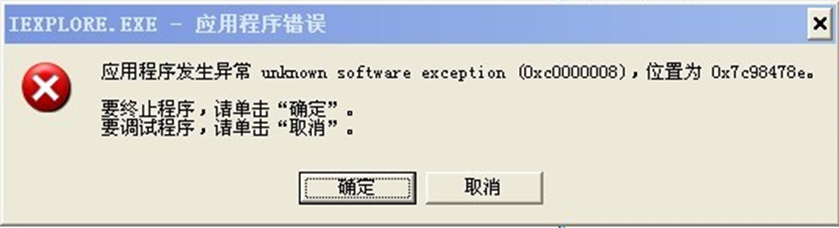
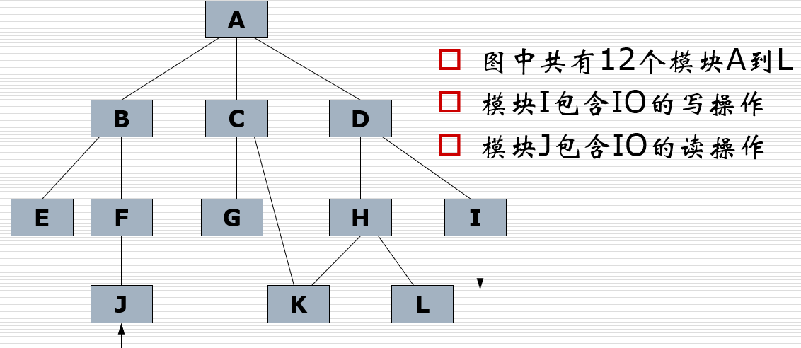
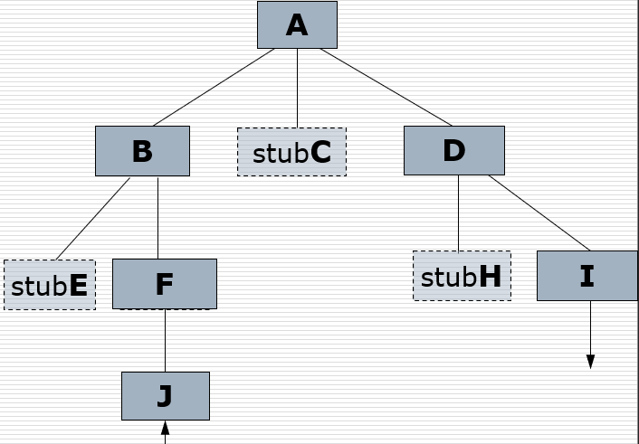
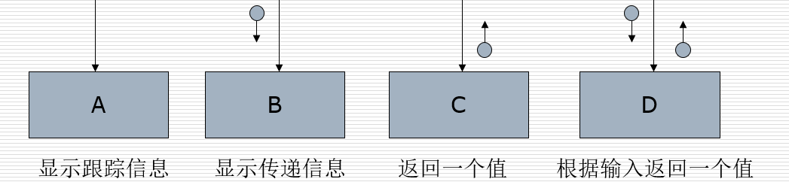
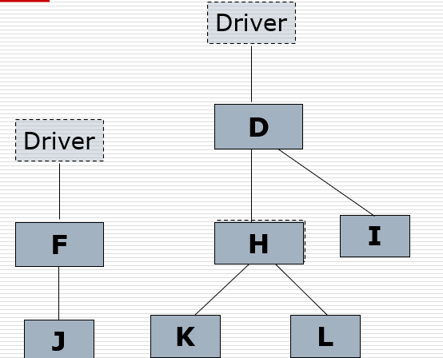
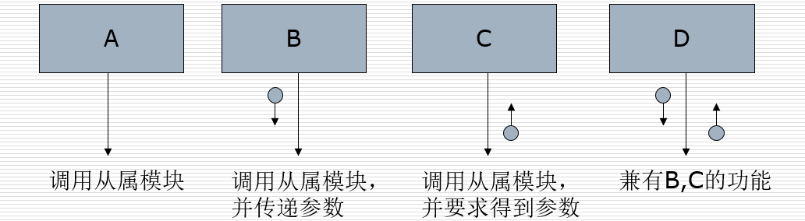
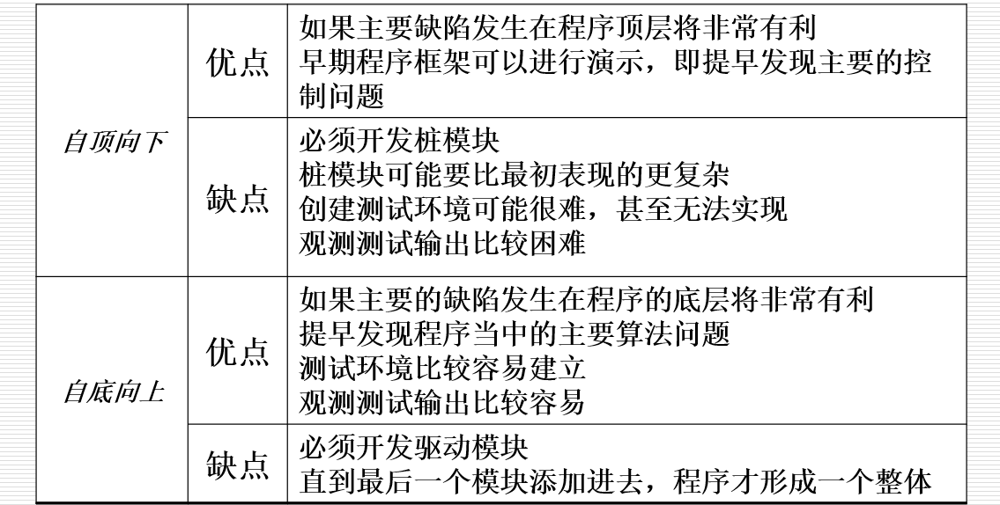

- 单元测试（模块测试）的对象
  - 对程序中较小构成元素—单个子程序或过程进行测试
- 动机
  - 集成测试及其他更高级别测试的基础
  - 单元测试减轻了调试的难度，因为错误一旦发现，就知道它在哪个具体的模块中
  - 单元测试提供了同时测试多个模块的可能，将并行工程引入了软件测试。
- 目的
  - 将模块与定义模块的规格说明进行比较，揭示出模块与其规格说明之间存在的矛盾。

## 单元测试针对的问题
- 模块接口：检查进出单元的数据流是否正确
- 局部数据结构：测试内部数据是否完整？例如：不正确的类型说明，错误的初始化等。
- 路径测试：发现由于不正确的判定或不正常的控制流而产生的错误，例如：不正确的逻辑操作或优先级，不适当地修改循环变量。
- 边界条件：测试边界处程序是否正确工作？
- 出错处理：测试出错处理措施是否有效？例如：提供的错误信息不足，难以找到错误原因等。

一个报错的例子

## 测试用例的设计
- 需要的信息
  - 模块的源代码
  - 模块的详细设计
  - 模块的规格说明：模块的输入和输出以及模块的功能
- 测试用例的设计方法
  - 单元测试总体上是面向**白盒**测试的（静态、动态）
    - 后续测试针对较大的元素不易进行白盒测试
    - 后续测试着眼于发现其他类型的错误，不一定与程序逻辑结构有关
  - 使用一种或多种白盒测试方法分析模块的逻辑结构，然后使用黑盒测试方法对照模块的规格说明补充测试用例

## 增量测试
- 测试单独的模块可能需要一个特殊的**驱动**模块和一个或多个**桩**模块
  - 驱动模块是为测试编写的一个小模块，用来将测试用例**驱动**或**传输数据**到被测模块。驱动模块还需要向测试人员**显示被测模块的结果**。
  - 桩模块充当被测模块**调用**的模块，**接受**被测模块的调用指令，**模拟**该模块的功能。
  - 例如测试模块B时需要一个驱动模块，和一个模拟模块E的桩模块
- 单元测试除了要考虑如何设计一个有效的测试用例集之外，还有一个重要问题，就是模块**组装方式**
- 两类测试方法
  - 非增量测试：先独立地测试每个模块，然后再将所有这些模块组装成完整的程序测试，又称为崩溃（big-bang）测试。
  - 增量测试：将被测模块组装到测试完成的**模块集合**中，然后再进行测试。
  > 注：在进行增量模块测试时，单元测试和集成是**同步**进行的，集成测试就是模块测试的**隐含**部分，往往并不作为一个独立的测试步骤。

### 非增量测试和增量测试
| 增量测试                                                                   | 非增量测试                                                     |
| -------------------------------------------------------------------------- | -------------------------------------------------------------- |
| 工作量小：使用前面测试过的模块来取代非增量测试中所需要的驱动模块或桩模块。 | 工作量较大：要设计驱动模块和桩模块                             |
| 可以较早发现模块中与不匹配接口、不正确假设等编程错误。                     | 到了测试过程的最后阶段，模块之间才能“互相看到”                 |
| 容易进行调试，新出现的错误往往与最近添加的模块有关                         | 直到整个程序组装之后，模块之间接口相关的错误才会浮现，难以定位 |
| 测试可以进行地更彻底，每个模块经受了更多的检验                             | 使用驱动模块和桩模块而非实际模块，对被测试模块的测试只影响自身 |
| 在测试上花费的时间多，设计驱动模块和桩模块所用时间少                       | 测试时间少，但设计驱动模块和桩模块需要大量时间                 |
| 并行性差                                                                   | 可以同时并行测试很多模块                                       |

## 自顶向下测试与自底向上测试
- 自顶向下测试
  - 从程序的顶部或初始模块开始测试。选择后续模块进行增量测试的原则是：**至少一个调用该模块的模块事先经过了测试**。有多种可能的测试序列时，应该考虑先测试关键模块和I/O模块
  - 为了测试上层模块，需要设计桩模块，桩模块通常要向被测模块提供测试数据，如访问数据库、读取外部文件
- 自底向上测试
  - 从不调用其他模块的终端模块开始测试，选择下一个模块进行增量测试的原则是：**该模块调用的所有的模块都已经事先经过了测试**。
  - 为了测试低层模块，需要为它们设计驱动模块：即包含着有效的测试输入、调用被测模块且显示输出的模块。

### 例子

自顶向下的增量测试
- 首先测试模块A，需要设计代表模块B,C,D的桩模块；如图
- 接着用实际模块代替桩模块，如B，并添加B的桩模块；如图
- 增量的序列有多种可能，例如：ABFJDICGEKHL，加入I后如图

自顶向下的增量测试中的桩模块

自底向上的增量测试
- 第一步是测试E,J,G,K,L和I中的部分或全部模块，既可以串行也可以并行进行；需要设计驱动模块，有的驱动模块可以供几个测试模块使用
- 接着测试的模块序列有多种可能，如果接下来是测试较关键的模块F,H，则用它们代替相应的驱动模块，并加入它们的驱动模块，如图

自底向上的增量测试中的驱动模块

### 自顶向下测试和自底向上测试的比较

## 执行测试
- 审核测试用例
  - 当测试用例造成模块输出的实际结果与预期结果不匹配的情况时，存在两种可能：该模块存在错误，或者测试用例不正确。因此，执行测试前应审核测试用例集。
- 使用自动化测试工具可以减少测试过程中的劳动，如流程分析工具等。
- 执行测试时，应该查找程序的副作用，即模块是否执行了不该执行的操作。
- 程序员不应测试自己编写的模块，最好交换测试；**编写调用模块的程序员**是测试被调模块的最佳人选。
- 模块测试的目的不是证明模块能够正确地运行，而是证明模块中存在着错误。

## 单元测试的通过准则
- 命名符合规则
- 控制流程正确；
- 变量存取无误差；
- 覆盖测试达到规定的覆盖率；
- 功能与设计说明一致；
- 性能达到软件设计指标；
- 所有软件单元达到质量度量指标；
- 对发现的问题已进行修改并通过回归测试。

## 单元测试与集成测试
- 每个模块完成单元测试后，需要按照结构图把它们连接起来，进行集成测试。
  - 集成测试往往不作为一个独立的测试步骤，尤其对增量式模块测试而言，它是其中的隐含部分。
  - 集成测试人员应包括具有两种背景的人员：熟知模块的内部细节，并能从足够高的层次上观察整个系统
- 集成测试的内容
  - 单元间的接口测试
  - 全局数据结构测试
  - 边界和人为条件下的性能
  - 软件功能模块的功能测试
