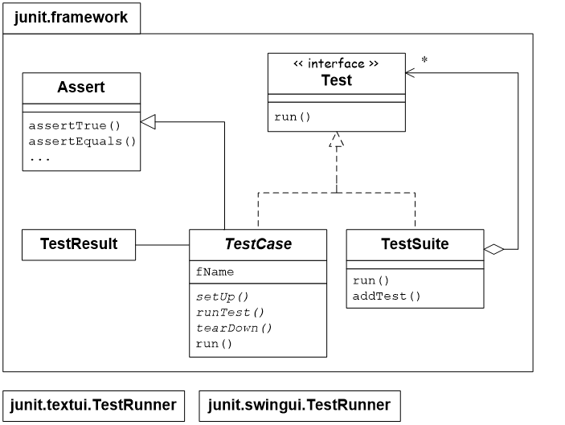
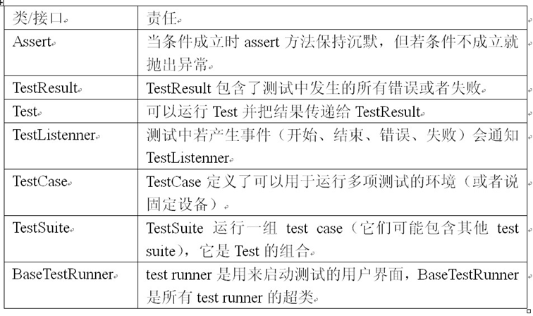

## 单元测试
- 单元测试是开发者编写的一小段代码，用于检验被测代码的一个很小的、很明确的模块
- 通常而言，一个单元测试是用于判断某个特定条件（或者场景）下某个特定函数的行为

## 核心实践—测试性思维
测试性思维 当你在建立模型（分析设计）的时候，你就要不断的问自己，“我该如何测试它？”如果你没办法测试正在开发的软件，你根本就不应该开发它。
在现代的各种软件过程中，测试和质保（quality assurance）活动都贯穿于整个项目生命周期，一些过程更是提出了“在编写软件之前先编写测试”的概念（这是XP的一项实践：“测试优先”）。

## JUnit的好处
- 开源工具，可以免费使用，可以根据需要扩展JUnit功能
- 促进了“先测试后编码”的软件开发理念
- 能为我们带来重构的勇气
- 可以将测试代码和产品代码分开
- 测试代码编写容易，功能强大
- 自动检验结果并且提供立即的反馈
- ……

## JUnit简介
- JUnit 是 Java 社区中知名度最高的单元测试工具。由 Erich Gamma 和 Kent Beck 共同开发完成
- 开源软件
- 支持语言
  - Smalltalk, Java, C++, Perl 等等
- 支持的IDE
  - JBuilder, VisualAge ,Eclipse等

## Junit框架

## JUnit核心类及接口

- TestRunner（测试运行器）
  - TestRunner继承自BaseTestRunner
- TestCase（测试用例）
  - 扩展了JUnit的TestCase类的类,包含一个或多个测试方法
  - TestCase的fixture
    - 管理一个或多个测试所需的公用资源或者数据集合
    - 通过setUp和tearDown方法来创建和销毁fixture
  - 创建单元测试方法
    - 继承自Assert的一组assert方法可以极大地简化单元测试的编写
- Assert提供的方法
  | 方法签名                             | 用途描述                                                 |
  | ------------------------------------ | -------------------------------------------------------- |
  | assertArrayEquals(expecteds,actuals) | 查看两个数组是否相等。                                   |
  | assertEquals(expected,actual)        | 查看两个对象是否相等。类似于字符串比较使用的equals()方法 |
  | assertNotEquals(first,second)        | 查看两个对象是否不相等。                                 |
  | assertNull(object)                   | 查看对象是否为空。                                       |
  | assertNotNull(object)                | 查看对象是否不为空。                                     |
  | assertSame(expected,actual)          | 查看两个对象的引用是否相等。类似于使用"=="比较两个对象   |
  | assertNotSame(unexpected,actual)     | 查看两个对象的引用是否不相等。类似于使用"!="比较两个对象 |
  | assertTrue(condition)                | 查看运行结果是否为true。                                 |
  | assertFalse(condition)               | 查看运行结果是否为false。                                |
  | assertThat(actual,matcher)           | 查看实际值是否满足指定的条件                             |
  | fail()                               | 让测试失败                                               |
- TestSuite（测试集合）
  - test suite可把多个相关测试归入一组
  - 若你没有提供自己的TestSuite，test runner会自动创建一个
- TestResult
  - 所有的TestSuite都有一个对应的TestResult
  - 负责收集TestCase的执行结果。储存了所有测试的详细情况，是通过还是失败。
  - TestRunner使用TestResult来报告测试结果 。没有TestFailure对象进度条就用绿色，否则进度条用红色并输出失败测试的数目
  - JUnit区分失败和错误
    - 失败：是可以预期的
    - 错误：是测试时不可预料的
- TestListener
  - 虽然Testlistener接口是JUnit框架的重要部分，但是你编写自己的测试时不必实现这个接口。只有需要扩展JUnit框架时才会需要实现这个接口

## Junit4的用法

### @Test
- 使用@Test注解的好处是：允许我们遵循最适合的应用程序的命名约定 (由开发组规范约定)
- 使用JUnit4后，测试用例类可以不继承TestCase类，所以我们也就可以扩展被测试类了。这种方法使得测试受保护的方法非常容易，我们只要将测试用例类继承被测试类，就可以测试受保护方法了。

- 测试异常 `@Test(expected=XXXException.class)`
- 限制测试运行时间 `@Test(timeout=500)` 可以帮助解决单元测试的一些性能问题。

### @Before(setUp)
- 在 JUnit4 中，我们仍然可以在每个测试方法运行之前初始化字段或准备数据。然而，完成这些操作的方法不再需要叫做 setUp()，只要用 @Before 注释来指示该方法即可。
- JUnit4允许我们使用 @Before 来注释多个方法，这些方法都在每个测试之前运行

### @After(TearDown)
- 用 @After 注释来指示该方法在测试方法结束后清除为此测试用例准备的一些数据。
- 也可以用 @After 来注释多个清除方法，这些方法都在每个测试之后运行。
- 我们不再需要显式调用在超类中的初始化和清除方法，测试运行程序将根据需要自动为您调用这些方法。
- 超类中的 @Before 方法在子类中的 @Before 方法之前被调用（这反映了构造函数调用的顺序）。
- @After 方法以反方向运行：子类中的方法在超类中的方法之前被调用。

### @BeforeClass和@AfterClass
- @Before和@After这种方法有个问题，如果要初始化的是数据库的链接，或者是一个大的对象的话，而这些资源恰恰是整个测试用例类可以共用的，每次都去申请，确实是种浪费。
- 所以JUnit4引入了@BeforeClass和@AfterClass。
- 任何用 @BeforeClass 注释的方法都将在该类中的测试方法运行之前刚好运行一次，而任何用 @AfterClass 注释的方法都将在该类中的所有测试都运行之后刚好运行一次。
- 注意
  - 被注释为 BeforeClass 和 AfterClass 的方法必须为static方法。
  - 这个特性虽然很好，但是一定要小心对待这个特性。它有可能会违反测试的独立性，并引入非预期的混乱。

### @Ignore
- 如果要忽略某个测试的时候，可以采用@Ignore。

## 测试套件（TestSuite）
在实际项目中，随着项目进度的开展，单元测试类会越来越多，一个一个的单独运行测试类，在实际项目实践中肯定是不可行的。
为了解决这个问题，JUnit 提供了一种批量运行测试类的方法，叫做测试套件。这样，每次需要验证系统功能正确性时，只执行一个或几个测试套件便可以了。

## 构建测试套件
- 创建一个空类作为测试套件的入口。
- 使用注解 org.junit.runner.RunWith 和 org.junit.runners.Suite.SuiteClasses 修饰该空类。
- 将 org.junit.runners.Suite 作为参数传入注解 RunWith，以提示 JUnit 为此类使用套件运行器执行。
- 将需要放入此测试套件的测试类组成数组作为注解 SuiteClasses 的参数。
- 保证这个空类使用 public 修饰，而且存在公开的不带有任何参数的构造函数。

- 我们将前面的测试类MaxMinTest和MaxMinToolTest放入了测试套件中
- 测试套件中不仅可以包含基本的测试类，而且可以包含其它的测试套件。
- 一定要保证测试套件之间没有循环包含关系。

## 参数化测试
- 测试类必须由Parameterized测试运行器修饰
- 准备数据。数据的准备需要在一个方法中进行，该方法需要满足一定的要求：
  1. 该方法必须由Parameters注解修饰
  2. 该方法必须为public static的
  3. 该方法必须返回Collection类型
  4. 该方法的名字不做要求
  5. 该方法没有参数

- 如果想重复的运行某个测试若干次，可用此法来制造模拟数据或性能测试 `RepeatedTest(new TestSuite(TestGame.class), 10);`

## JUnit最佳实践
- 一次只测试一个对象
  - 单元测试独立地检查你创建的每个对象，这样就可以在第一时间把它们隔离起来。如果一次测试多于一个对象，那么你就无法预测当这些对象发生改变时它们会如何交互
- 在assert调用中解释失败原因
  - 用到assert方法时，使用第一个参数是String类型的那个签名，这个参数让你可以提供一个有意义的文本描述，在断言失败时JUnit test runner会显示这个描述
- 选择有意义的测试方法名
  - 遵守testXxx的命名模式，其中Xxx是待测方法名。若你需要为同一个方法增加其他的测试，那么可以改用testXxxYyy的命名模式，其中Yyy描述了测试的不同之处
- 一个单元测试等于一个测试方法
  - 不要试图把多个测试塞进一个方法，这样导致的结果就是测试方法变得更复杂，而且在测试方法中编写的逻辑越多，测试失败的可能性也就越大，需要调试的可能性也就越大
- 同一个包，分离的目录
  - 把所有测试和待测类都放在同一个包中，但使用平行目录结构
