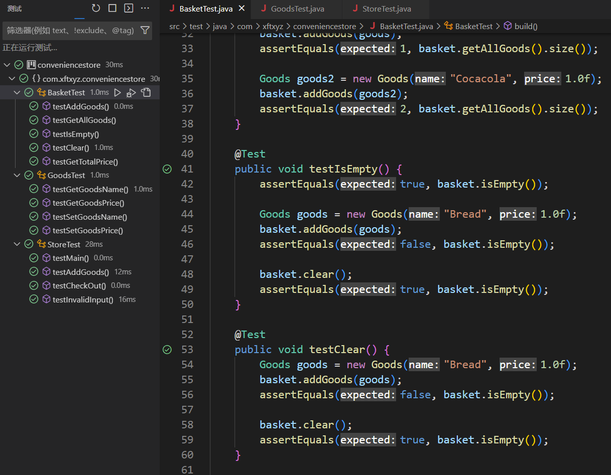

## 小芳便利店
以下是对该程序的界面要求：

如果你选择了1（选择2、3、4、5、6类似）：

之后你还可以继续选择其他的物品，在你确认购买完毕后，你可以选择9结帐：

按任意键后，你可以开始继续新一轮的购物。

以下是在购物过程中输入错误的反馈：

## 提示：可用以下三个类解决该问题

### 1．货物类（Goods）：一个商品，包含了名称，价格信息
[Goods](./src/main/java/com/xftxyz/conveniencestore/Goods.java)
- `-String name`
- `-float  price`
- `+Goods(String _name,float _price)`
- `+void setName(String _name)`
- `+String getName()`
- `+void setPrice(float _price)`
- `+float getPrice()`

### 2．购物篮类（Basket）：一个购物篮，包含了已经选择的东西
[Basket](./src/main/java/com/xftxyz/conveniencestore/Basket.java)
- `-ArrayList<Goods> goodsList`
- `+void addGoods(Goods goods)`
- `+ArrayList<Goods> getAllGoods()`
- `+boolean isEmpty()`
- `+void clear()`
- `+float getTotalPrice()`

### 3．Store：小芳便利店 主程序
[Store](src/main/java/com/xftxyz/conveniencestore/Store.java)
- `-static final Goods[] GOODS`         // 所有商品
- `-static Basket basket`               // 存放选中商品的购物篮
- `-static final String MESSAGE_HEADER` // 菜单顶部
- `-static final String MESSAGE_FOOTER` // 菜单底部
- `-static void exit()`                 // 打印消息退出整个程序
- `-static void checkOut()`             // 买单，打印所有已经选择的商品
- `-static void invalidInput()`         // 当输入错误的时候，打印消息
- `-static void addGoods(int choice`)   // 添加选中的商品到购物篮
- `-static void printMenu()`            // 打印菜单
- `+static void main(String args[])`    // 程序入口

要求：
- 使用Junit对改程序的各单元进行测试。
- 提交源程序和测试程序。

