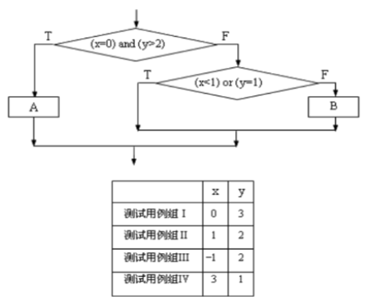

### 1、在白盒测试用例设计中，有语句覆盖、分支覆盖、条件覆盖、路径覆盖等，其中（A）是最强的覆盖准则。为了对如下图所示的程序段进行覆盖测试，必须适当地选取测试用例组。若x，y是两个变量，可供选择的测试用例组共有Ⅰ、Ⅱ、Ⅲ、Ⅳ组，如表中给出，则实现判定覆盖至少应采取的测试用例组是（B）或（C）；实现条件覆盖至少应采取的测试用例组是（D）；实现路径覆盖至少应采取的测试用例组是（E）或（F）。


供选择的答案：
- A：①语句覆盖；②条件覆盖；③判定覆盖；**④路径覆盖；**
- B~F：①Ⅰ和Ⅱ组；②Ⅱ和Ⅲ组；③Ⅲ和Ⅳ组；④Ⅰ和Ⅳ组；⑤Ⅰ、Ⅱ、Ⅲ组；⑥Ⅱ、Ⅲ、Ⅳ组；⑦Ⅰ、Ⅲ、Ⅳ组；⑧Ⅰ、Ⅱ、Ⅳ组；
  - B: ⑤
  - C: ⑧
  - D: ④
  - E: ⑤
  - F: ⑧

### 2、阅读下面这段程序，使用逻辑覆盖法进行测试，请问哪一组关于(a,b,c)的输入值可以达到条件覆盖。
```c
int func(int a, int b, int c)
{
    int k = 1;
    if ((a > 0 || (b < 0) || (a + c) > 0))
        k = k + a;
    else
        k = k + b;
    if (c > 0)
        k = k + c;
    return k;
}
```

- A: (a,b,c)=(3,6,1)、(-4,-5,7)
- **B: (a,b,c)=(2,5,8)、(-4,-9,-5)**
- C: (a,b,c)=(6,8,-2)、(1,5,4)
- D: (a,b,c)=(4,9,-2)、(-4,8,3)

### 3、阅读下面这段程序，使用逻辑覆盖法进行测试，请问哪一组关于(a,b,c)的输入值可以达到判定覆盖。
```c
int func(int a, int b, int c)
{
    int k = 1;
    if ((a > 0 && (b < 0) && (a + c) > 0))
        k = k + a;
    else
        k = k + b;
    if (c > 0)
        k = k + c;
    return k;
}
```

- A: (a,b,c)=(3,6,1)、(-4,-5,7)
- B: (a,b,c)=(2,5,8)、(-4,-9,-5)
- C: (a,b,c)=(6,8,-2)、(1,5,4)
- **D: (a,b,c)=(4,9,-2)、(-4,8,3)**

### 4、阅读下面这段程序，使用逻辑覆盖法进行测试，请问哪一组关于(a,b,c）的输入值可以达到判定条件覆盖。
```c
int func(int a, int b, int c)
{
    int k = 1;
    if ((a > 0 || (b < 0) || (a + c) > 0))
        k = k + a;
    else
        k = k + b;
    if (c > 0)
        k = k + c;
    return k;
}
```

- A: (a,b,c)=(3,6,1)、(-4,-5,7)
- **B: (a,b,c)=(2,-5,8)、(-4,9,-5)**
- C: (a,b,c)=(6,8,-2)、(1,5,4)
- D: (a,b,c)=(4,9,-2)、(-4,8,3)


<!-- [白盒测试练习及答案](https://blog.csdn.net/xidianlina/article/details/52903773) -->
